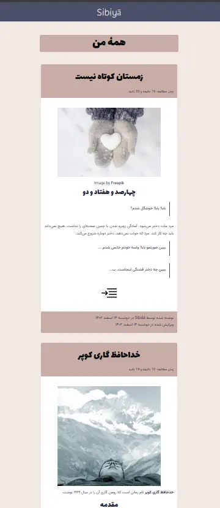

sibiya.ir
=========

This is the source code of my personal Persian [website](http://sibiya.ir). Persian aka Farsi is written right-to-left, however some people use Roman script to write Persian language in messaging applications and social networks.

This repository can be of use to anybody willing to build a new right to left website. I gradually fix issues which I came across while writing new posts in my website. This website is produced using [Grav](https://getgrav.org/) flat file cms.

# Make it yours
Take the following steps to make your own website:

  1. Fork the repository
  2. Buy a domain and a shared host
  3. Sign up in [launchdeck](http://launchdeck.io)
  4. Create a new project in launchdeck. Launchdeck build and upload your github Repository to your server! 
  5. delete _user/pages/03.blog/* contents  (you can use them as template)
  6. Edit _user/config/site.yaml
  7. Write your awesome stories :heart:
