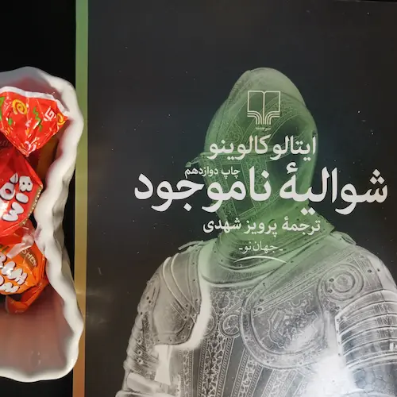

گوردولو ضمن آواز خواندن آماده می‌شود قبر مرده‌اش را حفر کند. آن را روی زمین می‌خواباند تا اندازه‌اش را تعیین کند. با نوک بیل حدود را تعیین می‌کند، مرده را کمی کنار می‌کشد،‌ و با قدرت شروع می‌کند به کندن زمین:

> مرده! گمان می‌کنم این طور در انتظار ماندن برایت کسل کننده باشد!

مرده را به یک پهلو می‌خواباند، به نحوی که چهره‌اش رو به قبر باشد و بتواند کار حفر کردن را ببیند:

> مرده! گفتن ندارد، ولی گه گاه یک بیل خاک برداشتن تو را نخواهد کشت.

جسد را می‌نشاند و سعی می‌کند بیل را در دست‌هایش بگذارد. مرده به یک پهلو می‌افتد:

> خب، قوّه نداری. باشد، عیبی ندارد، من گور را می‌کنم و بعد تو آن را پُر خواهی کرد. 

قبر کنده شده است: ولی با این طرز عجیبی که گوردولو بیل می‌زند، شکل نامنظمی پیدا کرده است، ته آن مقعر است. گوردولو هوس می‌کند خود آن را امتحان کند، می‌رود پایین و توی گودال دراز می‌کشد:

> آه که این جا آدم چقدر راحت است، چقدر آرام است! آه که این خاک چقدر نرم است! غلت زدن توی آن چه لذتی دارد! مرده، بیا پایین خودت امتحان کن، خواهی دید که چه قبر قشنگی برایت کنده‌ام!

ولی به فکر فرو می‌رود:

> خب، با توجه به قراری که با هم گذاشتیم که من قبر را بکنم و تو آن را پر کنی، بهتر است من همین جا بمانم و تو خاک را با بیل رویم بریزی!

یک لحظه صبر می‌کند:

> یالّا، بجنب! کار دشواری نیست که، ببین، این طوری!

و همان طور به حالت درازکش در ته گودال، بیل را  بر می‌دارد و سعی می‌کند خاک را توی گودال سرازیر کند. همهٔ خاک‌ها رویش فرو می‌ریزد.

** بخشی از کتاب شوالیهٔ ناموجود نوشته ایتالو کالوینو ترجمه پرویز شهدی نشر چشمه **
