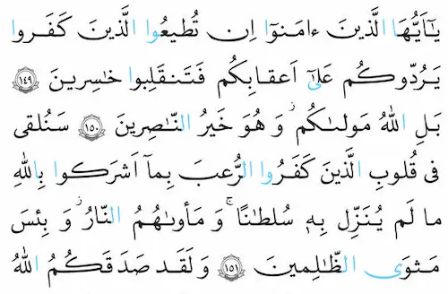

[سایت مرکز طبع و نشر قرآن کریم جمهوری اسلامی ایران](https://moshaf.org/fa/news/214/)
 در توضیح مصحف کم علامت نوشته است:

> این مصحف شریف به شیوه علامتگذاری آسان (کم علامت) و با حروف ناخوانای رنگی (که کمک زیادی به سهولت قرائت می‌کند) جهت استفاده نوآموزان تهیه شده است. با توجه به رواج این مصحف در مدارس و انطباق شیوه علامتگذاری آن با کتاب‌های درسی دانش‌آموزان، استقبال عمومی از آن بسیار زیاد بوده و به دفعات به چاپ رسیده است. 

حالا سالهاست که این شیوه از ضبط در کتاب‌های درسی دانش‌آموزان استفاده می‌شود. از اول ابتدایی تا کلاس دوازدهم در حالی‌که

> شیوه رایج علامتگذاری مصاحف در کشورهای عربی، شیوه مصری است و مصحف معروف به خط عثمان‌طه به همین شیوه علامتگذاری شده است. 

نمونه‌ای از علامتگذاری مصری را در تصویر زیر ببینید:

## دقیقاً چه اتفاقی رخ داده است؟

سال‌ها پیش کارشناسان مرکز طبع و نشر قرآن کریم جمهوری اسلامی ایران تلاش کردند تا در راستای آموزش آسان‌تر قرآن کریم، قرآنی را نگارش کنند که خالی از علامت‌های فراوان ضبط‌های مصری باشد. نتیجهٔ کار را مصحف جمهوری اسلامی ایران نامیدند: مصحفی مطابق با شیوهٔ نگارش فارسی. همانی که امروز به مصحف کم علامت می‌شناسیم.

## ایراد کار کجاست؟

سال‌ها است که این قرآن در کتاب‌های آموزش و پرورش چاپ می شود اما کافی است در مسجد محله‌تان یا یکی از دارالقرآن‌ها برای حفظ و یا فراگیری تجوید ثبت‌نام کنید تا متوجه شوید که اولین اصل از اصول کارشان این است که از قرآن با ضبط مصری (به ویژه قرآن به خط عتمان طه) استفاده شود! به علاوه با گذشت زمان همچنان تمام کتاب‌های آموزش روخوانی، روانخوانی و تجوید قرآن کریم بر مبنای همان شیوهٔ ضبط مصری نوشته می‌شوند.

من سال‌هاست که به طور همزمان از هر دو قرآن استفاده می‌کنم. هر دو شیوه را دوست می‌دارم و با هر دوی آنها راحت هستم.

اما کاش پس از گذشت سال‌ها از انتشار مصحف جمهوری اسلامی و استفاده از آن در کتاب‌های درسی دانش‌آموزان و همزمان عدم استقبال اکثریت دارالقرآن‌ها و اساتید قرآن از این مصحف و همچنان آموزش دادن از روی ضبط مصری مسئولین دلیل موجهی برای استفاده از مصحف جمهوری اسلامی ایران داشته باشند. 

- برای دانلود محصف کم‌علامت با فرمت PDF
[اینجا](https://moshaf.org/fa/news/214/)
را ببینید. در این صفحه، قرآن مجید در ۳۰ فایل مجزا ( هر جزء در یک فایل) در دسترس است.
- برای مطالعهٔ آنلاین 
[اینجا](https://moshaf.org/fa/showbook/214/%D9%85%D8%B5%D8%AD%D9%81-%D8%AC%D9%85%D9%87%D9%88%D8%B1%DB%8C-%D8%A7%D8%B3%D9%84%D8%A7%D9%85%DB%8C-%D8%A7%DB%8C%D8%B1%D8%A7%D9%86-%D8%A8%D9%87-%D8%B4%DB%8C%D9%88%D9%87-%DA%A9%D9%85-%D8%B9%D9%84%D8%A7%D9%85%D8%AA--%D8%A2%D9%85%D9%88%D8%B2%D8%B4%DB%8C-/)
را ببینید.
- هم‌چنین اگر می‌خواهید از متن قرآن به شیوهٔ کم‌علامت در نرم‌افزار مایکروسافت وُرد استفاده استفاده کنید
[اینجا](https://moshaf.org/news/204/)
را ببینید.