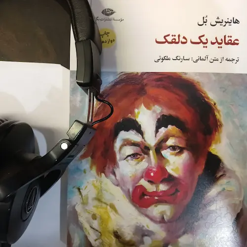

شیر آب را بسته و شلوار و پیراهن و زیرپیراهنم را از تن در آورده و به گوشه‌ای پرت کردم، تازه می‌خواستم وارد وان شوم که تلفن زنگ خورد. 

فقط یک انسان را می‌شناسم که قادر است این طور تند و تیز و مردانه زنگ تلفن را به صدا در بیاورد و آن هم کسی جز مدیر برنامه‌ام سونر نیست. او چنان نزدیک به گوشی و محکم صحبت می‌کند که من هر بار هراس دارم تف‌مالی بشوم.

تلفن همچنان لجوج و بی وقفه و مردانه زنگ می‌خورد. فکر کردم یکی از پشتی‌های مبل را پرت کنم رویش ولی حولهٔ حمامم را تنم کرده و به اتاق پذیرایی رفتم و جلوی تلفن ایستادم.

مدیران اعصاب قوی و توانایی مالی خوبی هم دارند و عبارت‌هایی مثل حساسیت روح هنرمند برایشان همانند سهام آبجوی شهر دورتموند است و هر تلاشی برای صحبت جدی با آنها در مورد هنر و هنرمند جز نفس از دست دادنِ بیهوده نیست. 

آنها خوب می‌دانند حتی یک هنرمند بی‌وجدان هزار بار وجدانش از باوجدان‌ترین مدیر بیشتر است.

و مدیران سلاحی به دست دارند که هنرمند در مقابلش قدرت مقابله ندارد؛ و آن آگاهی کامل مدیران از این موضوع است که هنرمند قادر به انجام کار دیگری جز همان کاری که انجام می‌دهد نیست، کارهایی مثل نقاشی کردن، از این شهر به آن شهر رفتن و دلقکی کردن و آوازه‌خوانی کردن و از سنگ و یا فلز مجسمه پرداختن.

هنرمند همانند زنی است که کاری جز عشق ورزیدن بلد نیست و خود را به هر دلال تازه‌نفسی می‌سپارد. 

این سوء تفاهم بیشتر از همه در مورد هنرمندان و زن‌ها صدق می‌کند و و در هر مدیری از یک تا نود و نه خصوصیات یک دلال محبت وجود دارد. 

و این زنگ تلفن یک زنگ خالص دلال محبتی بود.

**برشی از کتاب عقاید یک دلقک نوشتهٔ هاینریش بل ترجمه سارنگ ملکوتی، انتشارات نگاه**