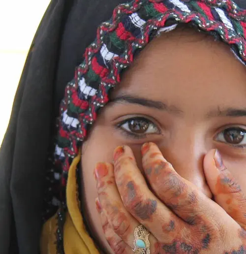

دنبال چی می‌گردی؟ کودکان فرشته‌ اند دیگه! نیاز به توضیح داره به نظرت؟ این عکس رو ببین:

فرشته نیست؟

بچه که بودم همیشه یا مهمانی بودیم یا مهمان داشتیم. بزرگتر که شدم رفتم مدرسه. هنوز اوضاع به همان گونه بود. هیچ وقت تنها نبودیم. دبیرستانی که شدم اوضاع به مرور تغییر کرد. از مهمانی رفتن و مهمان آمدن‌ها کم شد اما برای من کمتر مهم بود. عادت کرده بودم که صبح اول صبح از خانه بزنم بیرون و آخر شب از مدرسه یا دانشگاه برگردم. رفت و آمد با عمو و خاله و ... کم شده بود اما دوست‌هایم نقش پررنگی در زندگیم داشتند و برای همین هم جای خالی کسی را حس نمی‌کردم.

حالا مدت‌ها از آن زمان‌ می‌گذرد. یکی درگیر اضافه کاری است، یکی حامله‌ است، یکی مشغول تعویض کهنهٔ بچه است، یکی زنش اجازه نمی‌دهد، بعضی‌ هم از ترس این‌که عقاید فاسد من بهشان سرایت کند دورم را خط کشیدند. یکی هم که پایه است من نیستم. تو هم تکلیفت روشنه. خیلی وقته که نیستی. برای همین آخر هفته‌ها و روزهای تعطیل شده کابوس من.

این مختصر را نوشتم تا اعتراف کنم چه چیزی در این شرایط مرا سرپا نگه داشته است: خانوادهٔ کودکان فرشته‌اند.

۱۴ آذر بود. دو سه سال پیش. ۱۴ آذر را که می‌دانید؟ همان ۵ دسامبر: روز داوطلب.
<!--

<a href="https://www.freepik.com/free-photo/business-executives-with-hand-stacked_1005993.htm">Image by peoplecreations</a> on Freepik

ویکی پدیای انگلیسی در صفحهٔ کار داوطلبانه
[(Volunteering)](https://en.wikipedia.org/wiki/Volunteering)
نوشته:

<blockquote> Volunteering is a voluntary act of an individual or group freely giving time and labor, often for community service. Many volunteers are specifically trained in the areas they work, such as medicine, education, or emergency rescue. </blockquote>

-->

۱۴ آذر بود و من داشتم در مورد داوطلب و مؤسسه‌هایی که در ایران فعالیت‌های داوطلبانه انجام می‌دهند جستجو می‌کردم که به صورت اتفاقی با **کودکان فرشته‌اند** آشنا شدم.

**کودکان فرشته‌اند** با نام ثبتی **کودکان فرشته ایرانیان** یک مؤسسهٔ خیریه است که در حوزهٔ کودکان فعالیت می‌کند. هدفشان (بخوانید هدفمان) را هم خیلی ساده و کوتاه می‌شود این‌گونه توصیف کرد:

> بهبود  سلامت جسمی و روحی بچه‌های قد و نیم قد سرزمین‌مون

همهٔ ما اسم خیریه به گوشمان خورده است. اگر کسی از من می‌پرسید که خیریه چیه؟ در جواب او می‌گفتم خیریه جاییه که چند تا آدم سعی می‌کنند از بقیهٔ آدم‌ها پول بگیرند و بعد این پول رو بین افرادی که بهش نیاز دارند تقسیم کنند. اما بعدتر فهمیدم که باید در این تعریف تجدید نظر کنم. 

ما در **کودکان فرشته‌اند** چه کار می‌کنیم؟

<a href="https://www.freepik.com/premium-vector/female-hands-giving-red-heart-from-splash-watercolor-hand-drawn-sketch-illustration-paints_9939796.htm">Image by kapona</a> on Freepik

عکس را دیدید؟ کاری است که خیلی از داوطلب‌ها (خودم رو نمی‌گویم) انجام می‌دهند. قلبشان را می‌گیرند در دستشان و بعد دستشان را می‌گیرند جلوی شخصی دیگر تا بدون این که حرفی زده باشند نشان بدهند:

> عشق جریان دارد... 

من عضو کوچکی از این خانواده هستم و طبیعتاً در همهٔ بخش‌ها فعالیت ندارم اما این فعالیت‌ها را در کودکان فرشته‌اند داریم:

**جمع‌آوری هزینهٔ دارو و درمان فرشته‌ها**. این قسمت به اندازهٔ کافی گسترده است. از هزینه کردن از جیب خودمان تا انتشار پوستر‌های اعلام نیاز در صفحه‌های شخصی‌ و جذب خیّر و  ... همه و همه راه‌هایی هستند که به کمک‌ آنها هزینهٔ درمان فرشته‌ها تأمین می‌شود.

**جشن گرفتن و هدیه دادن** به بچه‌های بستری در بیمارستان. 

خیلی وقت‌ها هدیه‌هایمان کاردستی‌های ساده‌ایست که با کاغذ و مقوا می‌سازیم. یکی از داوطلبین گروه آموزش برای بچه‌هایی که زحمت درست کردن کاردستی‌ها را می‌کشند نوشته بود:

> خواستم بگم شما رو در رو با بچه ها در ارتباط نیستید بعضی هاتون
ولی چیز هایی که می‌سازید براشون ماندگاره
عضو آموزش بیمارستان مفید هستم دیروز که رفتم دیدم یه سری ها قورباغه دارن و مامان هاشون با اونا هواسشون رو پرت می‌کنه دارو میده بهشون قلبم اکلیلی شد❤️
دمتون گرم 
مرسی که پشتیبان لبخند هستید❤️

و تصویر قورباغه‌ای که دوستمان تعریفش را می‌کرد:

و این هم تصویری از تلاش‌های تیم پشتیبانی که زحمت ساختن این قورباغه‌های دوست‌داشتنی را به دوش کشیدند:

یکی دیگر از فعالیت‌های ما در کودکان فرشته‌اند **بازسازی** است! در بازسازی چه کار می‌کنیم؟ 

سطل رنگ و قلم‌مو به دست می‌گیریم و مدرسه یا مؤسسه‌ٔ کوچک‌تری که در حوزهٔ کودکان فعالیت می‌کند و بچه‌ها به آن‌جا رفت و آمد دارند را رنگ می‌کنیم. تهش این شکلی می‌شود:

 اینجا دقیقاً همان‌ جایی‌است که من پنجشنبه و جمعه‌های بدون تو را در آن می‌گذرانم. خلاصه که جایت حسابی خالی‌است!

آن چه نوشتم تنها گوشه‌ای از فعالیت داوطلب‌هایی‌ است که با جان و دل زحمت می‌کشند تا لبخند بر لب بچه‌ها نقش ببندد.

اگر با خواندن این نوشته علاقه‌مند شدی که عضوی از خوانواده‌مان باشی، منتظرتیم.

- این لینک وب‌سایت خیریه است. اگر دوست داری ببینش:

<a href="https://koodakancharity.ir">koodakancharity.ir</a> 

- این یکی لینک کانال تلگرام خیریه است. اینجا به نظرم چیزهای بهتری پیدا می‌شه! حتماً داخلش عضو شو و دنبال‌مون کن.

<a href="https://t.me/koodakancharity">@koodakancharity</a> 

- دوست داری عضو خانواده‌مون بشی؟ خیلی ساده است. کافیه به منابع انسانی پیام بدی. توی تلگرام:

<a href="https://t.me/Koodakancharity_HR">@Koodakancharity_HR</a> 

تلگرام نداری؟ این شمارشونه:

<a href="tel:+989381486833">0938 148 6833</a> 

راستی! من قبل‌تر گزارشی از یک پنجشنبه و جمعهٔ دوست داشتنی که در بازسازی گذشت نوشته‌ام. اگرچه حالا حس می‌کنم باید یک بازنگری روی آن انجام بدهم ولی این کار را نمی‌کنم چون حاصل هیجانات حضور من در بازسازی بعد از یک دورهٔ نسبتاً طولانی دوری بوده که بلافاصله بعد از بازسازی نوشته شده. حیفه حالا که اون هیجان نیست بخواهم در نوشته دست ببرم.  حتماً بخونیدش:

<a href="/blog/zendegi_sakhte_bia_bazsazi">
 زندگی سخته؟! بیا بازسازی 
</a>

این‌هم چند تا عکس از بچه‌های دوست‌داشتنی که منتظر تو هستند که بیای و کمک کنی تا بتونیم با هم‌دیگه لبخند رو به لباشون بیاریم.

