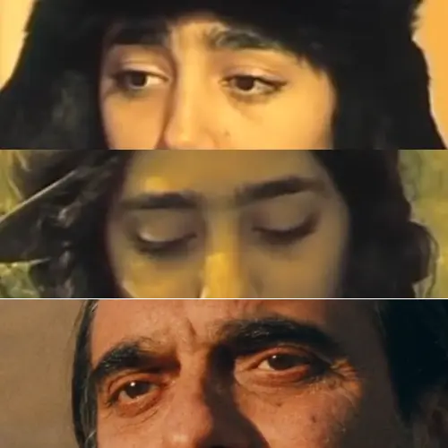

آخر هفته به هر دری زدم تا چیزی بنویسم اما ...

حال و روزم به همایون ارشادی می‌ماند در درخت گلابیِ داریوش مهرجویی.

ارشادی را دوست نمی‌دارم. نه در درخت گلابی و نه در طعم گیلاس. با موجودی روبه‌روییم که انگار روحی در بدن ندارد و تنها کالبدی است که از جایی دیگر هدایت می‌شود. با سیمایی **پوکر فیس** که بیش‌تر به درد نشستن پای میز قمار می‌خورد تا بازیگری. 

دقیق‌تر اما این خود هنری است که روحی در بدن داشته باشی و چنان وانمود کنی که روحی در کار نیست. البته اگر روحی باشد که من شک دارم...

من به تماشا نشستن چند بارهٔ درخت گلابی را وامدار گلشیفته‌ای هستم که حضورش نعمتی بود برای درخت گلابی. گویی گلشیفته روح ارشادی بود که با رفتنش تنها کالبدی از او باقی ماند. گلشیفته جان درخت گلابی بود.

به سان تو که جان من بودی، رفتی و بعد تو آنچه باقی است جسمی است بی‌جان بلکه جهانی بی‌جان...

جسم بی‌جان را صفایی نیست و تنها به کار کرم‌ها می‌آید و بهتر آنکه بگوییم آنچه اتفاق می‌افتد لطف کرم‌ها است که اگر نبودند بوی تعفن همه جا را پر می‌کرد.

و شاید طعم گیلاس دنباله‌ای بود پیش ساخته شده از سرنوشت ارشادیِ بی‌جان در درخت گلابی و آن را که جانی نباشد چه تفاوت می‌کند که در این جهان باشد یا آن جهان و این را عباس کیارستمی چه خوب فهمید که طعم گیلاس را نیمه‌کاره رها کرد.   

درست همان‌جایی که همه منتظر بودند که چه پیش خواهد آمد کیارستمی به خود آمد و فهمید که دارد سرنوشت مرگ و زندگی یک نفر از پیش مرده را روایت می‌کند و این چه بیهوده کاری است و در عمل به قول ماهی و آب و دیر نشدن در شادیِ حاصل از دست یافتن به این حقیقتْ فیلم را همان‌جا رها کرد و اعلام عید کرد و این را به خوبی از صحنه‌های پایانی طعم گیلاس می‌توان دریافت.

نیستی که ببینی تعفن همه جا را گرفته است. بعد تو حتی کرم‌ها هم با من قهر کرده‌اند.

بعد تو دیگر درختان هم شکوفه نمی‌دهند. بعد تو جهان با خودش قهر کرده است...