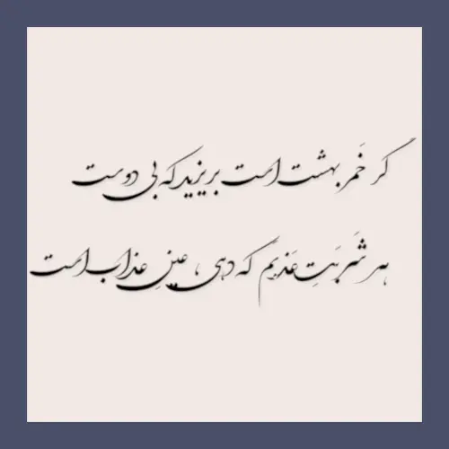

انتشارات صدرا کتابی دارد با نام آئینهٔ جام: دیوان حافظ همراه با یادداشت‌های استاد مطهری. نخست مرتبه این کتاب را در کتابخانهٔ دبیرستانمان یافتم که مرا سخت آزرد که چگونه ایشان به خود اجازهٔ داده‌اند که چنین جسارتی را روانهٔ ساحت مقدس جناب حافط بدارند و زیر بعضی از غزل‌ها بنویسند که عالی نیست! 

اکنون سال‌ها است که این کتاب چاپ نمی‌شود. گویی خود دریافته‌اند که نشر این کتاب مصلحت نبوده و از چاپ مجددش سر باز زده‌اند.

اما گذشت زمان مرا گستاخ ساخته است...

خواجهٔ شیراز غزلی دارد با این مطلع:

> ما را ز خیال تو چه پروای شراب است؟

و بعد در ادامه در بیت دوم می‌فرماید:

> گر خَمر بهشت است بریزید که بی‌دوست  
هر شَربَتِ عَذبَم که دهی، عینِ عذاب است

که مرا به یاد بیتی دیگر از ایشان می‌اندازد که:

> با خرابات نشینان ز کرامات ملاف  
هر سخن جایی و هر نکته مکانی دارد

گویی جناب حافظ در خلوتْ شربت عذب را نوش جان کرده‌اند و بعد یاد دوست افتاده‌اند و لاف عشق زده‌اند که آری! آن شربت عذب برایم مثل عذاب بود! 

> واعظان کـاین جلوه در محراب و منبر می‌کنند  
چون به خلوت می‌روند آن کارِ دیگر می‌کنند!

که سعدی چه خوب از پیش جواب خواجه را فرموده است که:

> ای مرغ سحر عشق ز پروانه بیاموز  
کآن سوخته را جان شد و آواز نیامد

> این مدعیان در طلبش بی‌خبرانند  
کآن را خبری شد خبری باز نیامد

و همچنین مولانا که فرموده است:

> هر که را اسرار حق آموختند  
مهر کردند و دهانش دوختند