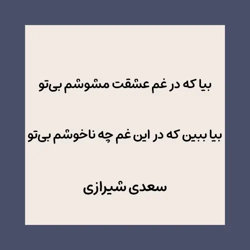

نقل است که حضرت رسول اکرم فرموده‌اند: (نیازمند سند!) 

> رحم اللَّه إمرأً عمل عملًا فاتقنه‏ 

**ترجمه:** خدا رحمت کند کسی را که وقتی کاری انجام می‌دهد، آن را درست انجام بدهد!

و لعنت خداوند بر من باد که بعد تو هیچ کاری را درست انجام نمی‌دهم!

باری به هر جهت شده‌ام. گهی اینجا گهی آنجا. گهی با این گهی با آن.

هیچ چیز و هیچ کس به دلم نمی‌شیند. بعد تو هیچ چیز را بویی نیست. بعد تو جهان رنگی ندارد.

خدا رحمت کند سعدی را که چنان اتقان کرد و کار خویش درست انجام داد که بعد از ۷۰۰ سال هر مصراع از این شعرش بر همهٔ چرندیات من می‌چربد:

بیا که در غم عشقت مشوشم بی‌تو  
بیا ببین که در این غم چه ناخوشم بی‌تو

شب از فراق تو می‌نالم ای پری‌رخسار  
چو روز گردد گویی در آتشم بی‌تو

دمی تو شربت وصلم نداده‌ای جانا  
همیشه زهر فراقت همی چِشَم بی‌تو

اگر تو با من مسکین چنین کنی جانا  
دو پایم از دو جهان نیز در کشم بی‌تو

پیام دادم و گفتم بیا خوشم می‌دار  
جواب دادی و گفتی که من خوشم بی‌تو