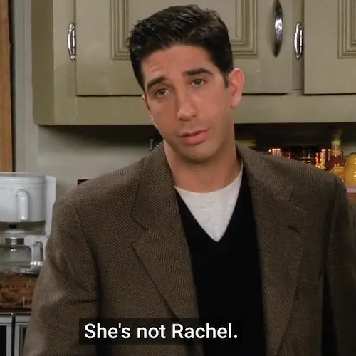

جایزهٔ بهترین سکانس تاریخ هم می‌رسد به آن قسمت از فصل دوم فرندز که راس باید بین جولی و ریچل یکی را انتخاب کند. به پیشنهاد چندلر تصمیم می‌گیرند نکات مثبت و منفی هر کدام را فهرست کنند:

<b>Joey:</b> Let's start with the cons
because they're more fun.
Ha-ha-ha. Rachel first.

<b>Ross:</b> I don't know.
I mean...
 
All right, I guess you can say
she's a little spoiled sometimes.

<b>Joey:</b> You could say that.

<b>Ross:</b> Yeah.
I guess, you know, sometimes
she's a little ditzy, you know?
 
And I've seen her be a little
too into her looks.
 
Uh. Oh, and Julie and I have
a lot in common because we're both
paleontologists, right?
But Rachel's just a waitress.

<b>Chandler:</b> Waitress!
Got it.
What else?

<b>Ross:</b> I don't know.

<b>Joey:</b> Oh, her ankles are a little chubby.

<b>Chandler:</b> Okay, let's do What Julie. 's wrong with her?

<b>Ross:</b> She's not Rachel!

