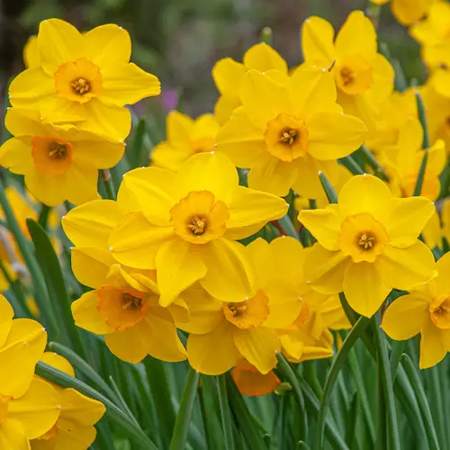

Image on <a href="https://www.colorblends.com/wholesale/daffodils/cornish-dawn/">colorblends</a>

ای نگارا شود آیا که تو ایثار کنی  
با نگاهی که سحر بر من بیمار کنی

حیف آن نرگس مست است که بر من افتد  
این چنین من به نگاهت تو بدهکار کنی

گل نرگس که نخندد علت هجر تو است
کاش با آمدنت شاد دل خار کنی

هر سعادت که بیابم ز تو باشد جانا  
پاره کاغذ به نگه برگ بهادار کنی

من که دانم به تفقد تو نیایی بر ما  
آنچه دشمن ننموده تو دگربار کنی

عاقبت ناز کنی ناز کنی جان بدهم  
خویش را در غم مرگ من عزادار کنی