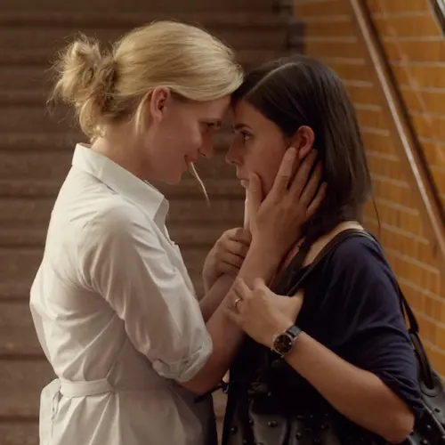

**مرا ببوس** با نام دیگر **با هر تپش قلب** یک فیلم  درام محصول سال ۲۰۱۱ سینمای سوئد است.

موضوع فیلم عشق میان دو زن است. حیفم می‌آید که اسم همجنس‌گرایی یا هر نام دیگری روی آن بگذارم. رابطهٔ جنسی تنها بخشی از این قبیل رابطه‌ها است. عمدهٔ مسئله همان عشق است که مرد و زن نمی‌شناسد. خواه کسی که درگیر است این موضوع را بفهمد یا نه. 

در این نوشته نه در پیِ آنم که پدیده‌ای را توجیح یا کسی را قضاوت کنم. فقط قصد کرده‌ام که به این مسئله از زاویه‌ای دیگر بنگرم که خوانندهٔ بی‌قصد و غرض پس از مطالعه خود گواه خواهد بود.

خداوند حکیم در قرآن می‌فرماید:

>  نَفَخْتُ فِيهِ مِنْ رُوحِي‌ (ص، ۷۲)

یعنی مقام خداوند پایین آمده و در انسان قرار گرفته است. خداوند متعال جنبهٔ فاعلی محض است. مردانگی و زنانگی در او راه ندارد. در مورد انسان نیز به همین گونه است و در اصل او، که مقام روح است زنانگی و مردانگی وجود ندارد و جنبهٔ انفعالی (انوثیت یا زنانگی) که در این عالم با آن روبرو هستیم مختص همین عالم است و خداوند آن را به جهت بقای نسل انسان‌ها قرار داده است. 

خداوند که عالم ماده (و البته عالم مثال) را خلق کرد، باید راهی را برای ورود ما انسان‌ها به آن تعبیه می‌کرد، خواه به واسطهٔ توالد و تناسل متعارف باشد، یا خلق دفعی و یا بسان حضرت عیسی خلق بدون پدر. و مصلحت بر آن قرار گرفت که شیوهٔ توالد و تناسلی که امروز می‌شناسیم انتخاب شود چه طور که اراده کرد و آدم و حوا و یا حضرت عیسی‌بن‌مریم را به مصلحتی از راهی دیگر به این دنیا آورد که:

> لَا يُسْأَلُ عَمَّا يَفْعَلُ (انبیاء، ۲۳)

و به مجرد اینکه این دنیا پایان یابد، دیگر بقای نسل معنایی نخواهد داشت و در نتیجه این جنبه فاعلی و انفعالی (مردانگی و زنانگی) که در این دنیا با آن روبرو هستیم وجود نخواهد داشت و مرد و زن همه یکسان محشور خواهیم شد.

و حال اگر چه در این دنیا تحت تأثیر شهوات هستیم اما همچنان خیلی از احساساتی که تجربه می‌کنیم تحت تأثیر عوالم بالاتر از ماده است. از جمله عشق و علاقه و دوستی که در بدو عمل اصولاً یک مسئله جنسی نیست. شما وقتی در ذهنتان می‌آید که من فلان شخص را دوست دارم عموماً به جنسیت او فکر نمی‌کنید. یک مادر که فرزندنش را دوست می‌دارد، یا خیلی‌ها که نسبت به یک انسان بزرگ و والا مقام عشق و علاقه‌ای در خودشان احساس می‌کنند اصلاً مسئله جنسیت را مد نظر خودشان قرار نمی‌دهند.

البته این مخالف است با بعضی از مطالبی که امروزه مطرح می‌شود که همه چیز ریشه در شهوات دارد و از این دست مسائل.

در مقابل این دست نظریه‌ها، نظریه‌ٔ اول ادعا می‌کند شهوت ذاتی انسان نیست. یعنی خداوند متعال که به طور ذاتی صفاتی مثل تعقل، رحمت و عطوفت را در انسان قرار داد، انسان را شهوانی نیافرید و هر چه از شهوت که در انسان پدیدار می‌شود همه در اثر برخورد با محیط است. (البته مسئله در مورد حیوانات متفاوت است.) 

صاحبان این نظریه ادعا می‌کنند كه اگر پسر و دختری را از ابتدا در یک جنگل بگذارند به طوری که هیچ‌گونه از مسائل خارجی حتی حیوانات در آنجا نباشد، این‌ها بدون اینكه نسبت به مسائل شهوانی و مسائل حسّی و هوسی توجه داشته باشند تا آخر عمر با هم زندگی می‌كنند. البته بررسی و داوری چنین ادعایی به صورت تجربی بسیار مشکل است. از راه دیگری باید به جواب مسئله رسید.

خرمشاهی ضمن بحثی با عنوان حافظ و همجنس‌گرایی در حافظ‌نامه می‌نویسد:

> صدرالمتألهین بحث مفصلی دربارهٔ عشق ظریفان و نوجوانان و خوبرویان دارد و می‌گوید که حکما در ماهیت این عشق و اینکه نیک است یا بد اختلاف دارند. بعضی آن را کار بیکارگان می‌شمارند و بعضی به ماهیت آن پی نبرده‌اند و آن را مرض نفسانی و بعضی جنون الهی می‌انگارند ولی چون نیک بنگریم و درست بیندیشیم و به اسباب کلی و مبادی عالی و غایات حکمت‌آمیز آن توجه کنیم چنین برمی‌آید که این عشق-یعنی لذت بردن شدید از صورت زیبا و شیفتگی به کسی که رفتار و کردار دلنشین و تناسب اعضا و ترکیب خوش دارد-از آنجا که بسان امر طبیعی در سرشت اکثر مردم، بدون تکلف و تصنع هست، از نهاده‌های الهی [الاوضاع  الالهة] ایست که مصالح و حکمت‌هایی بر آن مترتب است و لاجرم نیک و پسندیده است، علی‌الخصوص که انگیزه‌های والا و اهداف شریف داشته باشد.

به همین اندازه اکتفا می‌کنم که آنچه باید، گفته شد و آن کس که را که غرضی نبود غرض ما دریافت.

میا که در آستانهٔ ازدواج قرار دارد دل به فریدا می‌بندد و این عشق تمام زندگی‌اش را تغییر می‌دهد.

بهترین سکانس فیلم هم آن جایی است که:

<b>Mia:</b> It's hard for me, Frida. I'm not brave like you.
I just wish people wouldn't ask questions.

<b>Frida:</b> I want them to ask questions. I'm proud of you. 
I want to show the world how much I love you.

