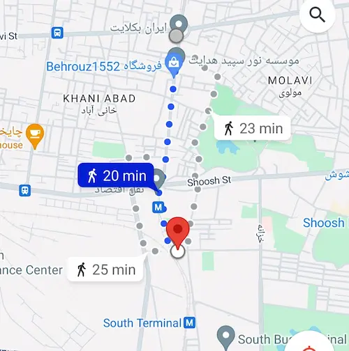
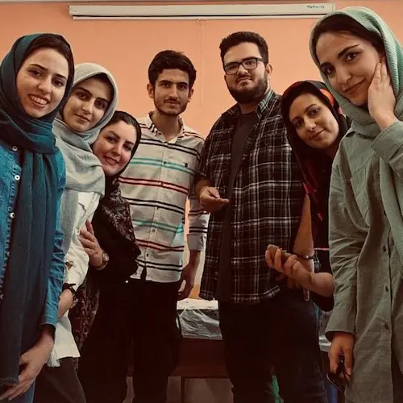

<!--

Generated by <a href="https://www.bing.com/images/create/a-tired-boy-with-his-head-on-his-desk2c-alone-and-w/1-665600a4c07447cab5ccad973f402141?id=KKPJsOo4KsTMs41Fccdfmw%3D%3D&view=detailv2&idpp=genimg&noidpclose=1&thId=OIG2.kH.YxjNHkZpJ1Z7nXYZM&FORM=SYDBIC&ssp=1&safesearch=moderate&setlang=en&cc=XL&PC=SANSAAND">Microsoft Copilot</a>

-->
میدان محمدیه پیاده می‌شوم. نقشهٔ گوگل مسافت یک و نیم کیلومتر و زمان تقریبی ۲۰ دقیقه را نشان می‌دهد. زمان کافی دارم که با خیال راحت این مسافت را قدم بزنم. بیست و چند دقیقه‌ای مانده به ده که می‌رسم جلوی در مرکز. چند مرتبه‌ای در می‌زنم و کسی باز نمی‌کند. زنگ هم انگار قطع است. باید محکم‌تر در بزنم اما می‌ترسم بی‌ادبی باشد. شمارهٔ خانم باقری را از داخل گروه پیدا می‌کنم و زنگ می‌زنم. هنوز خانم باقری جواب نداده که مهسا هم می‌رسد. مهسا سلام می‌کند و همزمان خانم باقری هم تلفن را جواب می‌دهد. دستی برای مهسا تکان می‌دهم و در همان حال به خانم باقی می‌گویم:

> سلام خانم باقری! چند تا از بچه‌های کودکان فرشته‌اند هستیم. پشت دریم.

گاهی اوقات احساسات آدم‌ها را از پشت تلفن هم می‌شود فهمید. مثل امروز که معلوم بود خانم باقری چه بی‌اندازه از آمدن‌مان خوشحال است. فوری در را باز می‌کند. انگار پشت در نشسته باشد. دو تا از بچه‌ها قبل از ما رسیده‌اند. مادر یکی‌شان هم هست. سلامی می‌کنم. گیجم و اضطراب دارم.

خانم باقری سعی می‌کند تا هنوز خلوت است و کسی نیامده خیلی سریع ما را با مرکز آشنا کند و کلاس‌ها را نشانمان بدهد. کلاس‌های طبقه‌ٔ بالا را نشانمان می‌دهد و خودش برمی‌گردد پایین. مقرر شده که من و نسا و ساره مربی کلاس خلاقیت باشیم و مهسا و فاطمه و شانیا هم مربی کلاس سفالگری! محمدرضا هم باید به بچه‌ها کامپیوتر آموزش بدهد و برایشان قصه بگوید. 

می‌روم سر کلاس سفالگری و شروع می‌کنم با مهسا حرف زدن. همان سؤالات همیشگی را از هم می‌پرسیم:
- چگونه با کودکان فرشته‌اند آشنا شده‌ایم؟
- چه مدت است داوطلب کودکان فرشته اند هستیم؟
- فعالیت‌مان در خیریه به چه میزان است؟
-  ...

هنوز کسی نیامده. حوصله‌مان سر می‌رود. شروع می‌کنیم به گل بازی.

لختی بعد نسا و ساره هم می‌رسند. چند دقیقه‌ای از ده گذشته است که خانم باقری بچه‌ها را به کلاس‌ها سوق می‌دهد. هفت هشت نفری می‌شوند. همه را دور یک میز بزرگ می‌نشانیم. یکی دو نفر هم دیرتر می‌آیند و می‌شوند ده نفر. از مهسا پرسیده بودم که آیا قبلاً هم با بچه‌های استثنایی کار کرده است و جواب **نه** شنیده بودم. جواب خودم هم **نه** بود. نسا و ساره دیر آمدند و همزمان با ورودشان بچه‌ها هم وارد شدند و فرصت نشد که بپرسم. 

بچه‌ها متفاوتند. با نیازها و توانایی‌های متفاوت. از این اختلالات چیزی سر در نمی‌آورم و این سر در نیاوردن آزارم می‌دهد.

تعدادی برنامه از پیش آماده کرده‌ایم. کشیدن نقاشی، یادگیری اشکال هندسی و ساخت آنها با چوب‌بستنی‌های رنگی و هم‌چنین ساخت برج با لیوان‌های کاغذی از برنامه‌هایمان است. 

وقتی داریم با لیوان‌ها برج می‌سازیم از زهرا می‌پرسم که تو هم می‌خواهی که برج بسازی؟ سرش را تکان می‌دهد که نه و مدادش را بر می‌دارد و به نقاشی کردن ادامه می‌دهد. کمی بعدتر اما انگار از نقاشی خسته شده باشد بهم می‌گوید که  برج بسازیم. با کمک هم لیوان‌ها را روی هم می‌چینیم و برج می‌سازیم. ساره را صدا می‌زند و با خوشحالی برجی که ساخته‌ایم را نشانش می‌دهد.

بعدتر شب خیلی اتفاقی صحبت از غربال‌گری و سقط جنین می‌شود. تصویر نیایش و زهرا از جلوی چشمانم نمی‌رود. این قدری بچه‌ها به دلم نشسته‌اند که نمی‌توانم بپذیرم جواز سقط جنین را. بچه عزیز است، پسر یا دختر، سالم یا ناقص.

 همین حالا هم اگر از مادران این بچه‌ها با وجود تمام مشقت‌هایی که با آن روبرو هستند بپرسی، همهٔ‌شان حاضرند هزار بار زنده زنده سوزانده بشوند اما خطی به فرزندشان نیفتند. 

مائده هم یکی از همراهان امروزمان است. عضوی از تیم تولید محتوا. با تلفن همراهش از کلاس‌ها عکس می‌گیرد. کلاس تمام می‌شود و بچه‌ها و مادرانشان می‌روند. یک عکس یادگاری گروهی می‌گیریم و می‌رویم طبقهٔ پایین پیش خانم باقری. 

برایمان شربت درست می‌کند. شربت را میان بچه‌ها پخش می‌کنم و گپ و گفت کوتاهی با خانم باقری داریم. کلی ازمان تشکر می‌کند و درس اول را یادمان می‌دهد:

> هر وقت مامان‌‌هاشون ازتون پرسیدند که بچه‌مون چطور بود؟ در جوابش بگید که عالی بود! نمی‌دونید که چقدر ذوق می‌کنند از شنیدن این جمله! همین براشون کافیه!

همه می‌روند. من می‌مانم تا هم نمازم را بخوانم و هم کمی بیشتر با خانم باقری حرف زده باشم. 

با خانم باقری چرخی در حیاط می‌زنیم. آلاچیق نیمه‌کاره را نشانم می‌دهد. حواسش به همه چیز هست. تمام تلاشش را می‌کند تا مرکز را سرپا نگه دارد. می‌گوید در همین مدت زمان کوتاهی که بچه‌ها در مرکز هستند اگر یکی از کلاس‌هایمان را بتوانیم در فضای آزاد برگذار کنیم خیلی در روحیهٔ بچه‌ها تأثیر مثبت دارد. امکانات و ابزارهایی را که در اختیار دارند را نشانم می‌دهد. خوشحال است از اینکه یک مکان تمیز و با امکانات مناسب در اختیار دارد. ناراحت است اما از این که آموزش و پرورش مربی نمی‌دهد. خودش تنها همهٔ‌ کارها را انجام می‌دهد. صبح می‌آید، همه چیز را آماده می‌کند و در نهایت ظهر هم اول همه جا را مرتب می‌کند و بعد می‌رود. سعی می‌کنم جارو را از دستش بگیرم که اجازه نمی‌دهد. با خوشحالی می‌گوید:

> من کارم را دوست دارم. هیچ از این که اینجا را جارو می‌زنم ناراحت نیستم. 

بعد کمی چهره‌اش در هم می‌رود و ادامه می‌دهد:

> مشکلم اینه که تنهایی کاری از دستم بر نمی‌آید. اگر شماها نیایید من تنهایی چه از دستم بر می‌آید؟ حیف این امکانات نیست که بی‌استفاده بماند؟

و اضافه می‌کند که:

> بیش‌تر خانواده‌هایشان هم وضع مالی خوبی ندارند که بتوانیم هزینه‌ای دریافت کنیم.

و تلخ‌ترین قسمت مکالمهٔ‌مان هم آنجایی است که می‌پرسد:

> شما فقط چهارشنبه‌ها می‌توانید بیایید؟