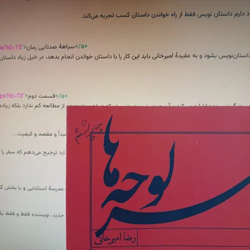

رضا امیرخانی در یادداشت‌های پراکنده‌اش که در کتابی با نام **سرلوحه‌ها** چاپ شده‌ است یادداشتی دارد با عنوان **آموزش داستان نویسی به زبان ساده** که در دو قسمت نوشته شده است. امیرخانی در
<a href="http://ermia.ir/contents.aspx?id=14">قسمت اول</a>
می‌نویسد:
> حتا دوزار هم به آموزش داستان نویسی به شیوهٔ مرسوم اعتقادی ندارم ... من اعتقاد دارم داستان نویس فقط از راه خواندن داستان کسب تجربه می‌کند.

توالی یادداشت‌ها را که در نظر بگیریم، یادداشت بعدی یادداشتی است با عنوان 
<a href="http://ermia.ir/contents.aspx?id=15">سیاههٔ صدتایی رمان</a>
که امیرخانی در آن ۱۰۹ رمان خوب از نظر خودش را فهرست می‌کند تا آنکه می‌خواهد داستان‌نویس بشود و به عقیدهٔ امیرخانی باید این کار را با داستان خواندن انجام بدهد، در خیل زیاد داستان‌های ضعیف مفرّی داشته باشد به چهار تا داستان به‌درد‌بخور.

یادداشت بعدی 
<a href="http://ermia.ir/contents.aspx?id=73">قسمت دوم</a>
 **آموزش داستان‌نویسی به زبان ساده** است. امیرخانی در این یادداشت به آبشخور دیگر نویسنده اشاره می‌کند و آن چیزی نیست جز سفر که در اهمیت چیزی کم از مطالعه ندارد بلکه زیاده هم داشته باشد. امیرخانی در این یادداشت می‌نویسد:

> سفر، دستِ کم دو حسن دارد. اول، احتمالِ برخورد با تجاربی جدید و دوم، پاره‌گی چرتِ عادت‌های روزمره. این دو حسنِ تضمین‌شدهٔ هر سفری هستند. فارغ از مبدأ و مقصد و کیفیت...

در عوض آنکه سفر را از روی دهخدا معنی کنم که سفر در مقابل حضر است و به معنای بریدن مسافت و بعد هم اشکال کنم که هر سفری لزوماً این دو حسن را ندارد ترجیح می‌دهم که سفر را از نو معنا کنم:

> وقعه‌ای را گویند که دو حسن داشته باشد: نخست برخورد با تجاربی جدید و دوم پاره‌گی چرت عادت‌های روزمره.

با این تعریف جدید دیگر لازم نیست گذرنامه بگیری و چمدان ببندی و چندده میلیون بلکه چندصد میلیون هزینه کنی. گاهی حضور نیم روزه در یک بیمارستان روانی، مدرسهٔ استثنایی و یا بخش کودکان بیمارستان سوانح سوختگی و ... چنان چرت عادات‌ روزمره‌ات را پاره می‌کند و با تجارب جدید آشنایت می‌کند که هیچ کدام از آن سفرهای معمول چنین کاری نمی‌کند.

بعلاوه چنانچه امیرخانی هم تعریف سفر را آنچه ما نوشتیم قرار می‌داد دیگر لازم نبود آبشخور نویسنده را به داستان‌خوانی و سفر کردن تقسیم کند که با این تعریف جدید، نویسنده فقط و فقط یک آبشخور دارد و آن سفر است و بس که خواندن یک کتاب بدیع هم چرت عادات روزمره را پاره می‌کند و خود را در تعریف سفر جا می‌دهد. 

اصلاً با این تعریف معنای سفر چنان توسعه می‌یابد که هر چه خیر است در سفر است و هر چه را که در آن خیری نیست سفر نیست.

بیخود نیست که عرفای ما توجه دل به حق را سفر نام نهاده‌اند که اسفار چهار باشد: سفر من الخلق الی الحق، سفر بالحق فی الحق، سفر من الحق الی الخلق بالحق و سفر فی الخلق بالحق.

آری. ایها‌الناس بشتابید به سوی سفر ...