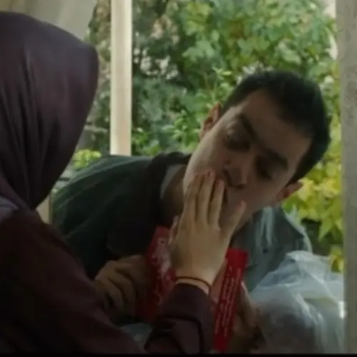

<!--

Generated by <a href="https://www.bing.com/images/create/a-tired-boy-with-his-head-on-his-desk2c-alone-and-w/1-665600a4c07447cab5ccad973f402141?id=KKPJsOo4KsTMs41Fccdfmw%3D%3D&view=detailv2&idpp=genimg&noidpclose=1&thId=OIG2.kH.YxjNHkZpJ1Z7nXYZM&FORM=SYDBIC&ssp=1&safesearch=moderate&setlang=en&cc=XL&PC=SANSAAND">Microsoft Copilot</a>

-->

حوض نقاشی روایت‌گر قصهٔ بسیاری از ما است.

حوض نقاشی یادآور سؤال خانم معلم است وقتی پرسید:

> بچه‌ها هر کسی خودش رو معرفی کنه و شغل پدرش رو بگه.

و دانش‌آموزی که قلبش تپیدن گرفت چون از گفتن شغل پدرش خجالت می‌کشید.

یادآور روزی که پدر خسته با لباس کار به مدرسه آمد و فرزند خجالت کشید از اینکه در مقابل دوستانش با او روبرو شود.
 

یادآور مادری که هر ظهر با لباس محلی عاشقانه راهی مدرسه می‌شد تا غذای گرم را به فرزند برساند. فرزند اما ترجیح می‌داد مثل بقیه ساندویچ بخورد.

و فرزندی که بر سر مادرش داد کشید. مادر اما چیزی نگفت. فقط غصه خورد.

مریم (نگار جواهریان) و رضا (شهاب حسینی) دو کم‌توان ذهنی که با هم ازدواج کرده‌اند حالا یک فرزند ده ساله دارند. مریم و رضا با وجود همهٔ سختی‌هایی که با آن روبرو هستند هر روز به سر کار می‌روند. آن دو در یک شرکت داروسازی در بخش بسته بندی قرص‌ها کار می‌کنند. پس از تمام شدن ساعت کاریْ مریم به خانه می‌آید و کارهای خانه را سامان می‌دهد و رضا در یک بقالی در نقش یک پیک پیاده برای رساندن سفارش‌‌ها کمک می‌کند. 

آنچه که پیداست کم‌توانی رضا و مریم از نوع خفیف یا حداکثر متوسط است. آن‌ها تقریباً می‌توانند همهٔ فعالیت‌های روزانهٔ‌شان را بدون کمک انجام دهند. نویسنده خراب‌کاری‌هایی هم کرده است مثلاً در یک سکانس  می‌بینیم رضا در هنگام خریدن عینک کاملاً توانا عمل می‌کند در حالیکه در سکانس دیگر حتی یادگرفتن قیمت دو بطری شیر هم برایش سخت است. البته من اشکالی نمی‌گرفتم اگر رضا در مجموع همیشه توانا عمل می‌کرد اما این بالا و پایین‌ها جای تأمل دارد.

مریم هر شب کتلت می‌پزد چون غذای دیگری را بلد نیست. کتلت تکراری اگرچه سهیل را خسته می‌کند اما با این حال طعم عشق می‌دهد.

کم‌توان ذهنی بودن موضوعیت ندارد. بیش‌تر جنبهٔ نمادین دارد. آنچه در حوض نقاشی می‌بینیم پدیده‌ای است که در خیلی از خانواده‌‌ها به ویژه در قشر ضعیف جامعه دیده می‌شود. فرزندان خیلی زود بزرگ می‌شوند. همزمان با رشد جسم آن‌ها دنیایشان هم بزرگ می‌شود؛ بزرگتر از دنیای پدر و مادر و اینجاست که چالش‌ها شروع می‌شود.

حوض نقاشی یادآور روزی است که فرزند بزرگ می‌شود و بین او و مادرش فاصله می‌افتد. مادری که حفظ خانواده تمام دنیایش بوده و شاد کردن همسر و فرزندان تنها چیزی بوده که به آن می‌اندیشیده. و فرزند بزرگ می‌شود و دیگر نمی‌تواند به فضای خانواده، مادر و پدرش قناعت کند. می‌خواهد جهان را کشف کند و به آرزوهایش برسد و چه بسا دنیای کوچک پدر و مادرش را سدی در برابر آرزوهایش می‌بیند. این چنین روز به روز از پدر و مادرش دورتر می‌شود. 

مادر اما خودش را کنار می‌کشد و رضایت می‌دهد به آنچه فرزندش را شاد می‌کند.

فرزند همچنان بزرگ و بزرگ‌تر می‌شود. آن قدری که می‌فهمد تمام دنیا را هم که داشته باشد، هیچ چیز جای پدر و مادرش را نمی‌گیرد. آنجاست که می‌فهمد چه قدر پدر و مادرش را دوست دارد...

