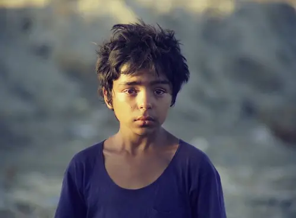

<!--

Generated by <a href="https://www.bing.com/images/create/a-tired-boy-with-his-head-on-his-desk2c-alone-and-w/1-665600a4c07447cab5ccad973f402141?id=KKPJsOo4KsTMs41Fccdfmw%3D%3D&view=detailv2&idpp=genimg&noidpclose=1&thId=OIG2.kH.YxjNHkZpJ1Z7nXYZM&FORM=SYDBIC&ssp=1&safesearch=moderate&setlang=en&cc=XL&PC=SANSAAND">Microsoft Copilot</a>

-->

**دونده** داستان کودکی است (امیرو) که در دنیای آدم بزرگ‌ها تنها روزگار می‌گذراند. 

امیرو برای گذران زندگی زحمت می‌کشد؛ کفش واکس می‌زند، شیشه جمع می‌کند و آب خنک می‌فروشد. 

جایی می‌بینیم که دوچرخه‌سواری لیوانی آب می‌خورد و بی‌آنکه پول آب را بدهد می‌رود. امیرو پیاده او را دنبال می‌کند. مدت زیادی به دنبال او می‌دود تا به او برسد. 

**دونده** ستایشگر تلاش و کوشش است. 

امیرو بعد از رسیدن به دوچرخه‌سوار، بدون هیچ کینه و نفرت دستش را جلو می‌برد و می‌گوید که "پول آب! یه قّرون می‌شه!" پول را می‌گیرد، لبخند می‌زند و می‌رود …

**دونده** ستایشگر صفا و صمیمیت است.

**دونده** نشان از آن دارد که کودکان به توحید نزدیک‌ترند که قال رسول الله:

> إنِّی‌ أُحِبُّ مِنَ الصِّبْیَانِ خَمْسَةَ خِصَالٍ: الاوَّلُ أَنَّهُمُ الْبَاكُونَ؛ الثَّانِی‌ عَلَی‌ التُّرَابِ یَجْتَمِعُونَ؛ الثَّالِثُ یَخْتَصِمُونَ مِنْ غَیْرِ حِقْدٍ؛ الرَّابِعُ لَایَدَّخِرُونَ لِغَدٍ؛ الْخَامِسُ یُعَمِّرُونَ ثُمَّ یُخَرِّبُونَ. (روح مجرد، ۵۹۷)

**ترجمه:** «من‌ پنج‌ كار اطفال‌ را دوست‌ دارم‌: اوّل‌ آنكه‌ پیوسته‌ گریانند؛ دوّم‌ آنكه‌ بر سر خاک گِرد می‌آیند؛ سوّم‌ آنكه‌ بدون‌ حقد و كینه‌ با هم‌ دعوا می‌كنند؛ چهارم‌ آنكه‌ برای‌ فردا چیزی‌ را ذخیره‌ نمی‌نمایند؛ پنجم‌ آنكه‌ خانه‌ می‌سازند و سپس‌ آنرا بدست‌ خودشان‌ خراب‌ می‌كنند.»

امیرو را اذیت می‌کنند، حقش را می‌خورند و به او ظلم می‌کنند. او اما از همهٔ این‌ها تنها یک درس می‌آموزد: برای رسیدن به آرزوهایش باید بیشتر تلاش کند و مصمم‌تر ادامه دهد.

امیرو گاهی برای دفاع از حقش با کسی درگیر می‌شود اما این او را عوض نمی‌کند و از او یک **آدم بزرگ بد** نمی‌سازد. او بزرگ می‌شود اما هنوز صفا و صمیمیت کودکانه‌اش را دارد.

امیرو می‌فهمد که جهان او نه غم یک لقمه نان است که آن را خدا ضامن است که او را برای هدفی بزرگ‌تر آفریده‌اند…

او همچنان مصمم ادامه می‌دهد؛ پیروز می‌شود و در زیباترین شکل ممکن شادی حاصل از پیروزی‌اش را با دوستانش تقسیم می‌کند.

**دونده**‌ نشان می‌دهد با وجود صفا و صمیمیت می‌توان همچنان شاد بود؛ اصلاً هر چه شادی است در صفاست که آن را که صفایی نیست دلی شاد چگونه باشد؟ 

آری؛ **دونده** نشان از جریان روح توحید در جهان دارد… 