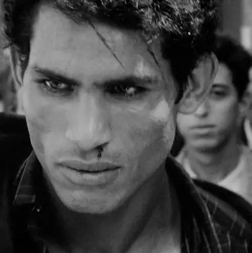
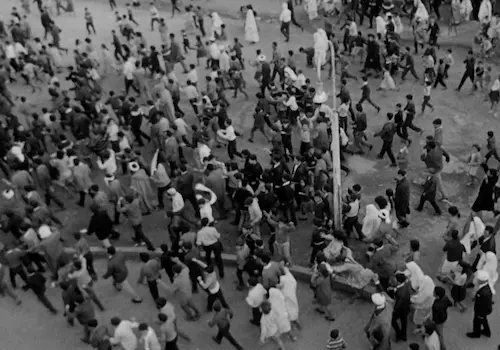
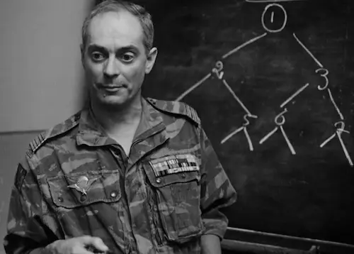

 <a href="/user/pages/03.blog/0082.the-battle-of-algiers/The.Battle.Of.Algiers.1966.1080p.BluRay.x264.AAC-[YTS.MX].srt">دانلود زیرنویس فارسی هماهنگ با نسخه YTS</a>

در فضای سرد انتخابات تلویزیون را خاموش می‌کنم و در عوض تماشای مناظره به تماشای فیلمی می‌نشینم که در سال ۱۹۶۶ یعنی ۱۳ سال پیش از انقلاب اسلامی ایران ساخته شد.

نبرد الجزیره که در ایران به اشتباه به نبرد الجزایر معروف است نام فیلمی است ایتالیایی به کارگردانی جیلو پونته کوروو. 

نبرد الجزیره قصهٔ تلاش مردم الجزایر است برای رهایی از استعمار فرانسه. این قصه از ۱۹۵۴ شروع می‌شود و به کشته شدن علی لاپوآنته در سال ۱۹۵۷ می‌انجامد. کشته شدن علی پوآنته، آخرین عضو باقی مانده از جبهه آزادی ملی، به نوعی نشان دهندهٔ موفقیت فرانسه در سرکوب کردن اعتراضات است.

 اما ناگهان وقتی کمتر از ده دقیقه از فیلم باقی مانده است با تصاویری روبرو می‌شویم که نشان از یک اعتراض گسترده در سال ۱۹۶۰ دارد. 

راوی می‌گوید:

> به دلیل نامشخص و به دلیل یک انگیزهٔ مخفی بعد از دو سال آرامش و سکوت نسبی شاهد آشوبی بدون اخطار هستیم و هیچ کس چرایی و چگونگی این امر را نمی‌داند. من با یکی از رؤسای جبههٔ آزادی ملی که در تبعید است حرف زدم، اما او هم چیزی نمی‌دانست…

و یکی دو دقیقهٔ بعد می‌شنویم:

> جنگ بیش از دو سال است که هنوز هم ادامه دارد… 

و بالأخره در ۲۲ جولای ۱۹۶۲ ملت الجزایر پیروز می‌شوند و فرانسه خاک کشورشان را ترک می‌کند.

یک بار دیگر به اعداد و ارقام نگاه کنیم. یک ساعت و پنجاه دقیقه شاهد مبارزات سه سالهٔ جبههٔ آزادی ملی هستیم و درست در لحظه‌ای که انگار می‌کنیم فرانسه پیروز شده باشد، در عرض کمتر از ده دقیقه ۵ سال می‌گذرد و شرایط به نحوی رقم می‌خورد که فرانسه خاک الجزایر را ترک می‌کند.

نبرد الجزیره یک فیلم تصنعی نیست. همه چیز آن قدری زیبا به تصویر کشیده شده است که انگار می‌کنی با یک فیلم مستند مواجهی. از تعریف و تمجید‌ بیش‌تر صرف نظر می‌کنم و می‌روم به آنجایی از فیلم که سرهنگ متیوی فرانسوی که مأموریت سرکوب مقاومت را به او سپرده‌اند در جلسه‌ای می‌گوید:

> تعداد چهارصد هزار عرب در الجزیره هستند. آیا همهٔ آنها دشمن ما هستند؟ معلومه که نه! اما اقلیت کوچکی هستند که ایجاد وحشت و خشونت می‌کنند. ما باید با این اقلیت وارد معامله بشیم تا اینکه آن‌ها را جداسازی کنیم و از بین ببریم. این اقلیت به صورت آزادنه و زیرزمینی فعالیت می‌کنند و از روش‌های انقلابی و شورش برانگیز امتحان شده به همان خوبی تاکتیک‌های اصلی استفاده می‌کنند. این دشمن ناشناس و غیر قابل شناسایی با صدها نوع دیگر ترکیب شده و همه جا هست: در کافه‌ها، کوچه‌های قصبه یا هر خیابان منطقهٔ اروپا نشین … چطور می‌توانیم آن‌ها را شناسایی کنیم؟ کارت‌های شناسایی مزخرفند… دشمن ما یک سازمان هرمی است و ساختاری هندسی دارد به این شکل که هر عضوی دو عضو جدید پیدا می‌کند. دلیل این ساختار هندسی این است که هر عضو سازمان فقط سه عضو دیگر را می شناسد:
فردی که او را انتخاب کرده است و دو نفری که خود آن‌ها را انتخاب می‌کند. تماس و ارتباط فقط به صورت نوشتاری است و برای همین ما دشمن را نمی‌شناسیم چون در حقیقت، آن‌ها خودشان همدیگر را نمی‌شناسند. شناختن آن‌ها به منزله حذف شدن آن‌ها است. در نتیجه، به‌طور کلی جنبه نظامی اهمیت کمتری برای ما دارد و جنبه پلیسی قضیه است که بیشترین اهمیت را دارد. ما باید که تحقیق کنیم تا هرم را از نو بسازیم و هویت مدیر کل اجرایی آن را تعیین کنیم و اساس کار ما اطلاعاتی و جاسوسی است. با چنین روشی مطمئناً به جواب می‌رسیم. در موقعیت ما، ملاحظات انسانی فقط به ناامیدی و اغتشاش و آشفتگی منجر می‌شود. اما متأسفانه، موفقیت برنامه فقط به ما بستگی ندارد. ما نیاز داریم که شهر در اختیار ما باشد و بتوانیم کاملاً شهر را بگردیم و از تمام ساکنان سؤال کنیم. اما اینجا است که وارد مارپیچی از نیروهای پلیس می‌شویم که این اجازه را به ما نمی‌دهند. ما درخواست آزادی عمل کرده‌ایم و برای اینکه به این آزادی برسیم به موقعیتی نیاز داریم که دخالت ما را توجیه کند و امکان دخالت ما را به وجود بیاورد.

و بعد اضافه می‌کند:

> ما خودمان باید این موقعیت را به وجود بیاوریم…

و این جمله چه‌قدر مرا به یاد ویدیویی که این چند روزه از روح الله زم بازنشر می‌کنند می‌اندازد. آنجایی که می‌گوید:

> امثال روحانی و ظریف مذاکره نمی‌کنند که فشار اقتصادی برداشته بشه برعکس به مردم فشار اقتصادی میارن که کشور مجبور به مذاکره بشه! پایان تحریم برای این‌ها یعنی پایان هم‌نشینی با کدخداشون! تا اینها باشند بساط تحریم نفتی و گرونی بنزین و آشوب خیابانی برقراره. 

این نوشته یک نوشتهٔ سیاسی نیست که پیش‌تر تکلیفم را مشخص کرده‌ام. حرف‌های روح‌الله زم هم اعتباری ندارد. نوشتم که اعتراف کنم تا به حال از این زاویه نگاه نکرده بودم…