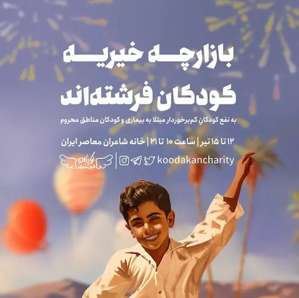

بعد از یک روز نه چندان سخت اینترنت گوشی‌ام را روشن می‌کنم؛ فاطمه از کودکان فرشته اند برایم پیام گذاشته‌ است که:

> سلام روزتون بخیر آقای شعبانی شما میتونید روز دوشنبه برای چیدن بازارچه همراهمون باشید؟

۱۲ تا ۱۵ تیر بازارچه داریم. بازارچهٔ این هفته در خانهٔ شاعران معاصر واقع در خیابان شهید کلاهدوز (دولت) مثل همیشه به نفع کودکان کم‌برخوردار مبتلا به بیماری و کودکان مناطق محروم سیستان و بلوچستان برگزار می‌شود.

روند کار خیریه به این شکل است که برای هر فعالیتی در گروه تلگرامی‌مان اطلاع‌رسانی می‌شود تا داوطلب‌هایی که در وقت اعلام شده آزاد هستند در صورت تمایل همکاری داشته باشند. برای فعالیت دوشنبه هم از یکی دو روز قبل در گروه اطلاع‌رسانی شده بود. حالا پیام خصوصی داده‌اند که آیا می‌توانید همراهمان باشید؟

پیام را که می‌بینم بهم می‌ریزم. می‌خواهم در جواب بنویسم که:

> سلام! توی گروه اطلاع‌رسانی شده بود. اگر می‌خواستم همراهتون باشم بهتون اطلاع می‌دادم!

بعد یاد روایت سید‌الشهدا می‌افتم که:

> و اعلموا انّ حوائج الناس الیکم من نعم الله علیکم؛ فلا تملّوا النعم فتحور نقماً (لمعات الحسین، ص ۱۹)

**ترجمه:** و بدانید که حوائج مردم به شما از جملهٔ نعمت‌های خداوندی است بر شما؛ پس با این نیازمندی‌ها با ملال و خستگی مواجه نشوید تا آن نعمت‌ها به مکافات و انتقام تبدیل نشود.

آن قدری ایمان ندارم که از مکافات و انتقام بترسم. روایت حضرت امیر دستم را می‌گیرد:

> وَ الْفُرْصَةُ تَمُرُّ مَرَّ السَّحَابِ، فَانْتَهِزُوا فُرَصَ الْخَيْرِ. (نهج‌البلاغه، حکمت ۲۱)

**ترجمه:** فرصت‌ها همچون ابرها می‌گذرند. از اين رو، فرصت‌هاى نيک را غنيمت شماريد و پيش از آنکه از دست بروند، از آن‌ها استفاده کنيد.

می‌ترسم. می‌ترسم از آن روز که دیگر کسی نپرسد که:

> آقای شعبانی می‌توانید همراهمان باشید؟

از آن روزی که دیگر آقای شعبانی به درد هیچ کاری نخورد. از آن روزی که سرم را بگیرم رو به آسمان، ببینم که خدا دارد بهم پوزخند می‌زند:

> تو بودی که می‌گفتی کار دارم؟ تو بودی که می‌گفتی چه جور به خودشان اجازه داده‌اند که پیام خصوصی بگذارند و مزاحمم بشوند؟ حالا خوب شد؟ راضی شدی؟ همه را از تو منصرف کردیم که دیگر کسی مزاحمت نشود. حالا برو هر غلطی دلت می‌خواهد بکن…

می‌گویند خدا رحمان و رحیم است، به بنده‌اش پوزخند نمی‌زند ولی باز می‌ترسم. می‌ترسم از آن روزی که رو به آسمان کنم و خدا را در لباس مادرم ببینم که می‌گوید:

> عیبی ندارد عزیزم! روزگاری به تو نیازمند بودند. قدر ندانستی و حالا امروز دیگر نیستند. صبر کن فرزندم که حالِ دوران دائما یکسان نباشد. صبر کن که اَلصَّبْرُ مَطِيَّةٌ لاَ تَكْبُو.

اما نه! مهربانی‌اش هم گرهی نمی‌گشاید. از قضا این یکی تلخ‌تر است. بیش‌تر می‌ترسم. با خودم می‌گویم:

> باشد! قبول! همراهشان می‌شوم!

می‌روم چیزی بخورم و بعد جواب فاطمه را بدهم. آن شکمی که پیغمبر فرموده:

> مَا مَلأ آدَمِيٌّ وِعَاءً شَرَّا مِنْ بَطْنِهِ

را پر می‌کنم و باز می‌گردم و روایت حضرت امیر را با استخوان‌هایم حس می‌کنم:

>  وَ الْفُرْصَةُ تَمُرُّ مَرَّ السَّحَابِ

پیامش را پاک کرده است. دنیا روی سرم خراب می‌شود. سرم را رو به آسمان می‌کنم اما خدا را نمی‌بینم. انگار قهر کرده باشد. کاش بود و پوزخند می‌زد. درد نبودنش بیش‌تر است. 

دستی به شکمم که حالا پر شده است می‌کشم. پوزخند می‌زند. اعتنایی نمی‌کنم و تلگرامم را باز می‌کنم. پیام‌ها می‌آیند. پیامش را پاک نکرده است. فقط نوتیفیکیشن پیامش بود که رفته بود. رو به آسمان می‌کنم. خدا را می‌بینم که لبخند محبت به لب دارد:

> فکر کردی تنهایت می‌گذارم؟

شرمنده می‌شوم و جواب فاطمه را می‌دهم:

> باشه چشم. فقط ساعت سه نمی‌رسم بیام دفتر. حوالی پنج اونجام.

خلاصه که من فردا می‌روم بازارچه را راه بیندازم، شما هم حواستان باشد که تا ابرها نگذشته‌اند فرصت را غنیمت شمارید که انّ حوائج الناس الیکم من نعم الله. بازارچهٔ کودکان فرشته‌اند را هم فراموش نکنید…