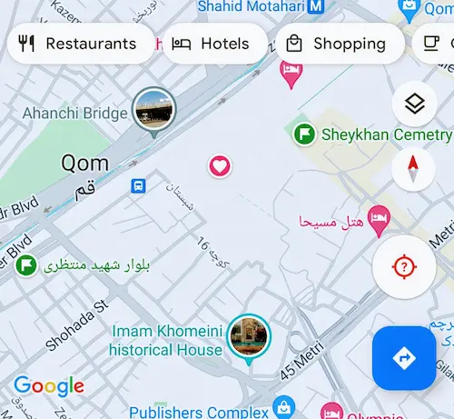
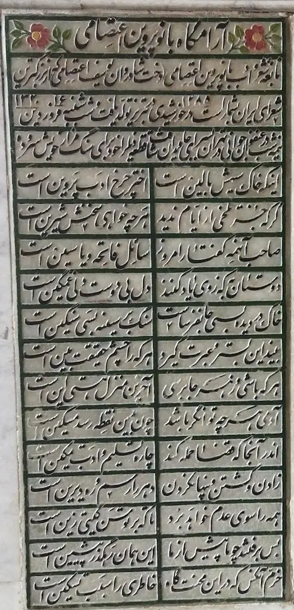
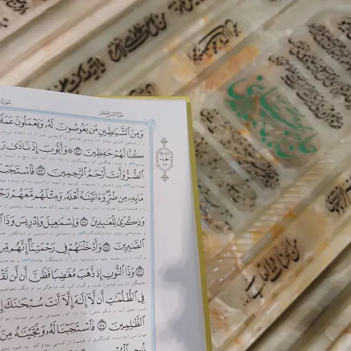

هفتهٔ پیش یک دوست قدیمی بعد از مدتی زیاد، شاید به بهانهٔ انتخابات، پیام داد و من هم به عنوان قدردانی با او تماس گرفتم و در عوض انتخابات دربارهٔ مسائل دیگری صحبت کردم.

بیش‌تر از یک سال است که قم مشرّف نشده‌ام. خرداد سال گذشته بود که چند هفته‌ای را مهمان حضرت معصومه بودم و حالا مدت‌هاست که قصد قم می‌کنم و جور در نمی‌آید.

دوستم که زنگ زد فرصت را غنیمت شمردم و گفتم که هفتهٔ بعد ان‌شاءالله یک روز را در قم هستم و خوش‌حال می‌شوم که ببینمش و او هم استقبال کرد و گفت که حتماً باخبرش کنم. 

پنجشنبه بود یا جمعه که به کمک اپلیکیشن **سبرا** برای سه‌شنبه بلیت قطار خریدم. 

1. تهران به قم، حرکت: ۱۰:۱۰
2. قم به تهران، حرکت: ۱۸:۳۰

چون معلوم نبود سه‌شنبه فرصت رفتن فراهم شود یا باز هم مثل قبل سعادت زیارت نیابم خبر کردن دوستم را گذاشتم برای دوشنبه و دوشنبه وقتی همه چیز میزان بود پیامی نوشتم که:

> سلام آقا به امید خدا من فردا مشرف میشم قم. ظهر می‌رسم و میرم حرم. برای بعد از ظهر اگر فرصتی داشتی خوشحال میشم ببینمت. ساعت ۶ هم حرکت می‌کنم به سمت تهران.

دوشنبه شب وقتی جوابی دریافت نمی‌کنم یاد این حکایت می‌افتم که روزی یکی از علمای تربت حیدریه قصد زیارت امام رضا می‌کند. همسر ایشان درخواست می‌کند که شما که مشرف می‌شوید، از مشهد یک جفت نعلین هم برای من بخرید. ایشان به سوی مشهد حرکت می‌کند، یک روز بعد باز می‌گردد و نعلین را تقدیم همسر می‌کند. همسرشان می‌پرسد که چرا این قدر زود برگشتید؟ ایشان جواب می‌دهد که رفته بودم نعلین بخرم. حالا اگر اجازه بفرمایید می‌خواهم بروم زیارت!

خلاصه اینکه نیت باید خالص باشد. در حدیث قدسی داریم:

> أَنَا خَيْرُ شَرِيكٍ وَ مَنْ أَشْرَكَ مَعِي شَرِيكاً فِي عَمَلِهِ فَهُوَ لِشَرِيكِي دُونِي لِأَنِّي لاَ أَقْبَلُ إِلاَّ مَا خَلَصَ لِي ([عدة‌ الداعی و نجاح الساعی، ج ۱، ص ۲۱۷](https://hadith.inoor.ir/fa/hadith/336651))

خداوند متعال می‌فرماید: من بهترین شريک هستم؛ هر كس در عبادتش مرا با ديگرى شريک كند آن عبادت را تمام و کمال به شريکم مى‌دهم و برای خودم چیزی برنمى‌دارم، زيرا من تنها عملى را كه خالص باشد قبول می‌کنم.

یک مرتبهٔ دیگر فرصت را غنیمت شمرده، خدا را متشکر می‌شوم که زیارت مرا از هر چه غیر زیارت است بری نموده است. با این حال وقتی در قم هستم حواسم به تلفنم هست که شاید جوابی بدهد اما خبری نیست. حالا پیامم نرسیده، آن را ندیده یا چیز دیگر؟ والله اعلم…

هیچ کس از قم رفتن من مطلع نیست. می‌ترسم کسی باخبر شود و سفارش نعلینی چیزی بدهد. 

از ترس آنکه دیر برسم و از قطار جا بمانم زود راه می‌افتم. نُه نشده که رسیده‌ام راه آهن. سعی کرده‌ام آداب زیارت را رعایت کنم. از خانه وضو ساخته‌ام و خودم را بسته‌ام به معارف اسلامی…

وقتی در راه آهن انتظار می‌کشم با روایتی در [باب نوزدهم مصباح الشریعه](https://hadith.inoor.ir/fa/hadith/76436) برخورد می‌کنم که در جایی از آن آمده است:

<!--

> أَغْلِقْ أَبْوَابَ جَوَارِحِكَ عَمَّا يَقَعُ ضَرَرُهُ إِلَى قَلْبِكَ وَ يَذْهَبُ بِوَجَاهَتِكَ عِنْدَ اَللَّهِ تَعَالَى وَ يُعْقِبُ اَلْحَسْرَةَ وَ اَلنَّدَامَةَ يَوْمَ اَلْقِيَامَةِ

**ترجمه:** آنچه را که ورود آن به قلبت صدمه می‌زند و جایگاه تو را نزد پروردگار پست می‌کند و همچنین در روز قیامت برای تو حسرت و پشیمانی به بار می‌آورد را به خود را مده.

تا می‌رسد به اینجا که:
-->

> وَ اَلْمُتَوَرِّعُ يَحْتَاجُ إِلَى ثَلاَثَةِ أُصُولٍ اَلصَّفْحِ عَنْ عَثَرَاتِ اَلْخَلْقِ أَجْمَعَ وَ تَرْكِ خَطِيئَتِهِ فِيهِمْ وَ اِسْتِوَاءِ اَلْمَدْحِ وَ اَلذَّمِّ 

صاحب ورع را سه اصل لازم است که سومین آن این است که مدح و ذم مردم در نظر او یکسان باشد. کاش یکسان بود که نیست. هر چه سعی می‌کنم که یکسان باشد اوضاع خراب‌تر می‌شود. نمی‌دانم چاره چیست؟ یا حضرت معصومه! می‌شنوی صدایم را؟ 

وقت زوال آفتاب می‌رسم قم. صدای اذان از بلندگوهای راه‌ آهن به گوش می‌رسد. پیاده راه می‌افتم به سمت حرم که نماز را زیر سایهٔ حضرت معصومه اقامه کنم.

در قم عمدهٔ وقتم را در حرم می‌گذرانم. گاهی برای تنوع تا شیخان می‌روم و میرزا جواد آقای ملکی تبریزی و میرزای قمی و جناب یوسف صانعی و چند تن دیگر از قدما را زیارت می‌کنم و دوباره به حرم برمی‌گردم. همچنین برای سدّ جوع تا قنادی تبریزی (که در نقشه علامت زده‌ام!) می‌روم و شیرمالی می‌خرم که در عین سدّ جوع زهد را هم رعایت کرده باشم. 

این بار اما ظهر است و گرسنگی مرا وامی‌دارد که پیش از رفتن به حرم و اقامهٔ فریضه به قنادی بروم. 

…

بعد از نماز ظهر و زیارت و قرائت قرآن شروع می‌کنم به قدم زدن در صحن‌ها که چند ساعت نشستن خسته‌ام نکند و حال زیارت را نگیرد.

مهم‌ترین اتفاق این گشت و گذار مواجهه با حجرهٔ پروین و پدرش است که تا به امروز داخل آن نرفته‌ام. خالی است. داخل می‌شوم تا فاتحه‌ای بخوانم. اول چیزی که به خاطرم می‌آید این است که وقتی بسیاری از بزرگان وصیت می‌کنند که آن‌ها را زیر پا خاک کنند و رویشان هم فرش بکشند که چیزی دیده نشود به دور از ادب است که پروین و پدرش حجرهٔ اختصاصی داشته باشند. البته من نمی‌دانم که داستان چه بوده و چه شد که این گونه شد و ایشان دارای حجرهٔ اختصاصی شدند که الله اعلم. دوم به این فکر می‌کنم که حالا که امثال پروین و شیخ فضل الله و چند تن از سایرین حجرهٔ اختصاصی دارند چه خوب می‌شد که چهار حکایت و عبرت آموزنده و طراوت‌بخش بر در و دیوار می‌چسباندند تا زیارت کننده را سودی رسانند که هیچ این کار را نکرده‌اند. سوم آنکه با همهٔ این کم‌کاری‌ها انگار پروین چاره‌ای اندیشیده باشد که شعر روی سنگ قبرش که سرودهٔ خود اوست حقیقتاً یک دنیا عبرت است:

اینکه خاک سیهش بالین است  
اختر چرخ ادب پروین است

گر که جز تلخی از ایام ندید  
هر چه خواهی سخنش شیرین است

صاحب آنهمه گفتار امروز  
سائل فاتحه و یاسین است

به اینجا که می‌رسد بغضم می‌ترکد. می‌زنم زیر گریه که صاحب آن همه گفتار امروز چه بی‌نوا است که چشم به همچو منی دارد که فاتحه‌ای بخوانم. همچو منی که خود فردا روزی…

زار زار گریه می‌کنم که یک زن و مرد و پسر بچهٔ ۹-۱۰ ساله‌ٔ‌شان وارد می‌شوند. زن و مرد پخته‌تر از آنند که توجهی کنند اما بچه بچه است دیگر. چپ چپ نگاه می‌کند و حتماً پیش خودش می‌گوید این دیوانه چرا زار می‌زند؟! مادر چند کلمه‌ای برای پسرش از بانو پروین می‌گوید و  مرا با گریه‌هایم تنها می‌گذارند. شعر را ادامه می‌دهم.

دوستان به که ز وی یاد کنند  
دل بی‌دوست دلی غمگین است

خاک در دیده بسی جان فرساست  
سنگ بر سینه بسی سنگین است

بیند این بستر و عبرت گیرد  
هر که را چشم حقیقت‌بین است

هر که باشی و ز هر جا برسی  
آخرین منزل هستی این است

آدمی هر چه توانگر باشد  
چو بدین نقطه رسد مسکین است

اندر آنجا که قضا حمله کند  
چاره تسلیم و ادب تمکین است

زادن و کشتن و پنهان کردن  
دهر را رسم و ره دیرین است

همه را سوی عدم خواهد برد  
تا که بر توسن گیتی زین است

بس برفتند چو ما پیش از ما  
این همان رهگذر پیشین است

خرم آن کس که در این محنت‌گاه  
خاطری را سبب تسکین است

حال و هوای خوبی دارد اینجا. حقاً که بانو پروین خوب پذیرایی نمودند. شعر را چند مرتبه مرور می‌کنم و سلامی می‌فرستم خدمتشان و زحمت را کم می‌کنم.

..…

عصر شده است. نماز عصر را می‌خوانم. یکی از زیبایی‌های حرم کودکانی‌اند که بازی می‌کنند. حالا ساعت از چهار و نیم گذشته است و من هم خسته‌ شده‌ام. در این خستگی تماشای بازی دختر پسر بچه‌هایی که دنبال هم می‌دوند آدمی را نشاط می‌بخشد. با یک دختر بچه‌ٔ عرب که بیش از دو سال ندارد چنان دوست می‌شوم که دلم می‌خواهد بگیرمش زیر بغلم و فرار کنم. شیرین است. طعم عسل می‌دهد. خدا نگهش دارد. بعدتر هنگام نگارش یادم می‌آید که عکس این عسل را ضبط نکرده‌ام و خوانندهٔ بی‌نوا را محروم ساخته‌ام.

ظهرها مسجد بالاسر را به جهت حضور نسوان پرده می‌کشند و آقایان را از زیارت علما محروم می‌کنند. حالا که پرده برانداخته‌اند فرصت سلامی می‌یابم. بعد از زیارت علامه طباطبایی و شهید مطهری و آقایان بهجت و مصباح و سایرین می‌رسم بر مزار آقا سید رضا بهاءالدینی. خیلی نمی‌شناسمش. یک قرآن روی سنگ قبرش است. به سرم می‌زند، نیت می‌کنم و قرآن را باز می‌کنم. آیه ۸۲ سوره انبیاء می‌آید:

> وَ مِنَ الشَّيَاطِينِ مَنْ يَغُوصُونَ لَهُ وَ يَعْمَلُونَ عَمَلًا دُونَ ذَٰلِكَ

آرام آرام این سفر هم به پایان خود نزدیک می‌شود. باید خداحافظی کنم. جملهٔ مامان‌بزرگ‌ها را به خاطر می‌آورم که:

> خداحافظی نکنید؛ قراره بازم بیایم!

خداحافظی نمی‌کنم. لبخندی می‌زنم و تشکر می‌کنم از مهمان نوازی ایشان. 

وقت خارج شدن از حرم دلم می‌خواهد از فروشگاه حرم از این خوراکی‌های متبرکه بخرم که چون کسی از قم آمدنم خبر ندارد جور در نمی‌آید. پیاده به سمت راه آهن حرکت می‌کنم. گرسنه‌ام. نان و پنیری می‌خرم و گوشه‌ای می‌نشینم و می‌خورم و منتظر می‌مانم تا بلندگو اعلام کند:

> مسافرین قطار شمارهٔ ۱۲۷ که عازم تهران هستند ... 