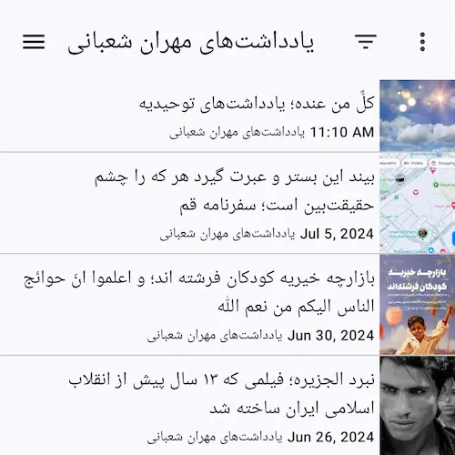

سال‌هاست که دیگر از خوراک‌خوان (فیدخوان یا خبرخوان) استفاده نمی‌کنم. همهٔ آنهایی که پیش‌تر وبلاگ می‌نوشتند یا دیگر نمی‌نویسند یا اگر می‌نویسند نوشته‌های جدیدشان را در کانال تلگرامی‌شان اطلاع‌رسانی می‌کنند. من هم ذوق و شوق گذشته را ندارم. خیلی وقت‌ها نوشته‌های بقیه را نمی‌خوانم و …

سال‌ها قبل وقتی آدم‌ها هنوز حوصله‌ای برای نوشتن داشتند و مهم‌تر از آن افراد دیگری بودند که نوشته‌های آن‌ها را بخوانند که البته این دسته همان‌ها بودند که خود نیز می‌نوشتند استفاده از خوراک‌خوان نشانهٔ فرهیختگی بود!

حالا اوضاع متفاوت است. دیگر هیچ کداممان حوصلهٔ خواندن نداریم و آدم‌ها را در عوض افکار و نوع نگاهشان با آیفونی که در دست می‌گیرند و پدال گازی که می‌فشارند قضاوت می‌کنیم.

اما بعد از این همه مدت هنوز هم باور دارم آنچه در وبلاگ‌ها می‌نویسند خیلی بهتر، مفیدتر و گره‌گشاتر از چیزی است که این روزها در شبکه‌های اجتماعی و پیام‌رسان‌ها می‌بینیم و آدم‌هایی که وقت می‌گذارند و وبلاگ می‌نویسند لیاقت بیش‌تری دارند برای دنبال شدن از آنهایی که صبح به صبح با چشم خواب‌آلوده و صورت نشسته در شبکه‌های اجتماعی و پیام‌رسان‌هایشان عکس می‌گذارند و کوتاه‌نوشت می‌نویسند.

چند روز قبل پس از سال‌ها با یک بازگشت به گذشته خوراک‌خوان نصب کردم و خوراک چندتا از وبلاگ‌های قدیم و جدید را به آن اضافه کردم. 

اما چرا؟ آیا صرفاً دلم برای گذشته تنگ شده است؟ 

نه! راستش بحران‌های فلسفی امانم را بریده است. گله دارم از همهٔ آن‌ها که آزادیمان را گرفته‌اند و بیش‌تر گله دارم از خودمان که به وعدهٔ راحتی و آسودگی فریب خورده‌ایم و آزادی خودمان را به بهایی ناچیز فروخته‌ایم. من وقتی از یک اپلیکیشن منبع‌باز و رایگان برای دنبال کردن وبلاگ‌ها استفاده می‌کنم دیگر هر کسی نمی‌تواند بیاید و برایم سیاست تعیین کند که چه کنم و چه نکنم. امروز اما داریم از سرویس‌هایی استفاده می‌کنیم که هر موقع بخواهند سیاست جدید تعیین می‌کنند و محدودمان می‌کنند. اگرچه تلگرام امروز که این یادداشت را می‌نویسم سرویسی محبوب و محترم است اما باید یادمان باشد که هر لحظه باید آمادگی هر اتفاقی را داشته باشیم. اتفاقی که ممکن است به مهاجرت از تلگرام وادارمان کند و مجبور شویم چشممان را به همهٔ‌ داده‌هایی که در تلگرام انبار کرده‌ایم ببندیم و برویم. یا مثلاً آن‌قدری وابسته بشویم که مجبور بشویم به هرخواستهٔ غیر منطقی‌اش تن بدهیم یا اینکه مثل خیلی سرویس‌های دیگر با بازکردن تلگرام با یک پیام معذرت‌خواهی روبرو شویم که تلگرام از این تاریخ دیگر تعطیل است. 

همچنین بارها در خیلی از شبکه‌های اجتماعی دیده‌ایم که خیلی راحت نوشته‌های یک کاربر را حذف می‌کنند، حساب کاربری او را مسدود می‌کنند و به طور کلی وقتی آزادی خودمان را فروختیم و بردهٔ تعدادی سرمایه‌دار شدیم به این معناست که گردن نهاده‌ایم که هر چه دوست دارند انجام دهند. 

آنچه نوشتم همه نتیجهٔ تمرکزگرایی است. باید قبول کنیم که دنیای ما آن‌قدری ایده‌آل نیست و آدم‌ها هم آن‌قدری قابل اعتماد نیستند که بتوانیم همه چیزمان را بدهیم به دستشان و بعد امید داشته باشیم که کار خوب پیش برود. ما باید یاد بگیریم که سیاست‌های رفتاری خودمان را چگونه تعیین کنیم که اهرم فشار به دست کسی ندهیم که فردا طلبکارانه هرچه دوست دارد طلب کند.

بیش‌تر از این دربارهٔ تمرکزگرایی حرف نمی‌زنم. توصیه می‌کنم نوشتهٔ [شبکه‌های اجتماعی نامتمرکز در وبلاگ مهدی صادقی](https://mehdix.ir/decentralized-social-networks.html) را بخوانید.

اما وقتی وبلاگ بنویسیم و از خوراک وب‌سایت برای آگاه شدن از بروز شدن وبلاگ‌هایی که دنبال می‌کنیم استفاده کنیم دیگر تقریباً هیچ کسی نمی‌تواند محدودمان کند. البته استفاده از سرویس‌های متمرکزی مثل بلاگفا، میهن‌بلاگ، وردپرس، مدیوم و … باز هم این اشکال را ایجاد می‌کند. چاره استفاده از نرم‌افزارهای رایگانی مثل جوملا، وردپرس، جکیل، هوگو، گرو و … است که باید خودمان راهشان بیندازیم تا دیگر مجبور نشویم تن به سیاست‌های ظالمانهٔ ظالمان بدهیم. این شیوه اگرچه هزینهٔ بیش‌تری دارد و زمان بیش‌تری می‌طلبد اما باید یاد بگیریم که برای آزادی خودمان هم که شده گاهی هزینه کنیم و در خاطرمان باشد که گاهی دوزار هزینه کردن خیلی به صرفه‌تر است از هزینه‌هایی که بعدتر باید بپردازیم. و همچنین بدانیم که هیچ گربه‌ای محض رضای خدا موش نمی‌گیرد. آنکه به رایگان سرویس ارائه می‌کند خیلی بیش‌تر از آنچه فکرش را بکنیم گیرش می‌آید…

بگذریم. خوراک وب سایت یک صفحه از وب سایت در قالب XML است که اطلاعاتی دربارهٔ آخرین نوشته‌ها را در خود جای می‌دهد. این که این اطلاعات به چه میزان باشد و هم‌چنین مطالب آخر چند مطلب آخر را شامل شود معمولاً قابل تنظیم است.

با اضافه کردن آدرس صفحهٔ‌ خوراک به خوراک خوان، او ما را از بروزرسانی وب‌سایت مورد نظر و انتشار مطالب جدید مطلع می‌کند.

برای پیدا کردن آدرس خوراک یک وب‌سایت هیچ روش تضمین‌شده‌ای وجود ندارد. بااین‌وجود معمولاً اگر همه چیز سرجای خودش باشد در سورس وب سایت در بخش 
‍```<head>``` 
باید چیزی شبیه به 

```
<link rel="alternate" ... 
```
وجود داشته باشد که به آدرس خوراک اشاره می‌کند. 

بیش‌تر خوراک‌خوان‌ها وقتی آدرس صفحهٔ اصلی سایت یا وبلاگ را بهشان بدهی در سورس صفحه می‌گردند و آدرس خوراک را (اگر موجود باشد) پیدا می‌کنند اما به طور کلی تجربیات چند روزهٔ من از پیدا کردن آدرس خوراک وب‌سایت‌ها به اینجا رسید که:

برای وبلاگ‌هایی که در بلاگفا ساخته می‌شوند:
```
mysite.blogfa.com/rss
```

برای وبلاگ‌هایی که در بلاگ بیان ساخته می‌شوند:
```
mysite.blog.ir/rss
```
برای وبلاگ‌هایی که به کمک هوگو ساخته می‌شوند:
```
mysite.com/index.xml
```

برای وبلاگ‌هایی که به کمک جکیل ساخته می‌شوند:
```
mysite.com/feed.xml
```

برای وبلاگ‌هایی که به کمک گرو ساخته می‌شوند:
```
mysite.com/blog.atom
```
یا
```
mysite.com/blog.rss
```
یا
```
mysite.com/blog.json
```

برای وبلاگ‌هایی که به کمک وردپرس ساخته می‌شوند:
```
mysite.com/feed
```
‍‍‍

یادم می‌آید چند سال پیش از Feedly به عنوان خوراک‌خوان استفاده می‌کردم. Feedly یک سرویس آنلاین است که آدرس خوراک‌ها را دریافت می‌کند و مطالب جدید را به شما نشان می‌دهد. اما راستش استفاده از Feedly به عنوان یک سرویس آنلاین باعث می‌شود که نوعی از تمرکزگرایی شکل بگیرد. برای همین تصمیم گرفتم یک ابزار جدید پیدا کنم. 

من Feeder را پیدا کردم که یک نرم‌افزار رایگان و منبع باز برای اندروید است که خیلی خوب کار می‌کند و در این تاریخ هنوز به شکل مرتب بروزرسانی می‌شود. دقت کنید که آن را با سرویس آنلاین feeder.co اشتباه نگیرید. Feeder یک نرم‌افزار رایگان است که تحت مجوز GPLv3 منتشر شده است. می‌توانید [مخزن پروژه Feeder در گیت هاب](https://github.com/spacecowboy/Feeder) را ببینید یا آن را از Google Play یا F-Droid دانلود کنید.

[](https://f-droid.org/repository/browse/?fdid=com.nononsenseapps.feeder)

[](https://play.google.com/store/apps/details?id=com.nononsenseapps.feeder.play)

به‌علاوه من [خوراک اتم سی‌بیا](/blog.atom) را هم راه انداختم که در پایین صفحه (در کنار تلگرام، گیت‌هاب و پست الکترونیک) قابل مشاهده است. مطمئناً توقع ندارم که برای دنبال کردن یادداشت‌هایم یک خوراک‌خوان نصب کنید اما اگر همین حالا یک خوراک‌خوان دارید و یا علاقه‌مند شده‌اید که یک خوراک‌خوان نصب کنید یادتان نرود که خوراک من را هم به خوراک‌خوانتان اضافه کنید تا از یادداشت‌های جدیدم باخبر شوید…
