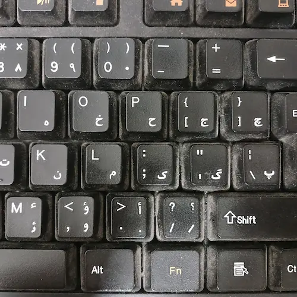
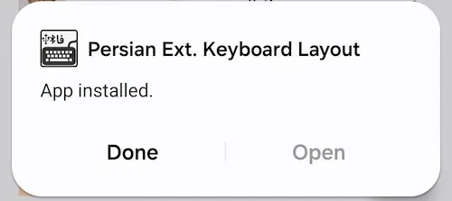
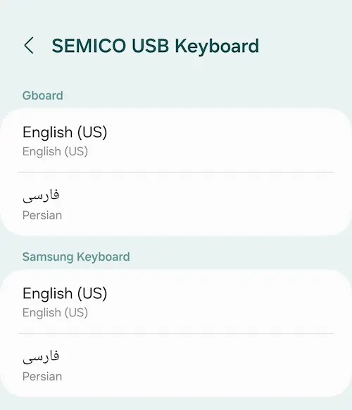
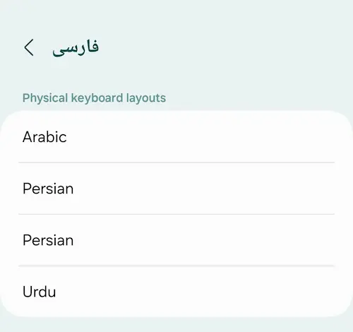

اگر خدا بخواهد چند روز دیگر عازم سفر هستم. برای نوشتن سفرنامه این بار تصمیم گرفتم در عوض کشاندن یک لب‌تاب به دنبال خودم در گوشی تلفنم بنویسم. برای این کار به یک ویرایشگر متن ساده نیاز دارم و یک کیبورد فیزیکی. اگر همه چیز میزان باشد در این چند روز یک کیبورد جمع‌و‌جورتر هم می‌خرم که مجبور نباشم این کیبورد بزرگ را دنبال خودم بکشانم.

کیبوردم را با کمک رابط OTG به تلفن همراهم که SAMSUNG Galaxy A24 است متصل می‌کنم تا مطمئن شوم همه چیز درست کار می‌کند.

کیبورد استاندارد فارسی با آنچه روی کیبورد من دیده می‌شود متفاوت است. در کیبورد استاندارد من برای تایپ حرف **پ** باید کلید M را بفشارم و برای تایپ **ئـ** Shif+S را. البته اینکه با فشردن یک کلید چه حرفی تایپ بشود یک مسئله نرم‌افزاری است که در سیستم عامل مشخص می‌شود و ربطی به لیبل‌هایی که روی کیبورد چسبانده‌اند ندارد.

بعد از اتصال کیبورد به تلفن همراهم خیلی سریع متوجه می‌شوم که صفحه کلید اندروید برای زبان فارسی استاندارد نیست. اینجا دقیقاً همه چیز مطابق با همان چیزی است که روی کیبورد من نقش بسته است. یعنی برای تایپ حرف **پ** باید کلید \ را بفشارم و برای تایپ **ئـ** کلید M را.

دارم سعی می‌کنم با اوضاع کنار بیایم که متوجه می‌شوم حتی نیم‌فاصله هم ندارم. Shift+Space که در کیبورد استاندارد فارسی یک نیم‌فاصله تایپ می‌کند در اندروید یک فاصلهٔ معمولی تایپ می‌کند و انگار اینجا هیچ راهی برای تایپ نیم‌فاصله وجود ندارد.

کمی بعدتر متوجه می‌شوم که مشکلات به همین چند مورد ختم نمی‌شود و علائمی مثل -َ -ِ -ُ -ً -ٍ -ٌ و … هم همگی جابجا هستند.

سعی می‌کنم در تنظیمات اندروید جایی را پیدا کنم تا بلکه بتوانم کاری بکنم اما نتیجه‌ای نمی‌گیرم. می‌افتم به جان گوگل بلکه چیز به‌درد‌بخوری پیدا کنم. 

برایم جالب است که در عوض پیدا کردن یک مطلب به‌درد‌بخور مثلاً [کیبورد فارسی](https://cafebazaar.ir/app/com.ziipin.softkeyboard.iran) را پیدا می‌کنم که در کافه بازار بیش از هشت میلیون مرتبه نصب شده است! واقعاً‌ نمی‌توانم بفهمم چرا هشت میلیون نفر این برنامه را نصب کرده‌اند؟! حالا مردم از قلّت آگاهی آن را نصب کرده‌اند. توسعه‌دهنده به چه انگیزه‌ای آن را توسعه می‌دهد؟

بیش‌تر جستجو می‌کنم و می‌یابم که پیش‌تر اپلیکیشنی با نام 
Farsi Hardware Keyboard Layout
در گوگل‌پلی وجود داشته که امکان تایپ فارسی با کیبورد فیزیکی را در اندروید فراهم می‌کرده است. یادم می‌آید که من هم سال‌ها پیش آن را روی اندروید ۴ نصب کرده بودم. ظاهراً آن روزها اندروید امکانات خیلی کمتری برای استفاده از کیبورد فیزیکی ارائه می‌کرد. یادم نمی‌آید که همه چیزش میزان بود یا نه اما به هر حال حالا از روی گوگل‌پلی حذف شده است و به‌علاوه اصلاً روی نسخه‌های جدید اندروید نصب نمی‌شود.

بیش‌تر جستجو می‌کنم و [این مخزن](https://github.com/kaykanloo/android-persian-layout) را روی گیت‌هاب پیدا می‌کنم که آخرین بروزرسانی آن مربوط به نُه سال قبل است. در این شرایط چاره‌ای ندارم. باید امتحانش کنم. امید چندانی ندارم که درست کار کند. خوشبختانه جناب Kaykanloo نسخهٔ بیلد شده را در مخزن گنجانده‌ است تا من مجبور نشوم خودم این کار را بکنم و معلوم نیست با چه دردسرهایی مواجه بشوم. 

فایل نصبی AndroidPersianLayout را از [مخزن گیت‌هاب پروژه](https://github.com/kaykanloo/android-persian-layout/raw/master/build/outputs/apk/AndroidPersianLayout-debug.apk) دانلود می‌کنم. ضمناً برای مطمئن شدن از اینکه این برنامه کار بدی نمی‌کند می‌شود آن را از روی سورس کامپایل کرد. من اعتماد می‌کنم و همان نسخهٔ از پیش بیلد شده را نصب می‌کنم که خوشبختانه با موفقیت نصب می‌شود. 


 
در تنظیمات اندروید این مسیر را طی می‌کنم:
```
General management > Physical keyboard > SEMICO USB Keyboard (name of my keyboard)
```

 و با ناامیدی با این صفحه روبرو می‌شوم:



امید داشتم که یک کیبورد جدید به این قسمت اضافه شده باشد که با استفاده از آن مشکلاتم حل بشود اما زهی خیال باطل.

دارم ناامید می‌شوم که اتفاقی در همان صفحهٔ قبل روی **فارسی** می‌زنم و با این صفحه روبرو می‌شوم:



پیش‌تر این صفحه را بررسی کرده بودم و حواسم بود که سه گزینه داشت و حالا یک Persian دیگر هم اضافه شده است. آن را انتخاب می‌کنم و حالا انگار همه چیز استاندارد است.

البته می‌توانم حدس بزنم این تنظیمات روی تلفن‌های غیر سامسونگ کمی متفاوت باشد اما قاعدتاً باید روی همهٔ گوشی‌ها کار کند.

در اندروید برای تغییر زبان باید از میانبر Ctrl+Space استفاده کنم که اگرچه به آن عادت ندارم ولی خیلی هم بد نیست.

کم‌کم دارم سعی می‌کنم علاوه بر تایپ همهٔ کارهایم را با کیبورد انجام بدهم و از صفحهٔ لمسی گوشی استفاده نکنم!

واقعیت این است که نباید از گوشی اندرویدیم به اندازهٔ میز کار LXDE توزیع رزبری پای انتظار داشته باشم. اندروید سیستم عاملی است که به طور پیش‌فرض با یک نمایشگر لمسی نسبتاً کوچک کار می‌کند اما با این وجود مخصوصاً در نسخه‌های جدیدتر اندروید امکانات خوبی برای استفاده از موس و کیبورد تعبیه شده است. میانبرهای خوبی وجود دارد. مثلاً با Alt+F4 اپلیکیشن در حال اجرا بسته می شود، با CMD+N پنل نوتیفیکیشن باز می‌شود، با Alt+Tab می‌توان بین اپلیکیشن‌های باز جابجا شد و همچنین CMD+Shift+L نقش دکمهٔ‌ Lock را بازی می‌کند.

به‌علاوه اندروید این اجازه را می‌دهد که برای هر اپلکیشن یک میانبر مخصوص تعریف کنیم و به کمک آن اپلیکشن مربوطه را اجرا کنیم که استفاده از این میانبرها کار با گوشی را خیلی سریع‌تر از حالت معمول می‌کند.

با این حال مشکلی که وجود دارد این است که عموم موس و کیبوردهای بی‌سیم موجود در بازار با دانگل مخصوص خودشان کار می‌کنند و این یعنی من برای استفادهٔ‌ هم‌زمان از موس و کیبورد مجبورم یک هاب USB هم به گوشی‌ام آویزان کنم!

بگذریم. قرار نبود گوشی موبایلم را تبدیل به یک دسکتاپ کنم. صرفاً قرار بود آن را به نحوی آماده کنم که بتوانم به کمک یک کیبورد فیزیکی در آن تایپ کنم که عملیات خوشبختانه موفقیت‌آمیز بود.

و در آخر هم یک ستاره می‌دهم به مخزن [android-persian-layout](https://github.com/kaykanloo/android-persian-layout) که فرمود:

> مَن لم يَشكُرِ المَخلوقَ لَم يَشكُرِ الخالِقَ