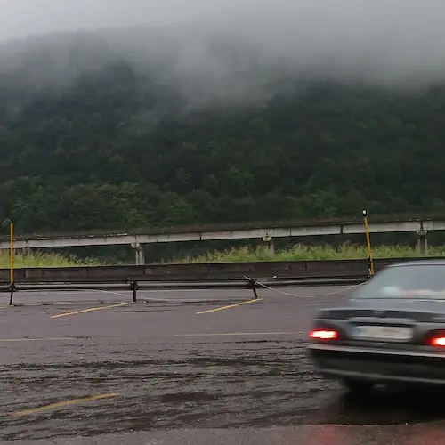

جمعه است. باران می‌بارد. کار خدا را می‌بینی؟ باران در مرداد…

صبح پاشده‌ام آمده‌ام لنگرود به پدربزرگ مادربزرگم سر بزنم. مادربزرگم از چهار پنج سال پیش که سکته کرد زمین‌گیر شد و حالا تقریباً هیچ کاری انجام نمی‌دهد. پوشک می‌پوشد و می‌نشیند روی تخت و بعد هم که خسته شد روی همان تخت دراز می‌کشد و مدام میان این دو وضعیت تغییر حالت می‌دهد.

مادربزرگ در این چهار سال شاید به تعداد دفعات انگشت‌شماری از خانه بیرون رفته باشد. پدربزرگم که او هم به اندازهٔ کافی پیر و ناتوان است همهٔ خریدها را انجام می‌دهد، غذا می‌پزد و اگر فرصتی بماند مغازه‌اش را که چسبیده به خانهٔ‌شان است باز می‌کند. 

زندگی به اندازه‌ٔ زیادی برای پدربزرگم هم سخت است اما فکر می‌کنم اوضاع بر مادربزرگ سخت‌تر می‌گذرد. او که دیگر حتی چشم‌هایش هم به درستی جایی را نمی‌بیند صبح تا شب روی تخت می‌نشیند و به دیوار سفید روبرویش نگاه می‌کند. گاهی می‌چرخد و در عوض دیوار چشم می‌دوزد به در اتاق که شاید باز شود و مهمانی بیاید و او را از این تنهایی در بیاورد یا اگر بخت یار باشد و هوا به گونه‌ای باشد که بشود در را باز گذاشت در عوض در چشم به حیاطی می‌دوزد که هیچ یک از جزئیاتش را نمی‌بیند. تنها مونس او در این روزها رادیویی است که گاهی صدایش را آن قدری بالا می‌برد که دیگر صدای دیگری را نمی‌شنود؛ درست مثل امروز صبح که وقتی وارد اتاقش شدم حضورم را احساس نکرد.

حال و روز خودم به این شکل است که اگر یک روز در خانه بمانم با وجود همهٔ سرگرمی‌هایی که در خانه دارم کلافه می‌شوم. معمولاً وقتی من در خانه‌ هستم مامان هم خانه است و مامان هیچ وقت ساکت نمی‌ماند. حتی وقتی دارم کار انجام می‌دهم هم همیشه با من حرف می‌زند! علاوه بر مامان گوشی همراه، کامپیوتر، تعداد زیادی کتاب و … چیزهایی هستند که هیچ وقت تنهایم نمی‌گذارند اما با وجود همهٔ این‌ها باز هم یک روز کامل در خانه ماندن برایم غیرقابل تحمل است. 

دلم برای مامان‌بزرگ می‌سوزد و بیش‌تر از این دل سوختن وحشت دارم از روزی که همین اوضاع و احوال یقهٔ مرا هم بگیرد. پیری سوی چشمانم و قوت پاهایم را بگیرد و نه بتوانم از خانه بیرون بروم و نه دیگر نوشته‌های کتاب را ببینم. مامان هم نباشد که با من حرف بزند. بنشینم روی تخت و خیره بشوم به دیوار روبرویم و انتظار بکشم ورود مهمانی را که مرا از این تنهایی در بیاورد…

با این مشاهدات دارم از پیری می‌ترسم. من تقریباً به تمام آرزوهایم رسیده‌ام و از مرگ هراسی ندارم و کاملاً برای این شتری که بالأخره جلوی در هر خانه‌ای می‌خوابد آماده‌ام اما موضوع پیری متفاوت از مرگ است. زمانی که به سبب پیری توانایی انجام کارهای روزمرهٔ خود را هم نداشته باشم واقعاً ترسناک به نظر می‌رسد.

دارم بیست و ششمین سال از زندگی‌ام را می‌گذرانم. پیش‌تر وقتی کسی می‌گفت که از چهل سالگی سراشیبی عمر شروع می‌شود و یا از سی سالگی دیگر رشد چندانی وجود نخواهد داشت باور نمی‌کردم اما حالا که دارم به سی سالگی نزدیک می‌شوم کم‌کم دارم این اوضاع و احوال را از نزدیک می‌بینم. شور و هیجان هجده نوزده سالگی، سال‌های آخر مدرسه و سال‌های اول دانشگاه کجا و من امروز کجا؟ شاید بعداً سانسورچی روشن شود و این قسمت‌ها را سانسور کند اما حالا می‌نویسم که حتی فشارهای جنسی‌ام هم کاهش یافته‌اند. مثل قبل رویاهای جنسی به سراغم نمی‌آید و خلاصه شرایط همه جوره رو به افول می‌رود. با این همه هنوز نیازهای عاطفی‌ام از بین نرفته‌اند و البته هیچ وقت هم نخواهند رفت. پیش‌تر در [یادداشتم بر فیلم مرا ببوس](/blog/kiss_me) نوشته بودم که مسائل جنسی ذاتی انسان نیست و آنچه ذاتی نباشد تا ابد نخواهد ماند اما عشق و محبت و دوستی با خمیر انسان عجین شده‌اند و هیچ وقت او را رها نخواهند کرد. 

و من حالا فرصتی یافته‌ام که با تماشای حال این زوج کهن‌سال که روزگاری از من هم جوان‌تر بودند به آیندهٔ عاطفی خودم بیندیشم. مادربزرگ زمین‌گیر شده است و همین اتفاق به کلی روح و روان او را به هم ریخته است. از طرفی دیگر پدربزرگ فشار بسیاری را تحمل می‌کند. پیرمردی به سن او به طور معمول برای ادامهٔ‌ زندگی به کمک نیاز دارد اما او…

ناراحت‌کننده‌تر از همه اینکه پس از تلاش‌های بسیار و زحمت‌های فراوانی که در طول روز می‌کشد، شب‌هنگام در وقت استراحت در عوض آرامش با غرغرها و بهانه‌گیری‌های مادربزرگ روبرو می‌شود. با خودم می‌اندیشم که کدامین وضعیت را ترجیح می‌دهم: افتاده باشم روی تخت و چشم دوخته باشم به دیوار سفید روبه‌رویم یا صبح تا شب جان بکنم و بعد با لج‌بازی همسر از کار افتاده‌ام روبرو شوم؟ هیچ کدام! صادقانه باید اعتراف کنم که به نظرم هر دوی این شرایط غیر قابل تحمل است. البته که خدا به همراه درد و سختی صبر هم می‌دهد و شاید آن روز تحمل و طاقت بیش‌تری داشته باشم. در هر صورت حالا به نظرم می‌رسد که حداکثر فشاری را که بتوانم تحمل کنم رسیدگی به احوال همسر خوش‌روی زمین‌گیرم است یا مثلاً برعکس من زمین‌گیر باشم و او رسیدگی کند و من در عوض بهانه جویی قربان صدقه‌اش بروم و دستش ببوسم. خجالت می‌کشم از روزی که او بخواهد این قدر زحمت بکشد و بعد من در عوض تشکر مدام بهانه‌جویی کنم.

بعد از این مشاهدات به دختری می‌اندیشم که شاید تنها ویژگی مشترکمان نیاز به یک همسر برای ادامهٔ زندگی است. همه چیز در حد یک خیال سادهٔ کودکانه است. قرار هم نیست اتفاقی بیفتد. وقتی بیست و شش سال داشته باشی و هنوز تنها باشی طبیعی است گاهی از این جور احساسات کودکانه دربارهٔ یکی از دختران همسایه، همکار یا فامیل که البته هیچ پشتوانهٔ عقلی و غیر عقلی ندارد. در همین خیال‌های کودکانه گاهی سعی‌ می‌کنم آینده‌ام را با او به تصویر بکشم. همان اویی که با من متفاوت است. چه آینده‌ای می‌‌توانم با او داشته باشم؟ 

پس از این خیال‌های کودکانه از یک زندگی شیرین رویایی سعی می‌کنم کمی هم بزرگ شوم و منطقی فکر کنم. مطمئناً با این حجم از تفاوت در نگاهمان به زندگی، آینده‌ای که او در خیال دارد متفاوت است از آنچه من خیالش را در ذهن می‌پرورانم. چه باید کرد؟

در میان همهٔ این تفاوت‌ها سعی می‌کنم نقطهٔ اشتراکی پیدا کنم تا بتوانم خیال‌های کودکانه‌ام را در همین نقطهٔ مشترک ادامه بدهم. سعی می‌کنم در عوض خیال‌بافی در مورد روزهایی که داریم زیر یک سقف زندگی می‌کنیم و پیر شده‌ایم برگردم عقب‌تر. خیلی عقب‌تر: اولین روزهای آشنایی‌مان… 

•••

او هم از من بدش نمی‌آید. او هم شاید همان احساسات کودکانهٔ مرا دارد و شاید او هم دارد خیال آینده‌اش در کنار مرا می‌بافد. نمی‌دانم نقطه اشتراکی پیدا کرده است یا نه. نمی‌دانم خیالش را چگونه می‌بافد.

اسمش حیا نیست. آن قدری جانماز آب کشیده‌ام که نمی‌توانم خودم این صحبت را شروع کنم. می‌توانم از دوست مشترکمان که یک دختر است بخواهم اما او مجرد است و چنین درخواستی از یک دختر مجرد به دور از ادب است. پس باید منتظر بمانم که خودش سر صحبت را باز کند اما این یکی را هم دوست ندارم.

اصلاً ازدواج و زندگی مشترک خیلی سخت است. من حتی برای شروعش هم آمادگی ندارم وای از ادامه‌اش. در هر صورت دستم را می‌گذارم روی اسکیپ و خیالم به جلو می‌پرد. نمی‌دانم چه شد و از کجا شروع شد. حالا نشسته‌ایم روی چمن‌های پارک ملت. مدام به این فکر می‌کنم که همین الآن است که یکی ما را ببیند و آبرویم برود. من و یک دختر با این ریخت و قیافه. 

اما آب که از سر گذشت چه یک وجب چه صد وجب. پس با خیال راحت شروع می‌کنم به صحبت کردن از خیال‌هایم. البته مطابق معمول به صورتش نگاه نمی‌کنم. چشمانم به سینه‌هایش است و او هم باهوش‌تر از آن است که نفهمد سینه‌هایش را نگاه نمی‌کنم.

> من یه فهرست آماده کردم از مسائلی که ممکنه روش اختلاف نظر داشته باشیم. اما قصدم این نیست که بفهمیم روی چند تا از اون‌ها اختلاف نظر داریم چون همین جوری از ظاهرمون هم معلومه که احتمالاً در مورد همه‌شون متفاوت فکر می‌کنیم!

چشمانش از تعجب درشت می‌شوند. با خودم فکر می‌کنم که من که چشمانم به سینه‌هایش بود از کجا فهمیدم که چشمانش درشت شده‌اند؟ جوابش هم البته خیلی سخت نیست. همان طوری که زهرا را از فاطمه تشخیص می‌دهم درحالیکه به صورت‌هایشان نگاه نمی‌کنم. البته ممکن کسی فکر کند آن‌ها را از تفاوت در سایز سینه‌هایشان تشخیص می‌دهم ولی جواب احمقانه‌ای است. واقعیت این است که اگر چه به صورت هایشان نگاه نمی‌کنم ولی کور هم نیستم. بخواهم نخواهم می‌بینم و در ذهنم می‌ماند. 

در جوابم می‌گوید:

> پس چی؟

ادامه می‌دهم:

> من کلی فکر کردم. به این نتیجه رسیدم که ممکنه دو نفر روی تقریباً همهٔ موارد این فهرست تفاهم داشته باشند. بعد یکی از این موارد باعث اختلاف بشه و همون اختلاف باعث بشه که ادامهٔ زندگی برای اون دو نفر غیر ممکن بشه.

می‌پرسد:

> پس باید پیدا کنیم که کدوم یکی مهم‌تره؟

در جواب می‌گویم:

> البته درسته که توی این فهرست بعضی‌ از موارد مهم‌تر از بعضی دیگه هستند ولی من توی ذهنم چیز دیگه‌ای بود.

بعد از کمی مکث می‌پرسد:

> چی؟

مورد بیست و هفتم را نشانش می‌دهم:

> الان مثلاً این مورد رو نگاه کن! فکر کن توی این مورد ما با هم اختلاف داشته باشیم.

حرفم را قطع می‌کند:

> +قطعاً اختلاف داریم!

> -آره! حاضری به خاطر من کوتاه بیای؟

> +چرا باید کوتاه بیام که حرف شما بشه؟ خوب شما کوتاه بیا!

> -حرفم دقیقاً همینه. با این نگاه ما هیچ وقت نمی‌تونیم خوشبخت باشیم!

> +خوب شما خودت حاضری توی این مورد برای اینکه خوشبخت باشیم کوتاه بیای؟

> -ببین! یه طرفه فایده نداره. ما برای اینکه بتونیم خوشبخت باشیم باید توی تمام این موارد، عاشقانه خواستهٔ اون یکی رو نسبت به خواستهٔ خودمون مقدم بدونیم.

بعد ادامه می‌دهم:

> مثلاً فکر کن عروسی دوستته. با کلی ذوق میای بهم میگی که عروسی دوستمه و باید برای عروسیش فلان لباس رو بخرم و فلان کار رو انجام بدم. بعد یهویی قیافهٔ من بهم می‌ریزه چون من دوست ندارم که بریم عروسی. با این حال برای خوش‌حال کردن تو چیزی نمی‌گم و هر چی که تو می‌گی رو تأیید می‌کنم. بعد میری با خودت فکر می‌کنی که همسرم با اینکه دوست نداره این عروسی رو اما واسه خاطر من هیچ اعتراضی نکرد. با خودت فکر می‌کنی که خیلی خودخواهانه است که به خاطر یه عروسی همسرتو ناراحت کنی و اون مجبور بشه کاری که دوست نداره رو انجام بده. برای همین هم میای و بهش می‌گی که عروسی نریم و اون هم وقتی می‌فهمه که تو این حرف رو به خاطر اون زدی و خیلی دلت می‌خواد که به عروسی دوستت بری پاش رو می‌کنه تو یه کفش که الّا و بالله باید بریم عروسی. حالا مهم نیست تهش کی برنده میشه. چیزی که مهمه اینه که ما همدیگه رو دوست داشته باشیم. یا دقیق‌تر اینکه هر کدوممون اون یکی رو بیش‌تر از خودش دوست داشته باشه.

به اینجا که می‌رسم سرم را بلند می‌کنم و چشمانم را در عوض سینه‌هایش می‌دوزم به چشمانش که حالا خیس اشک است. در حالیکه سعی می‌کند با پشت دستانش اشک‌های روی گونه‌هایش را پاک کند می‌پرسد:

> یعنی میشه؟

جواب سؤالش را نمی‌دانم. خیلی رؤیایی به نظر می‌رسد. شاید واقعاً نشود. در هر صورت در جوابش می‌گویم:

> نمی‌دونم! فقط می‌دونم که اگه هم بشه خیلی سخته! ولی چاره‌ای نداریم. آدما باید برای خوشبخت شدن خیلی تلاش کنند. خیلی سختی بکشند. اگه همیشه دنبال راحتی باشیم هیچ وقت خوشبخت نمی‌شیم.

سرت را می‌اندازی پایین و به فکر فرو می‌روی. چند دقیقه‌ای بیش‌تر نگذاشته که شالت را می‌اندازی روی موهایت و محکمش می‌کنی و لبخند می‌زنی:

> یک هیچ به نفع من! مگه نه؟

به اینجا که می‌رسد چشمانم پر از اشک می‌شود. دیگر سینه‌هایت را نمی‌بینم. دستم را می‌گذارم روی اسکیپ و می‌رسم به جایی که صدای تشییع جنازه می‌آید. یکی‌مان را می‌برند تا خاک کنند دیگری اما نشسته گوشهٔ اتاق و متبسم زیر لب تکرار می‌کند:

> الحمدلله.