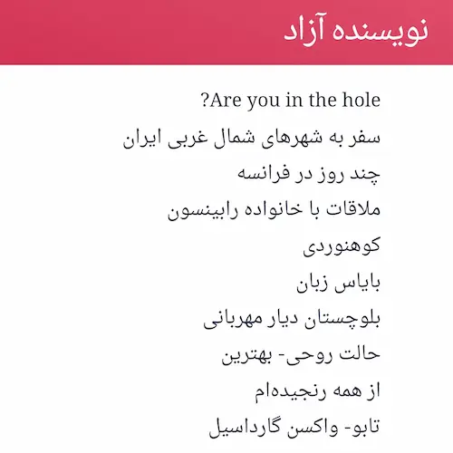

چند روز پیش اتفاقی با زینب آشنا شدم که وبلاگی دارد با آدرس 
[spacelover.ir](https://spacelover.ir)
یادداشت‌هایش به دلم نشست و در همان دو سه روز اول در اوقات فراغتم تقریباً همهٔ آنچه که نوشته بود را خواندم و برایش نوشتم که:

> سلام.  
تقریباً اتفاقی با وبلاگت آشنا شدم.   
یادداشت‌های کوتاه، مختصر و مفیدی داری.  
در مجموع هم تعداد یادداشت‌ها جوریه که نشون می‌ده هم واقعاً می‌نویسی و هم بیش از اندازه نمی‌نویسی.  
این جور پرهیز از نوشتن اضافاتِ خسته کننده باعث می‌شه که وقتی یکی وارد سایتت می‌شه به احتمال بیش‌تری موندگار بشه که من هم به همین دام افتادم انگار.  
توی مترو فرصتی شد تا تعداد خوبی از یادداشت‌هات رو بخونم.  
خواستم خوراک سایتت رو به خوراک‌خوانم اضافه کنم که با خطا مواجه شدم.   
نوشتن این ایمیل رو شروع کردم که بگم درستش کنی ولی برای اطمینان، دوباره امتحان کردم و عملیات با موفقیت انجام شد.  
و حیفم اومد این چند خطی که نوشتم رو برات نفرستم. حداقل من اینجوری‌ام که خیلی ذوق می‌کنم وقتی کسی بهم پیام بده و در مورد یادداشت‌هایی که می‌نویسم نظر بده. نمیدونم. شاید تو اینجوری نباشی. به هر حال...  
توی این دنیایی که گاهی حس می‌کنیم با ادمای کنارمون اشتراک و شباهتی نداریم واقعا خیلی خوبه که فضای مجازی این فرصت رو بهمون می‌ده که با ادمایی که **شاید** بهمون نزدیک‌تر هستند اشنا بشیم.  
البته انگار چند ماهیه که ننوشتی. امیدوارم همه چیز میزون و اوضاع رو به راه باشه.  
و من بیش‌تر از این‌که منتظر جواب این ایمیل باشم دلم می‌خواد خوراک‌خوانم آلارم بده و بگه که اسپیس لاور یادداشت جدید منتشر کرده.  
از بچگی همیشه دوست داشتم نامه بنویسم و وقتی می‌دیدم جودی مثلاً نامه می‌نویسه (جودی نامه می‌نوشت ایا؟) کلی بهش حسودیم می‌شد.  
این طولانی نوشتن و گزاف گویی‌‌ها رو هم بزار رو حساب ارضا نشدن نیازهای دوران کودکی:)  
منتظر یادداشت‌های جدیدت هستم.   

او هم برایم جوابی نوشت و مکالمه‌ای کوتاه داشتیم.

من و زینب هر دو برای برون رفت از وضع موجود به دنبال راه حل می‌گردیم. هر دو می‌دانیم که با دست روی دست گذاشتن و سکوت کردن اوضاع بهتر نخواهد شد و این نقطهٔ اشتراک بزرگی است با این حال حداقل در ظاهر بنیان‌های فکری‌مان به شدت متفاوت است. 

بعدتر وقت سفر در اتوبوس فرصتی پیدا می‌کنم که به این موضوع بیندیشم که این تفاوت از کجا شکل گرفته؟ من خوبم و او بد؟ یا او خوب است و من بد؟ یا شاید به قول بعضی اصلاً خوب و بدی وجود ندارد…

من عاشق موضوع تقریب بین نگرش‌ها هستم. پس در این مورد هم تمام سعیم را به کار می‌گیرم تا نشان بدهم فاصله‌ٔ چندانی میان ما وجود ندارد.

ظاهرمان چه می‌گوید؟ من یک آدم سنت‌گرا هستم اما زینب یک انسان آزاد است؛ ناراحت از محدودیت‌ها و تبعیض‌هایی که جامعه و شاید سنت بر او تحمیل کرده است.

باید اعتراف کنم که من اصلاً مثل زینب فکر نمی‌کنم و کنار آمدن با آدمی مثل زینب واقعاً برام دشوار است.

اما ماجرا چیست و چرا ما این قدر با هم متفاوت شدیم؟

باید از زندگی خانوادگی خودم شروع کنم که دوران کودکی من چگونه گذشت:

مادرم خانه‌دار بود و عمده وقتش به سر و کله زدن با ما می‌گذشت. (حالا که ما بزرگ شدیم آزادتر است و فعالیت‌های اجتماعی بیش‌تری هم دارد.)

پدر کار می‌کرد و درآمد لازم برای ادامهٔ زندگی را کسب می‌کرد.
در خانهٔ ما پدرم تأکیدی بر خانه ماندن مادرم نداشت. مادرم هر وقت که می‌خواست اجازه داشت هر جایی که می‌خواهد برود و پدرم هم شاکی نمی‌شد که چرا رفتی. نظرش را می‌گفت، انتقاد می‌کرد ولی اجباری وجود نداشت و با این حال مادرم به تشخیص خودش در این سال‌ها ترجیح داد که بیش‌تر وقتش را در خانه بماند و کارهای خانه را ضبط و ربط کند. حالا چرا مادر من چنین تصمیمی گرفت؟ مادر من خوب و عاقل بود و زینب عقل درست و حسابی ندارد؟

نه! قطعاً این طور نیست و باید به دنبال دلیل دیگری باشم. 

در خانوادهٔ ما پدرم هیچ وقت برای خودش حساب شخصی نداشت. همیشه درآمدش شفاف بود و همهٔ اعضای خانواده هر موقع به پول نیاز داشتند اجازه داشتند از حساب پدر یا جیب او پول بردارند و برای این کار در بیش‌تر موارد حتی نیاز به اجازه گرفتن هم نبود. همچنین پدرم این حق را برای خودش قائل نبود که چون سر کار می‌رود پس باید سهم بیش‌تری از بقیه داشته باشد. در چنین شرایطی بقیهٔ اعضای خانواده (همسر یا فرزندان) فقط وقتی تصمیم به کار کردن می‌گیرند که اقتصاد خانواده با مشکل مواجه شده باشد. البته همیشه انگیزه‌های اجتماعی برای کار کردن وجود دارد اما کار کردن به خاطر استقلال یا اینکه چون مردها کار می‌کنند پس ما زنها هم کار کنیم دیگر معنای خاصی ندارد.

در خانوادهٔ ما تقریباً هیچ موردی نبود که کاری را یک نفر (مثلاً پدر یا مادر) انجام بدهد و این کار برای بقیهٔ اعضای خانواده قفل باشد که دختران آرزو کنند کاش پسر بودند و بچه‌ها آرزو کنند کاش بزرگ بودند. همه چیز عادلانه تقسیم شده بود. همه چیز شفاف بود.
علاوه بر این‌ها ما همیشه اجازه داشتیم که نسبت به خرج‌هایی که یک نفر انجام می‌دهد انتقاد کنیم و نظر خودمان را اعلام کنیم. مثلاً خود من از سن چهارده پانزده سالگی که سر از اقتصاد در آوردم تقریباً در تمام تصمیم‌گیری‌های خانواده نقش داشتم. 

و این شرایط را مقایسه کنید با خانواده‌ای که مرد خانواده از درآمدی که کسب می‌کند برای خودش سهم برمی‌دارد و تفریحات و سفرهای خاص خود را دارد. در مرحلهٔ بعد مادر خانواده سهم بیش‌تری دارد و بعد هم بچه‌ها به ترتیب سن و یا احیاناً جنسیت. طبیعی است که بقیهٔ اعضای خانواده هم به این فکر بیفتند که درآمد داشته باشند و مستقل باشند. طبیعی است که دخترها با خودشان فکر کنند که کاش پسر بودند و بچه‌ها هم دوست داشته باشند زودتر بزرگ شوند که سهم بیش‌تری داشته باشند یا مستقل شوند. در چنین خانواده‌ای هیچ کس از نقش و وضعیت فعلی خود راضی نخواهد بود. 

با این توضیحات به نظر من حجم زیادی از این تفاوت فکری در امثال من و زینب به تفاوت محیط زندگی و فرهنگ برمی‌گردد.
من در شرایطی زندگی کردم که نیازی به تغییرش ندیدم در حالیکه شرایط برای زینب قطعاً متفاوت بوده است.

حتی با به یادآوری خاطرات دوران کودکی‌ام روزهایی را به یاد دارم که در کنار دخترهای فامیل بازی می‌کردیم و شعر پسرها شیرن و نمی‌دانم چه را هم نمی‌خواندیم. بزرگ‌تر هم که شدیم فارغ از مسائل جنسیتی همیشه با هم دوست بودیم، در کنار هم به دانشگاه رفتیم و رشد کردیم و من در هیچ یک از دخترهای فامیل هم این موضوع را ندیدم که از جنسیتشان ناراضی باشند یا خیال کنند در حقشان ظلمی صورت گرفته است.

و حالا باید اعتراف کنم که اگرچه من به تفاوت نقش مرد و زن در جامعه اعتقاد دارم و خیال می‌کنم که در شرایط عادی بهتر است که مرد بیرون از خانه کار کند و زن بیش‌تر وقتش را در خانه بگذراند (نوشتم شرایط عادی چون می‌دانم نمی‌توان حکم واحد و ثابت برای همه چیز داد مضاف بر اینکه شرایط امروز جامعهٔ ما هم خیلی عادی به نظر نمی‌رسد! ) اما مطمئن هستم که همهٔ مردهایی که خودخواهانه از این تفاوت نقش‌ها سوء استفاده کردند و باعث شدند دخترانمان در عوض یک‌ زندگی آرام و شاد مدام خودشان را به در و دیوار بکوبند که از این وضعیت بد نجات پیدا کنند باید روزی جواب پس بدهند و البته قطعاً هیچ جوابی نخواهند داشت.

و اینکه به حکم **الناس علی دین ملوکهم**
اگر خیال کنیم دختران امروزمان ره اشتباه می‌پیمایند گریزی نخواهیم داشت جز آنکه بپذیریم این راه اشتباه نه آنکه یک شبه پدید آمده است بلکه در ادامهٔ راه اشتباه قبلی‌هاست. پدران و مادران ما اشتباه فکر کردند و اشتباه زیستند که کار به اینجا انجامید.

باید واقع‌بین باشیم. احتمالاً اگر من در محیطی که زینب رشد کرده بزرگ شده بودم و یا او در فرهنگ خانوادگی ما رشد کرده بود همه چیز متفاوت می‌شد و این نشان می‌دهد که اگر ما نسخهٔ شخصی خودمان را به عنوان یک اصل ارائه کنیم هیچ چیز بهتر نخواهد شد که هیچ روز به روز هم رو به افول خواهیم رفت. با سنت‌گرایی من دخترانی مثل زینب باید تا ابد رنج بکشند و از طرفی آزادی‌ای که زینب از آن می‌نویسد کانون گرم خانواده‌ٔ من را نابود می‌کند. 

اگر سنت را اصل بدانیم حق با من است. اگر آزادی را اصل بدانیم حق با زینب است. اما اگر هیچ کدام از این دو اصل نباشد و هدف رسیدن به آرامش و سعادت باشد در آن صورت شاید حق با هیچ کداممان نباشد…

به امید روزی که هر چیزی در جای خود قرار گیرد... 

همزمان با نوشتن این یادداشت سریال سال‌های دور از خانه با نام اصلی اوشین  از شبکهٔ نمایش بازپخش می‌شود. و هاشیدا سوگاکو چه عالی به تصویر می‌کشد زنی را که در عوض نشستن در خانه و تسلیم وضع موجود شدن با استعداد و پشتکاری که دارد خود و خانواده‌اش را نجات می‌دهد. 

من این یادداشت را برای خودم نوشتم و هیچ نمی‌دانم کسی مثل زینب چه اندازه با آن موافق خواهد بود…