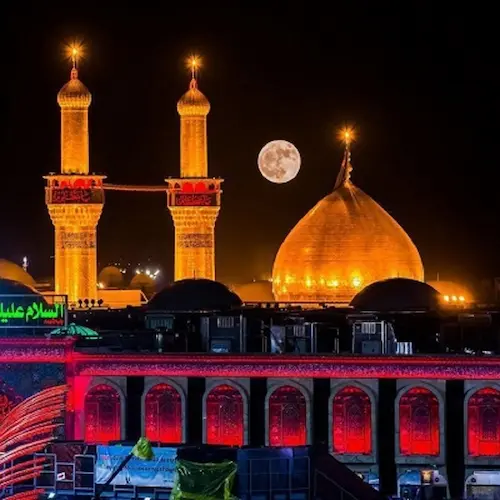

شنبه ۳۰اُم تیر است. یا دقیق‌تر ۱۴اُم محرم. باید صادقانه اعتراف کنم اوضاع خیلی مطابق میلم نیست. هیچ چیز آن گونه که انتظار داشتم پیش نمی‌رود. در این وضعیت مخابرات هم شده است قوز بالا قوز. مدام با قطعی اینترنت مواجهیم. انگار قرار نیست درست بشود. دفعهٔ قبل هم که قطعی داشتیم شاید صد بار زنگ زدم و هربار جواب دادند که مودمتان را بررسی کنید، سیم‌کشی داخلی را بررسی کنید که مشکل از ما نیست. یک روز در حالی که از درست شدن اینترنت ناامید شده بودم خانمی زنگ زد و عذرخواهی کرد که مشکل از ما بوده و حالا رفع شده و واقعاً هم رفع شده بود. حالا هم باید صبر پیشه کنم انگار. چاره‌ای نیست…

ساعت یک ربع به چهار بعد از ظهر است. اینترنت لعنتی دوباره قطع است. گوشی همراهم را می‌برم لب پنجره و از حالت پرواز در می‌آورم که بتوانم از اینترنت همراه استفاده کنم و لنگ نمانم. هنوز از حالت پرواز در نیامده شروع می‌کند به زنگ خوردن:

```
+98 21 8873 1792
```

معمولاً کسی با خط ثابت زنگ نمی‌زند. مطمئن نیستم ولی می‌توانم حدس بزنم که از کودکان فرشته‌اند تماس می‌گیرند. حتماً دوباره فاطمه است و به قول خودش برایم زحمت دارد که البته زحمت نیست و رحمت است که [و اعلموا انّ حوائج الناس الیکم من نعم الله](/blog/koodakancharity-market).

 جواب می‌دهم و می‌شنوم که:

> سلام آقای شعبانی وقتتون به‌خیر. شناختید؟

جواب می‌دهم که بله ولی مطمئن نیستم شناخته باشم. 

خودش ادامه می‌دهد که:

> من رو با فاطمه اشتباه نگیرید. الهامم…

هر بار که فاطمه مرا می‌بیند به شوخی می‌پرسد:

> هنوز من رو بلاک نکردین؟

الهام هم می‌ترسید که خیال کنم فاطمه است و تلفن را قطع کنم و برای همین تأکید داشت که فاطمه نیست. البته هنوز آن قدر وقیح نشده‌ام که تلفن را روی کسی قطع کنم. آن هم روی عضو خیریه.

الهام ادامه می‌دهد:

> از هلال احمر از سید درخواست کردند که به همراه چند تا از داوطلب‌های آقا توی سفر کربلا همراهیشون کنند. سفر از هشتم تا بیستم مرداده. شما شرایطش رو دارید؟

سکوت می‌کنم و شروع می‌کنم به فکر کردن. در همان حال ندایی درونی اعتراض می‌کند که:

> ببین اگه بخوای بیش‌تر فکر کنی مطمئناً جوابت منفیه! پس لطفاً فکر نکن. فقط بگو آره و همراهشون برو. از چی می‌ترسی؟ چه اتفاقی می‌خواد بیفته؟ هیچ‌چی! فقط بگو آره. یالّا عجله کن! 

به ندای درونی گوش می‌کنم و جواب می‌دهم که **آره**. الهام هم در جواب می‌گوید:

> باشه. گروهش رو توی تلگرام می‌زنیم و جزئیات بیش‌تر اونجا قرار داده میشه.

بعد هم التماس دعا دارد و تأکید می‌کند که گرفتن گذرنامه را فراموش نکنم.

***

جمعه بیست و ششم مرداد است. تقریباً یک ماه از روزی که الهام زنگ زد می‌گذرد. رفتیم و حالا نزدیک به یک هفته است که به سلامت برگشته‌ایم. از همان روز که الهام تلفن کرد شروع به نوشتن یادداشت‌هایی کردم که تصمیم داشتم همه‌ٔ‌شان را ذیل عنوان سفرنامهٔ کربلا منتشر کنم.

حجم یادداشت‌ها زیاد شد که تنظیم، ویرایش و بازخوانی‌شان وقت و حوصلهٔ فراوانی می‌طلبد. با خودم خیال می‌کردم که همهٔ این مراحل خیلی سریع انجام خواهد شد و می‌توانم سفرنامهٔ کربلا را ظرف مدت کوتاهی منتشر کنم اما حالا پس از یک هفته از بازگشت به تهران می‌فهمم که انتشار این سفرنامه خیلی بیش‌تر از چیزی که خیال می‌کردم زمان می‌برد. 

و امروز با خودم فکر کردم که اصلاً چرا باید همهٔ این سفرنامه را یکجا منتشر کنم؟ چون خیلی از قسمت‌های این سفرنامه پتانسیل انتشار تحت یک عنوان مستقل را دارد و همچنین خواندن همهٔ این سفرنامه به صورت یکجا خواننده را نیز خسته خواهد کرد.

برای همین یک دسته‌بندی جدید با نام [سفرنامه‌ٔ‌ کربلا](/categories/karbala-travelogue) ساختم تا سفرنامه را در قالب یادداشت‌هایی مجزا به شکل موضوعی منتشر کنم و یادداشت حاضر هم شد نخستین قسمت از این سفرنامه. 

به امید آنکه توفیق آن بیابم که باقی سفرنامه را نیز به همین شکل منتشر سازم.