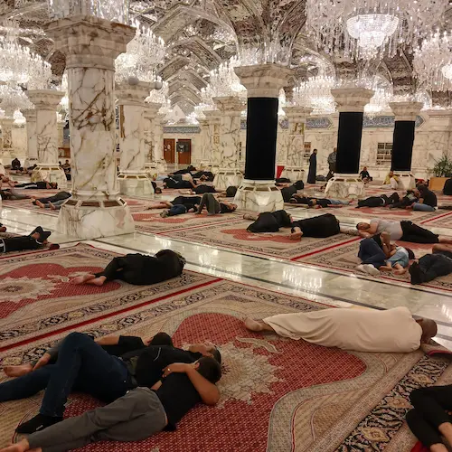

پیش‌دانشگاهی بودم که بعد از چند سال با مدرسه رفتیم زیارت امام رضا. آن موقع تقریباً هجده سال داشتم. یکی از شب‌ها تصمیم گرفتم شب را در حرم  به صبح برسانم. نمی‌دانم شاید حوالی ساعت یک و دوی بعد از نصف شب بود که خواب به سراغم آمد. نشستم گوشه‌ای و تکیه دادم به دیوار و چشمانم را بستم که خادم حرم خیلی مؤدبانه صدایم زد:

> آقا اینجا جای خوابیدن نیست.

هر چند بعداً فهمیدم که در حرم امام رضا یک رواق مخصوص برای استراحت زوّار وجود دارد اما آن شب را تا صبح از شدت خواب دیوانه شدم و هر چه در صحن قدم زدم و آب به صورتم زدم خواب از سرم نرفت که نرفت.

در اولین سفرم به کشور عراق نخست به نجف رفتیم و در نخستین حضورم در حرم حضرت امیر در شهر نجف زائرانی را دیدم که در جای‌جای حرم خوابیده بودند. زائران فرش‌های حرم را لول کرده بودند و گذاشته بودند زیر سرشان و وقتی سردشان می‌شد نیمی از همان فرش را بلند می‌کردند و می‌انداختند روی خودشان.

دیدن این صفا و سادگی حرم قند در دلم آب می‌کند و دیگر خودم را روی زمین حس نمی‌کنم. حس می‌کنم در آسمان‌ها میهمان حضرت امیرالمؤمنین هستم. انگار بعد از سال‌ها از بند تظاهر و ریا نجات یافته‌ام و می‌توانم بی‌خیال از اینکه دیگران چه فکر می‌کنند و چه می‌گویند میهمان حضرت امیر باشم که:

> هیچ آدابی و ترتیبی مجو  
هرچه می‌خواهد دل تنگت بگو 

زائر بی‌نوا با عشق فراوان شاید بعد از سال‌ها فرصتی یافته تا چند روزی را میهمان حضرت امیر باشد. غسل می‌کند، لباس تمیز می‌پوشد، عطر می‌زند و راهی حرم می‌شود. چند ساعتی را به زیارت، قرائت قرآن، دعا، مناجات‌ و درد دل با حضرت امیر می‌گذراند. بعد خسته می‌شود و خوابش می‌گیرد. چه کار کند؟ همهٔ این راه را برگردد تا در اقامتگاهی که اصلاً معلوم نیست داشته باشد بخوابد؟ این ادب میهمان نوازی است؟

روز سوم حضورم در نجف نیمه شب از خواب بیدار می‌شوم و راه می‌افتم به سمت حرم. زیارت می‌کنم، نماز می‌خوانم، دعا می‌کنم و بعد از نماز صبح خوابم می‌گیرد. هوا برای خوابیدن عالی است. حضرت امیر در صحن مبارک آغوشش را برایم باز می‌کند. کنار پیرزنی دراز می‌کشم و می‌خوابم و چه کیفی می‌دهد خوابیدن در آغوش حضرت امیر. یک ساعت نگذشته که بیدار می‌شوم. انگار چند ساعت خوابیده باشم. همان جا با خودم قرار می‌گذارم که شب آینده را به تمامی در حرم بگذرانم که اگر خواب هم به سراغم بیاید آغوش گرم حضرت امیر همیشه باز است. 

بعد از ظهر اما برنامه عوض می‌شود و باید همین امشب به سمت کربلا حرکت کنیم. می‌زنم زیر گریه که یا حضرت امیر! بیرونمان کردی؟ فایده ندارد و راهی کربلا می‌شویم.

در کربلا اوضاع متفاوت است. اینجا آزادی عمل زیادی برای خوابیدن وجود ندارد. جز بین‌الحرمین و سرداب ظاهراً خوابیدن در همه جا ممنوع است. این را با همان نگاه اول با دیدن آدم‌هایی که نخوابیده‌اند می‌توان فهمید. زیارت می‌کنم و خوابم می‌گیرد و گوشه‌ای در صحن مبارک دراز می‌کشم. تازه چشمانم گرم شده است که خادم گرامی بیدارم می‌کند. عربی صحبت می‌کند و نمی‌فهمم چه می‌گوید اما مطمئناً دارد می‌گوید اینجا نخواب!

دوباره سانسورچی خاموش می‌شود و بی‌آنکه فکر کنم که مردم درباره‌ام چه فکر می‌کنند می‌نویسم که کربلا را دوست ندارم! در کربلا نمی‌گذارند که آسوده بخوابی. در کربلا هم مثل مشهد هیچ با خودشان نمی‌اندیشند که اگر امام معصوم حیات مادی داشت با زائر خسته‌اش این‌گونه رفتار می‌کرد؟ اینجا هم در عوض دل شکسته انگار فقط به دنبال آداب و ترتیب می‌گردند.

این‌ها را می‌نویسم و بعد شک می‌افتد به جانم که نکند این‌گونه خوابیدن به دور از ادب باشد. بعد یاد حکایت مرحوم قاضی می‌افتم و با خودم می‌گویم کاش دوباره قسمتم بشود خوابیدن در صحن حضرت امیر. کاش کربلا قسمتم بشود و این بار ببینم که در کربلا هم محدودیتی برای خوابیدن وجود ندارد. کاش در مشهد هم آداب و ترتیبی نیاز نباشد و بتوانم هر جور که می‌خواهم با امام خودم خلوت کنم. کاش…

اما در مورد حکایت مرحوم آقای قاضی حضرت آقای حاج سیّد هاشم حدّاد ـ روحی فداه ـ می‌فرمودند:

> «مرحوم قاضی برای زیارت حضرت أباعبدالله الحسین علیه السّلام زیاد از نجف أشرف به کربلای معلّی می‌آمدند، و با سایر زوّارِ عرب در کوچه و بازار می‌آمیختند. هیچ‌گاه دیده نشد که در مسافرخانه و فندقی بروند، بلکه به مساجد و مدارس می‌رفتند و چه بسا کنار خیابان روی خاک می‌خوابیدند. بسیاری از اوقات که در صحن مطهّر جا برای توقّف بود، در خود صحن بیتوته می‌نمودند و تا به صبح به زیارت و نماز و دعا مشغول بودند؛ و احیاناً هم روی سنگ فرشِ صحن، عبای خود را بر روی خود کشیده، می‌خوابیدند.» [(مهر تابناک، ص ۲۰۵)](https://maktabevahy.org/Document/Book/Details/51/%D9%85%D9%87%D8%B1-%D8%AA%D8%A7%D8%A8%D9%86%D8%A7%DA%A9?page=205)

همچنین مرحوم قاضی خود می‌فرمودند:

> «من در تمام نقاط صحن مطهّر خوابیده‌ام؛ در تمام مدّت عمر که بدین‌جا مشرّف بوده‌ام هر شب را در نقطه‌ای بیتوته کرده و خوابیده‌ام به طوری که جایی به قدر وسعت بدن من یافت نمی‌شود که در آن نخوابیده باشم.»  [(همان، ص ۲۰۶)](https://maktabevahy.org/Document/Book/Details/51/%D9%85%D9%87%D8%B1-%D8%AA%D8%A7%D8%A8%D9%86%D8%A7%DA%A9?page=206)
