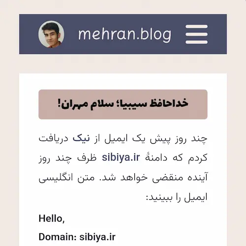

چند روز پیش یک ایمیل از [نیک](https://nic.ir) دریافت کردم که دامنهٔ [sibiya.ir](https://sibiya.ir) ظرف چند روز آینده منقضی خواهد شد. متن انگلیسی ایمیل را ببینید:

<blockquote>
Hello,
 
Domain: sibiya.ir
 
This domain expires on 2024-08-31 and will NOT be active from that date. It will be kept for domain holder for 60 days after the expiration date.
 
Look at Terms and Conditions (.ir), Appendix 4: Renewal Policy and Procedure for more details.
</blockquote>

در ایمیل یاد شده علاوه بر متن انگلیسی، ترجمهٔ فارسی آن را هم نوشته بودند:

> سلام،  
دامنه: sibiya.ir  
مهلت تمدید ثبت این دامنه در تاریخ 1403/06/10 تمام خواهد شد و این دامنه غیرفعال خواهد شد، ولی به‌مدت ‏۶۰ روز پس از تاریخ فوق برای صاحب‌امتیاز دامنه، به‌منظور تمدید ثبت، باقی خواهد ماند.  
برای اطلاعات بیشتر به Terms and Conditions (.ir), Appendix 4: Renewal Policy and Procedure مراجعه نمایید.

واقعاً جای تأسف دارد که فهمیدن متن انگلیسی برای چون منی که زبان مادری‌ام فارسی است راحت‌تر است از خواندن متن فارسی. (خودتان مقایسه کنید.) 

بعد فرهنگستان می‌آید و واژه جعل می‌کند و معادل سازی می‌کند برای واژه‌های بیگانه. الآن مشکل ما جعل معادل برای واژگان بیگانه است؟ اصل را رها کرده‌اند و چسبیده‌اند به خاله زنک بازی. کاش به خودشان بیایند که زبان فارسی با جعل واژه حفظ نمی‌شود و حفظ آن همت بیش‌تری می‌طلبد…

### اول

از کودکی همیشه ترس از قضاوت شدن داشتم و پیش‌تر هم در  [یادداشتم بر کتاب خاطرات سفیر](/blog/riaye_zahede_salous) نوشته بودم که مدام احساساتم را پنهان می‌کردم و گفتنی‌ها را نمی‌‌گفتم مبادا که قضاوت شوم.

تقریباً یک سال از ثبت دامنهٔ [sibiya.ir](https://sibiya.ir) می‌گذرد. روزی که تصمیم گرفتم برای یادداشت‌هایم دامنهٔ شخصی ثبت کنم، ترس از قضاوت شدن دلیل خوبی بود که موجود نبودن دامنهٔ مناسب متناسب با اسم خودم را بهانه کنم و یک اسم بی‌ربط انتخاب کنم و بعد هم در هیچ کجای وب‌سایت اسمی از خودم نیاورم. [sibiya.ir](https://sibiya.ir) را خریدم و یک لینک تلگرام ناشناس گذاشتم پایین وبلاگ تا از راه آن با مخاطبین در ارتباط باشم!

البته از همان روزهای اول تعدادی از دوستانم از وجود چنین وبلاگی مطلع بودند اما به طور کلی سعی می‌کردم چراغ خاموش جلو بروم و خیلی مردم را خبردار نکنم.

### دوم

وجود همان چند نفری که یادداشت‌هایم را می‌خواندند و البته بازخوردهای مثبت و حمایت‌هایشان سبب شد که تا حد خوبی ترسم از قضاوت شدن بریزد و آمادگی این را پیدا کنم که قدمی فراتر بگذارم.

بعد از نوشتن تعدادی یادداشت تصمیم گرفتم که یادداشت‌ها را با نام خودم بنویسم و ایمیل و حساب کاربری گیت‌هابم را هم به وب‌سایت اضافه کنم. به‌علاوه آدرس وب‌سایت را هم در حساب کاربری تلگرامم قرار دادم که افراد بیش‌تری یادداشت‌هایم را بخوانند.

خدای مهربان هر کس را به گونه‌ای آفریده است. هر کس شاکلهٔ خاص خود و شکل و شمایل مختص به خود را دارد پس دلیلی ندارد که کسی بخواهد از داشته‌هایش خجالت بکشد و آن‌ها را پنهان کند.

و حالا به نظرم می‌رسد که عوض پنهان شدن بهتر است که در گذر زمان در بهبود ویژگی‌های شخصیتی‌ام بکوشم و نقاط ضعفم را برطرف سازم و با این پنهان نشدن بیش از پیش آمادهٔ شنیدن نقدها باشم و شنیدن همین نقدها است که راه را برایم هموارتر خواهد ساخت.

### سوم

حالا پس از گذشت یک سال انگار افق جدیدتری به رویم باز شده باشد و چیز جدیدی را کشف کرده باشم:

> افراد بسیار کمتر از آنچه می‌پندارید به شما اهمیت می‌دهند.

آمار و ارقام نشان می‌دهد که اکثریت افراد اصلاً این یادداشت‌ها را نمی‌خوانند که بخواهند قضاوت کنند! 

این یعنی علاوه بر آنکه قضاوت ترس ندارد، اصلاً قضاوتی در کار نیست…

همزمان با این داستان علیرضا هم با خریدن دامنهٔ [alireza.dev](https://alireza.dev) مرا  وسوسه می‌کند یک دامنه با نام خودم ثبت کنم. [mehran.blog](https://mehran.blog) را آزاد می‌یابم و می‌خرم و این دامنهٔ جدید از همین الآن برای خواندن یادداشت‌های من در دسترس خواهد بود. (ظرف مدت کوتاهی از انتشار این نوشته sibiya.ir روی  [mehran.blog](https://mehran.blog) ریدایرکت خواهد شد.)

با این حال باید اعتراف کنم و البته برای کسی که یادداشت‌هایم را می‌خواند روشن است که هنوز هم دربارهٔ بسیاری از موضوعات نمی‌نویسم. با این که نسبت به گذشته خیلی جلو آمده‌ام (یک دامنه با نام خودم دارم، اسمم را بالای وبلاگ نوشته‌ام و دربارهٔ بسیاری از مطالب می‌نویسم) با این حال هنوز هم بسیاری از مسائل را سانسور می‌کنم و دربارهٔ‌شان نمی‌نویسم.

 امیدوارم که خیلی زود برسد روزی که پس از این **اول** و **دوم** و **سوم** چهارمی هم بیاید که قدمی فراتر گذاشته باشم و بنویسم دربارهٔ همهٔ آن مسائلی که امروز نمی‌نویسم…
