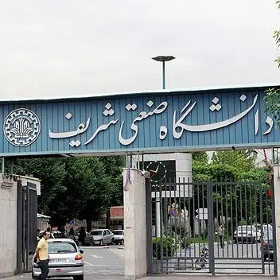

کمدم را مرتب می‌کردم که تعدادی کاغذ پیدا کردم: نامه‌هایی از دانشجویان دانشگاه صنعتی شریف به ورودی‌های سال ۱۳۹۶ این دانشگاه. با خودم فکر کردم که شاید به درد کسی بخورد. از همهٔ آن‌ها عکس گرفتم و به لطف OCR همهٔ‌شان بی‌دردسر به متن تبدیل شدند و حالا هم قرار است بدون هیچ نظم و ترتیب خاصی در این صفحه منتشر شوند.

از آن سال‌ها خیلی گذشته. جامعه دگرگون شده. وضع اقتصاد متفاوت است. دانشجوی امروز جوری دیگر می‌اندیشد. نمی‌دانم بچه‌های شریف هنوز هم از این کارها می‌کنند یا نه. شاید شنیدن حرف‌های امروز دانشجویان برای نوجوانی که هنوز پا به دانشگاه نگذاشته مفیدتر باشد از خواندن این کاغذپاره‌های خاک گرفته اما من منتشرشان می‌کنم بلکه همین کاغذهای فسیل شده گرهی بگشاید.

برای انتشار این نامه‌ها مجبور می‌شوم همهٔ‌شان را بخوانم. مجموعاً سی و یک نامه است. تقریباً هیچ کدامشان را یادم نمی‌آید. شاید هم هیچ وقت نخوانده بودمشان. چندتایشان حتی به درد امروز من بیست و شش ساله هم می‌خورد. چاره‌ای نداریم و باید از یکدیگر درس بیاموزیم…

### یک

> اول که این رشته رو انتخاب کردم همش به این فکر بودم که شاید رشتهٔ دیگری می‌رفتم بهتر بود ولی الان می‌بینم اون تصمیمی که آدم با توجه به شرایط همون موقع که توش قرار داره می‌گیره بهترین تصمیمه الان از همه مواقع سرحال تر و امیدوارتر هستم و با این که ترم‌های اول سخت گذشت و ناامید بودم ولی الان در همه کارهام موفق‌تر از همیشه هستم این رو همیشه توی ذهن داشته باش که به هر چی بخواهی برسی می‌رسی.  
از همه مواقع سرحال‌تر و موفق‌تر-مهندسی شیمی ورودی ۹۳

### دو

> از فرصتت استفاده کن تو فقط قراره چهار سال اینجا باشی کارای مثبتی انجام بده (کلاس زبان و نرم افزار مربوط به رشته) دنبال این نباش که از همین اول عاشق شی!! خودش کم کم بوجود میاد درستو بخون نمی‌تونی بعدا نمره‌ها تو جبران کنی همه کلاساتو تو رو خدا بروو! هر استادی هم هر چقدر بد باشه باز سوادش از تو بیش‌تره برنامه داشته باش همش تو خوابگاه نخواب آنلاین نباش زیادی عشق تو تلگرامو اینستاگرام پیدا نمیشه.  
خوش بختم هم درسمو می‌خونم هم تفریحمو که تو شریف خیلیا نمی‌تونن همزمان داشته باشنش-مهندسی شیمی ورودی ۹۴

### سه

> سلام  
درسته که فکر می‌کنی اونقدرا هم شاخ نیستی و ممکنه کم بیاری اما خودتم میدونی راهی که انتخاب کردی از روی آگاهی بوده خدا هواتو داره بذار خدا روت کار کنه تا بزرگ شی! دفشارا رو تحمل کن و درگیر حواشی نشو… آخرش یه سال که بزرگتر شی می‌بینی اونقدرا هم دغدغه هات مهم نبودن؛ پس سخت نگیر خودتم دست کم نگیر... رشتتو جدی بگیر این سال اولم یه خورده بیشتر تلاش کن تا اعتماد به نفستو از دست ندی.  
در حال تصمیم گیری برای انتخاب راه آینده-مهندسی و علم مواد ورودی ۹۵

### چهار

> ورودی عزيز  
وارد مرحلهٔ مهمی از زندگی‌ات شدی. در دوره‌ای که هر لحظه‌اش غنیمت است و بهره بردن از لحظاتش بر تو واجب. دوره‌ای که چون ابر گذراست و چون کوه ماندگار می‌شود در زندگی‌ات. پس برخیز. بر خدا توکل کن. تلاش و پشتکار یادت نرود که تا به خودت بیايی خواهی دید که این دوران خاتمه یافته است. مشورت با کاردانان را فراموش نکن. مبادا خستگی بر تو چیره گردد و بدان که با اغتنام فرصت‌هایت به زیر آوری چرخ نیلوفری را  
منتظر وقایع خوش زندگی-مهندسی هوافضا ورودی ۹۵

### پنج

> دانشگاه اگه اومدی بیا که درس بخونی، خیلی زود میگذره، شاید عاشق بشی شاید بشکنی شاید دوباره رو پات واستی :))) فقط حواست باشه جبران کردن نمره‌ها بعد دو سال سخته
برگشته!-مهندسی کامپیوتر ورودی ۹۴

### شش

> سلام  
خوشحال باش  
مهم نیست چه رشته‌ای قبول شدی و الان چه دانشگاهی هستی  
مهم نیست بقیه دوستات الان پیش تو هستن یا نه  
از این فرصت استفاده کن، بخند لذت ببر از زندگی  
از تجربه بودن با دوست‌های جدید از تجربه یادگیری  
به استقبال اجتماعی شدن و بزرگ شدن برو  
نترس  
تو بهترینی  
هر چیزی رو خواستی و نبود خودت به وجود بیار  
شروع کننده باش  
هیچ چیزی اونقدرها مهم نیست که خیلی نگرانش باشی  
خوب، خوشحال، موفق، راضی، امیدوار…-مهندسی برق ورودی ۸۳

### هفت

> با خودت صادق باش و برو دنبال علاقه‌های واقعیت. 
می‌خوای چیزی یاد بگیری برو کلاسای بیرون یا آنلاین یاد بگیر. زبان و هنر و ورزش رو سفت بچسب تو دانشگاه نمره مهمه نه یادگیری به من اینو گفتن و باور نکردم و پشیمونم. 
از همین الان برو سر کار حتی اگه مجبور باشی بدون حقوق و از صفر شروع کنی الان دیگه برای کنکور نمی‌خونی اگه واقعا دوست نداری هر روز چندین ساعت درس‌های بی‌ربط بخونی یا برو جای دیگه یا انصراف بده!  
سال ششمی‌ای که پنج سال از عمرش را هدر داده و بسیار پشیمان است-مهندسی کامپیوتر ورودی ۹۱

### هشت

> سلام از همین ابتدا در مورد ۵ ساله کردن دوره کارشناسی هم فکر کن که مزایایش آنقدر زیاد است که در اینجا نمی‌گنجد. تلاش کن در اکثر فعالیتهای دانشجویی مشارکت کنی که هم تجربیات مفیدی به همراه می‌آورد و هم بسیار مایه خوشگذرانیست و در غیر این صورت بعدها حسرتش را خواهی خورد. همچنین در کل سعی کن از جوگیری بپرهیزی و در مورد همه چیز با تفکر کافی براساس وضع موجود و توانایی هات تصمیم بگیری.  
خوب-مهندسی کامپیوتر ورودی ۹۴

### نه

> تا وقتی سیستم آموزش طوری که الان هست باشه خيلی رشته مهم نیست، سعی كنيد یه هدف برای خودتون مشخص کنید در راستای هدفتون درس بخونید کار کنید و زندگی کنید.  
به امید دانشگاه نشینید!   
خودم سه ساله دانشگاه شریفم و قطعا دوران دبیرستان بیشتر از این سه سال مفید بود.  
فاکت آپ-مهندسی صنایع ورودی ۹۳

### ده

> زندگی خیلی بیشتر از اون چیزی که فکرشو میکردم پیچیده بود. خیلی وقت تلف کردم. خیلی چیزا رو پیچوندم و اشتباه کردم دوست خوب هم نشد پیدا کنم که کمکم کنه. پسری از جنوب شهر بودم که انگار جنوب شهری تو این دانشگاه نبود. هیچکس خاکی نبود. دانشگاه خوب بود و هست.  
دارم توش دنبال آرزوهام میگردم یا علی مدد…  
هیییییی انگیزه سابق رو ندارم-فیزیک و مهندسی مکانیک ورودی ۹۴

###یازده

> برنامه‌ات رو برای آینده بدون اگر هم نمی‌دونی اشکالی نداره کم‌کم می‌فهمی برای آینده‌ات برنامه‌ریزی کن از سال اول خوب درس بخون و برای خودت بخون نه معدل تا جایی که می‌تونی مهارت‌های دیگه‌ات رو هم پرورش بده.  
دکترای مهندسی صنایع دانشگاه پیتسبرگ متاهل-مهندسی صنایع ورودی ۹۱

### دوازده

> ای کاش بجای غرق شدن در هیاهوی شریفی شدن دمادم برای خود چرا و چه بایدها می‌ساختی و در تکاپوی یافتن پاسخ چراها و چه بایدها، ذره‌ذره خود را می‌ساختی چرا من؟! چرا شریف؟ چرا این رشته؟! چه باید بشوم؟! چه باید بکنم؟… چرا؟… چه باید؟  
خوب راه خویش یافته تا حد خوبی-مهندسی مکانیک ورودی ۹۴

### سیزده

> به انتخاب دوستات خیلی توجه کن نه فقط خوب بودنشون به اینکه چقد پرانرژی و پرانگیزه‌اند به زور دیگران نرو به رشتهٔ دیگه عقب میفتی به توانایی‌هات باور داشته باش و از اول دانشگاه با قدرت شروع کن اگه نمره‌ایت بد شد اصلا مهم نیس؛ فقط طوری بخون درسا رو که احساس کنی اون درسا رو یاد گرفتی ورزش کن تفریح کن از اول با بقیه ارتباط برقرار کن خصوصا اساتید از همون موقع یکم چیزای دیگه بخون. خصوصا فیزیک. الان خوشم میاد.  
بی‌نشاط و بی‌انگیزه ... افسرده-ریاضی تغییر رشته از کامپیوتر به ریاضی ورودی ۹۳

### چهارده

> ای کاش به حرف‌های معلم‌ها و مادرم گوش می‌دادم و پزشکی می‌خواندم.  
پشیمان از تحصیل مهندسی-مهندسی مکانیک ورودی ۶۳

### پانزده

> سلام  
خوشحالم که بعد از این همه تلاش تونستی اون جایی باشی که دوست داشتی من هم اون روزا خوشحال بودم و کمی غرور داشتم ولی الان بعد از ۸ سال نه اون غرور سابق رو دارم و نه اون نشاط رو. می‌خوام بدونی که خیلی باید حواست رو جمع کنی همیشه و هر لحظه به دانشگاه به عنوان یک معبر نگاه کن نه مقصد تو تازه اول راهی. این چند سال ممکنه خیلی اتفاقا برات بیوفته که اصلا شاید انتظارشون رو هم نداشته باشی. بزرگ فکر کن.  
پر از ایده-سردرگم و کمی ناراحت-میم شیمی ورودی ۸۸

### شانزده

>‌ خب ۵ سال قبل! توصیه! خب باید به خودم بگم که سختی‌ها و سستی‌های دوری تموم می‌شه! خب صبر کن تا ثمرات صبرت وجودت رو لبریز از آرامش کنه! علاوه بر اینها، فکر نکن اومدی شریف که فقط درس بخونی چه بسا که علم اندکت موجب طغيان بشه! شریف قراره تو رو بسازه! هجرت، زمینه رشده! نه تند برو و نه کند! نه در اختیار کردن دوستان تعجیل کن و نه تعلل! فضای جدید تو رو عوض نکنه.  
والسلام على من التبع الهدى  
وضعیت من الان دوباره بعد از 5 سال یک جابجایی رو داشتم یک بار از مشهد به تهران / و الان از ایران به آمریکا / پشت میزم نشستم و دارم به قبل از ورود به دانشگاه شریف فکر میکنم یه چیز تو ذهنم مرور میشه سجاده نشین باوقاری بودم ... بازیچه کوی کودکانم کردی / به جان دوست که غم پرده بر شما ندرد ....گر اعتماد بر الطاف کارساز کنید-مهندسی صنایع ورودی ۹۱

### هفده

> اگر ۱۸ سالم بود و اختیارم دست خودم بود، فقططط دنبال کار حرفه مهارت رشته یا هر چیز دیگه ای که توش پول باشه می‌رفتم پول همه چیزه حرف اول و آخر ... محبوبیت سلامتی محبت خوشی ذهن پویا و … به پول داشتن و جیب پر برمی گرده این حرفو یه دختر داره میزنه با پول میشه پدر و مادرتو پادشاه و ملکه کنی و اگه ۱۸ سالم بود ۱۰ برابر کتاب‌های غیر درسی می‌خوندم پول و کتاب همه چیزه.  
در حال مجوز گرفتن برای به وسیله اختراع شده توسط خودم برای فروش-فیزیک ورودی ۸۸

### هجده

> سلام  
می‌دونم الان از این که اون کارت آبی رنگ رو بالاخره به دست آوردی خوشحالی و حوصلهٔ شنیدن نصیحت نداری و می‌خوای شاد باشی … گوشت از خیلی حرفا پره و به هیچ حرفی بدهکار نیست می‌خوای کار خودتو بکنی یه رویایی تو ذهنت هست سیاه سفید تار گنگ فقط میخوام ازت بپرسم اصلا این رویای توئه؟ دوستش داری؟ خب پس چرا رنگیش نمی‌کنی؟ واضحش کن نکنه شک داری؟  
راهمو پیدا کردم و از وضعیت فعلی راضی‌ام اما ناراحت از این که چه دیر و چه قدر اشتباه کردم و وقت تلف شد-فیزیک ورودی ۹۳

### نوزده

> ضمیر درونم همون که همیشه دلداریم می‌ده می‌گه که همه چیز داره اروم اروم پیش میره و خيلی عجله‌ای واسه رسیدن به همه چی نداشته باش میگه تو خوب بودی واقعا تو طول این سالهایی که گذشت و سخت تلاش کردی. اگه خوب دور و و برت هم ببينی، می‌بينی که به نتیجه خوبی رسيدی. درسته که اون رشته‌ای که علاقه قلبیم بود قبول نشدم و هیچ کس هم بهم نگفت اگه شاگرد الف می‌شدی می‌تونستی دورشته‌ای بشی اما خودآموز به علاقم رسیدم.  
حال من خوب است اما تو باور نکن-مهندسی صنایع ورودی ۹۰

### بیست

> در مورد من شاید مهمترین عامل خوب بودن حالم اینه که قبل از ورود به دانشگاه یک سری اصولی برا خودم تعریف کردم و تقریبا بهشون عمل کردم مثل اخلاق و ورزش و درست و به اندازه درس خوندن... اگر چه بدم نمیاد بتونم برگردم عقب و یک سری از اشتباهات بخصوص تو انتخاب واحد و انتخاب اساتید خوب جبران کنم. حتما استاد خوب انتخاب کن. کاری که من خیلی بهش اهمیت نمی‌دادم خوب ورزش کن! خوب درس بخون و اصول اخلاقی مناسبی انتخاب کن یاحق.  
حالم خوبه راضیم از مسیری که رفتم ولی کاش می‌شد برگردم و چند تا تغییر کوچیک بوجود بیارم-مهندسی عمران ورودی ۹۳

### بیست و یک

> سلام.  
قبل از هرچیز تکلیف خودت رو با اهدافت مشخص کن برنامه‌ریزی استراتژیک یاد بگیر و در زندگی شخصی اعمال کن. برای ارتباط با خدا وقت ویژه بذار و هر روز بهبودش بده. دانش روانشناسیتو ارتقا بده و به دنبال ساختن خودت برای زندگی متناسب با اهدافت باش… حواست باشه سختی درس‌ها و جذابیت‌های آزادی از محیط دبیرستان وقتتو تلف نکنه.  
مجرد در حال گذراندن سربازی شاغل با حقوق ۲۲۰۰-مهندسی صنایع ورودی ۸۹

### بیست و دو

>‌ سلام می‌دونم که شادی و فکر می‌کنی اصل مسیر رو رفتی و حالا باید چند تا قدم آخر رو برداری که موفق باشی… گول نخور بازی تازه شروع شده قراره عاشق شی کارکنی درس بخونی و تازه بیای قدم‌های اولیه برای آینده‌ات رو بسازی؛ پس گام هات رو درست بذار رفقایی پیداکن که بتونی بهشون تکیه کنی و بهت تکیه کنند فقط برا نفع کوتاه مدت شخصی‌ات تصمیم نگیر که همونه که گیرش افتادیم. خیر عمومی رو هم در نظر بگیر و ترویج کن… حق یارت.  
همچنان دانشجو-مهندسی صنایع ورودی ۹۴

### بیست و سه
> 
سلام می دونم که حالت خوبه و کلی خوشحالی که رتبه کنکورت خوب شده و از بقیه دوست‌هات بهتر شد و فک میکنی شاخ غول رو شکوندی باشه همه اینها قبول... از الان به بعد می‌خوای چیکار کنی؟ میدونی تو دانشگاه چه خبره؟ نشه که بیای دانشگاه گیج و گم بشی اصلا هدف داری؟ تهش چی میشی؟ از من به من نصیحت بشین فکر کن وجدانا به حرفم گوش بده نگو حرف الکی نزن و نصیحت نکن و فلان گوش بده و همین... دوستت دارم عزیزم!!!  
گم-مهندسی کامپیوتر - ورودی ۹۵

### بیست و چهار

> سلام دختر کوچولوی خجالتی من اين روزا باید مشغول خوشحالی کردن برای قبولی دانشگاهت باشی سالهای پیش روت هم غم داره هم شادی ولی نگران نباش..... هیچ چیزی نیست که نشه جبران کرد فقط چند تا چیز رو یادت باشه بهترین های زندگیت بابا و مامانت هستن یادت نره هر روز بوسشون کنی چون یه روز دلت واسه همین تنگ میشه عاشق شو انقدر نترس از گفتن این که دوسش داری بزار بدونه اونم كل دنيای تو هستش اینجوری شاید الان کنار هم باشید.  
دانشجو دکترا-مهندسی و علم مواد ورودی ۸۸

### بیست و پنج

> من صراحتا حرفمو می‌زنم شریف دیگه شریف نیست. نمره گرفتن شده با استاد حرف زدن الان همه در تلاشن که یه جوری برن در اتاق استاد و نمره بگیرن اینو الان نمی‌فهمین ولی سال اخر خیلی خوب درک می‌کنین من نمی‌گم برین این طوری نمره بگیرین : جو رو بهتون گفتم ولی توصیه می‌کنم جو درس خوندن کنکورتون رو حفظ کنید. سال آخر که برسین می‌فهمین که بیشترین سود نه صرفا مالی مال کسیه که درسا رو خوب خونده درسا رو جدی بگیرید.  
دانشجوی سال آخر رو به رشد... مهندسی کامپیوتر ورودی ۹۳

### بیست و شش

> ببخشید که تو این یه سال خیلی اذیتت کردم که رفتارهای نابجام، باعث شد تو زمان رو از دست بدی و نتونی پیشرفت کنی که باعث پسرفتت شدم... هم تو درس هم تو مسائل اخلاقی خلاصه ببخشید که اعتماد بی‌جای من به یه سری افراد بی‌ارزش باعث شد تو آزرده بشی از سوء استفاده‌های اونا ولی خداروشکر زود از خواب غفلت بیدار شدی و به خودت اومدی ممنون که اراده به پرواز کردی. اینو بدون که اراده به پرواز از خود پرواز قشنگتره عزیزم  
فردی زخم خورده که دلش برا اونایی که نباید می‌سوخت سوخته ولی الان شاد و خوشحال -مهندسی شیمی ورودی ۹۵

### بیست و هفت

> اگه تا الان فکر می‌کردی بزرگ شدی اشتباه می‌کردی دانشگاه تازه شروع بزرگ شدنه قبل از شروع هر کاری بهش فکر کن اگه درست بود تجربه‌اش کن اگه تجربه‌اش کردی و بد بود حسرت نخور و این !!!!! اشتباهو تكرار نکن ! :) در همه مراحل هم اعم از سخت و آسون سعی کن از زندگیت لذت ببری و راضی باشی.  
وضعیتم شاید اون قدرها از لحاظ درسی خوب نباشه ولی خودم خیلی از خودم و کارایی که تو دانشگاه می‌کنم راضی‌ام. مهندسی کامپیوتر ورودی ۹۵

### بیست و هشت

> که دیدی داری شکست می‌خوری از اینکه از دیگران کمک بگیری هیچ ابایی نداشته باش  
پشیمون-مهندسی برق ورودی ۸۹

### بیست و نه

> سلام محمد  
می‌دونم خیلی سردرگمی و نمی‌دونم داری چیکار می‌کنی و دنبال یه هدف خوب می‌گردی تا برای رسیدن بهش تلاش کنی اما ناامید نشو و از همه مهمتر خوب درس‌هات رو بخون تو قراره یه مهندس عالی بشی و لازمه که از لحاظ علمی پر باشی می‌دونم دنبال چیزهای جدید و هیجان انگیز تر و عملی‌تری اما با نظم عمل کن رد نده ورزش کن و خودت رو از لحاظ معنوی هم تغذیه کن محمد صبر داشته باش برای اتفاق‌های خوب و خیلی به خودت سخت نگیر  
خوب-مهندسی عمران ورودی ۹۴

### سی

> تو را چه شده؟! بنگر به کجا رسیده‌ای چه مسیر پرفراز و نشیبی را طی کرده‌ای و چه دوران تلخ و شیرینی را گذرانده‌ای چه آرزوهایی که فقط آرزو ماندند و افکاری که هیچ گاه تحقق پیدا نکردند به یادآر آن دل صاف و پاکت را به یادآر آرمان خواهیت را یادت هست آن تحول جهانی که فکرش را می‌کردی؟ یادت هست آن آرمان شهری که دنبالش بودی؟ نکند هدف را گم کرده باشی در هیاهوی شهر راهت را گم کرده باشی به راستی تو را چه شده؟  
ترم اول ارشد مکانیک هستم-مهندسی مکانیک ورودی ۹۱

### سی و یک

> خسته نباشید بهت میگم اولا بخاطر تلاشت که حالا تورو به این موفقیت بزرگ رسوند ولی دقت کن که شریف اومدن فرصته. فرصت اینو داری که موفقیت و افتخار کسب کنی توی رشتهٔ خودت و اپلای هم امتیاز... افتخار نیست. امتیازه و فرصتی برای ترقی و کسب موفقیته دورتم شلوغ نکن هر چقدر آدم شاخ و با حالم دورت باشه باز توی رزومه از تو توصیه‌نامه استاد میخوان نه رفیق : جون مادرت گوش کن بای  
عبرت گرفتهٔ پشیمون-مهندسی برق ورودی ۹۵
 