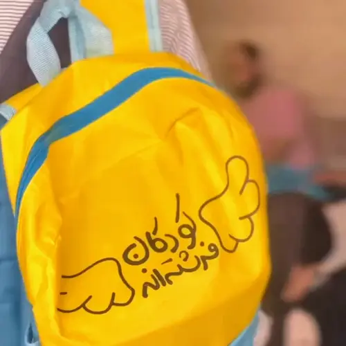
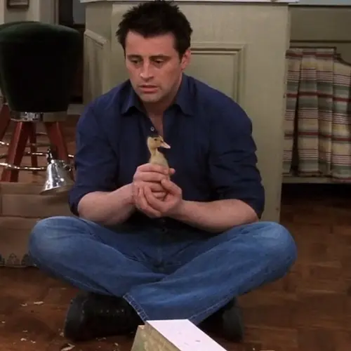

بعد از ظهر جمعه است.

کوله‌پشتی‌ها و بگ‌ها را در خانهٔ مهناز که لطف کرد و در اختیارمان گذاشت پر کردیم و حالا دارم برمی‌گردم خانه.

قرار است مقداری لوازم‌التحریر به دانش‌آموزان بلوچستان هدیه شود. در یک طرح خیلی منطقی آمده‌اند دانش‌آموزان را به دو دسته تقسیم کرده‌اند. آن‌هایی که به تازگی (یکی دو سال اخیر) کوله گرفته‌اند و آنهایی که نگرفته‌اند!

به همه لوازم‌التحریر یکسانی داده می‌شود. فقط دستهٔ اول کوله نمی‌گیرند و لوازم‌التحریرشان را درون یک ساک پارچه‌ای دریافت می‌کنند. بچه‌ها به این ساک‌های پارچه‌ای می‌گویند بگ!

دارم با خودم فکر می‌کنم که چرا باید به این ساک‌های پارچه‌ای بگوییم بگ؟ مگر آن یکی کوله پشتی‌ها بگ نیستند؟

سعی می‌کنم نگاهی به معنای بگ در آکسفورد بیندازم. می‌دانم بیهوده است اما با این حال باز هم انجامش می‌دهم.

در آکسفورد از گودی زیر چشم گرفته تا پیرزن بدعُنُق را برای معنای **بگ** پیدا می‌کنم اما باز هم نمی‌فهمم چرا به این ساک‌ پارچه‌ی‌ها می‌گوییم بگ. حتماً این یکی هم تقصیر فرهنگستان است.

توی مترو ایستاده‌ام در همان جایی که نباید ایستاد و آقایی که پایهٔ نگهدارندهٔ موبایل می‌فروشد را تماشا می‌کنم. از همان پایه‌هایی می‌فروشد که من شصت هزار تومان خریده بودم و حالا همه پنجاه می‌فروشند. 

یکی می‌خرد و خودش نمی‌تواند سر هم کند. از آقای فروشنده می‌خواهد این کار را برایش انجام بدهد تا احتمالاً مطمئن بشود جنسی که خریده ایرادی ندارد.

آقای فروشنده دارد سر هم می‌کند و من هم زل زده‌ام و تماشایش می‌کنم. انگار نه انگار که تا حالا خودم ده مرتبه این کار را انجام داده‌ام.

آقای فروشنده دارد سر هم می‌کند که می‌فهمم دست چپش سالم نیست. اول دلم برایش می‌سوزد. بعدتر اما می‌ترسم از روزی که دستم سالم نباشد. بعد اما یادم می‌آید که گهی پشت به زین و گهی زین به پشت. ترس ندارد. این‌ همه سال این همه آدم دستشان سالم نبود و هیچ کدامشان هم از گرسنگی نمردند. پس من چرا باید بیخود نگران چیزی باشم که هیچ معلوم نیست هیچ وقت اتفاق بیفتد؟

دلم برای پوریا تنگ شده است. هنوز یک هفته نشده که رفته. شب آخر رفتم پیشش و دو تا از بچه‌هایی را که پنج سال بود ندیده بودم دیدم. سید و علی و با امیرحسین هم آشنا شدم. فضای صمیمی آن شب یادم انداخت که چه فرصت‌هایی را از دست داده‌ام. سال‌ها بود چنین فضایی را تجربه نکرده بودم. یه تعداد آدم جانماز آب‌نکش که می‌توانند فارغ از همهٔ گرفتاری‌های روزمره دور هم جمع شوند و مثل چهار تا بچهٔ دبیرستانی که هنوز هیچ از زندگی نفهمیده‌اند رفتار کنند. با هم مهربان باشند و دربارهٔ موضوعات کمتر مهم به صحبت بنشینند و یادم بیندازند که سیستم بانکداری‌مان خیلی سالم نیست و من هم بعد از چند سال [این یادداشت را دربارهٔ ربا](/blog/riba-vs-renting) بنویسم.

دلم می‌خواهد جویی باشم. کمی خنگ و شلمغز. بروم در یخچال مانیکا را بی‌آنکه ناراحت شود باز کنم و فیلانجی؟! با خل‌وضعی‌اش حالم را خوب کند.

اما راستش هیچ کدام از این‌ها اتفاق نمی‌افتد. بعد از سربازی خیلی به ندرت فوسبال بازی کرده‌ام. انگار کسی فرصت ندارد. هر کس به نوعی درگیر است.

واقعیت این است که جویی هم که باشی عاقبت همهٔ دوستانت می‌روند پی زندگی‌شان و همه چیز تا همیشه باقی نمی‌ماند با این حال:

> همیشه تمام شدن هر نعمتی حداقل فایده‌اش قدردانی بیش‌تر از نعمتی است که زمانی بود و حالا دیگر نیست. گاهی این قدر دانستن نوش‌داروی بعد مرگ سهراب است اما هر چه که باشد بهتر است از قدر ندانستنی که به واسطهٔ حضور دائمی نعمت است. 

سه روز است درست نخوابیده‌ام و در عوض مثل چی کار کرده‌ام. حالا کم‌کم دارم بدن درد را حس می‌کنم. در این سه روز شاید مجموعاً به اندازهٔ یک روز عادی غذا خورده باشم. 

داشتم دربارهٔ خیریه می‌گفتم و بسته بندی کیف‌ها و بگ‌ها. معمولاً در خیریه خیلی خوب کار می‌کنم. یعنی همیشه همه جا خیلی خوب کار می‌کنم. خیریه هم فقط یکی از مصادیق است.

 این چند وقت این قدری کار کرده‌ام که شده‌ام زبانزد عام و خاص. از شنیدن این تعریف‌ها سر ذوق می‌آیم و این آزارم می‌دهد. خلوص نیتی دیگر نمانده و این واقعاً بد است.

هنوز آزادی نرسیده‌ام که اذان می‌شود. حالا شهریور است و روزها دارند کوتاه می‌شوند. می‌رسیم آزادی، وضو می‌گیرم و قامت می‌بندم که پیرمردی در به در دنبال یکی می‌گردد که به او اقتدا کند. سعی می‌کنم خلوص نیت بیش‌تری به خرج بدهم تا بلکه مقبول بیفتم. با این حال همزمان رکوعم را سریع تمام می‌کنم که مثلاً راضی نیستم ولی انگار نه انگار. پیرمرد از ما خوشش نیامده، می‌رود و به کس دیگری اقتدا می‌کند. او البته می‌گوید که راضی نیست. کسی را قضاوت نمی‌کنم ولی شاید حالا داد حسابی کیف می‌کند از امام جماعت شدن.

من اما در ادامه وقت را غنیمت می‌شمرم و سر نماز به آنچه باید بنویسم می‌اندیشم.

گاهی اوقات غصه‌ام می‌گیرد وقتی فکر می‌کنم هیچ کس قرار نیست این یادداشت‌ها را بخواند. چه‌قدر تنهایم من. 

بعدتر یادم می‌افتد که یکی دو نفر می‌خوانند. آن قدری تنها شده‌ام که ترجیح می‌دادم همان یکی دو نفر هم نمی‌خواندند. 

بعدتر اما با خودم فکر می‌کنم که دارم برای همان یکی دو نفر قمپز در می‌کنم که الکی مثلاً برایم مهم نیستید.

نباید خودم را گول بزنم. اگر دلم نمی‌خواست کسی بخواندشان روی رایانهٔ خودم نگه می‌داشتمشان و هیچ وقت منتشرشان نمی‌کردم.

نماز را می‌خوانم. دلم هوای پوریا را دارد. دلم می‌خواهد گریه کنم. دلم می‌خواهد آسمان‌جل باشم و شب را در پارک المهدی سحر کنم. 

خسته‌ام از این همه قیل و قال.

قدیم‌تر فرصتی داشتم که بنشینم و به دیوار سفید روبرویم زل بزنم و هیچ چیز و هیچ کسی مزاحمم نباشد. حالا اما هیچ وقت خالی ندارم. یا سرم به کامپیوتر است، یا کتاب می‌خوانم یا با مامان و میلاد حرف می‌زنم. تا هم وقت خالی پیدا می‌کنم شروع می‌کنم به فکر کردن. این یکی از همه بدتر است. حالم از این وضعیت بهم می‌خورد.

خل‌بازی‌های امروز فاطمه بیش‌تر یادم انداخت که همهٔ‌مان چه اندازه تنهاییم. یکی خرکاری می‌کند و یکی هم می‌زند به در خل‌بازی. همه نشان از یک حس مشترک دارد و آن تنهایی است.

توی اتوبوس دوست دوران خدمتم را می‌بینم. اسمش را یادم نمی‌آید. پسر خوبی است. دوستش دارم ولی با این حال سمتش نمی‌روم. حوصلهٔ سلام و احوال پرسی‌های تعارفی را ندارم. بیش‌تر ترجیح می‌دهم یکی باشد که بتوانم همین‌ها را برایش بخوانم. کاش حداقل پوریا نرفته بود.

دلم گریه می‌خواهد.

مچ دستم هم به درد افتاده است. نمی‌دانم ارتباطی با بقیه بدن دردم دارد یا نه ولی این یکی بیشتر از بقیهٔ جاها اذیت می‌کند. به جز مچ، باسن‌هایم هم به درد افتاده‌اند. انگار دارند اعتراض می‌کنند به این حجم از فشار.

عیبی ندارد. این‌ دردها همه خوب می‌شود. خوب هم نشود یک جوری با آن‌ کنار می‌آیم. فقط کاش روحم درد نکند…