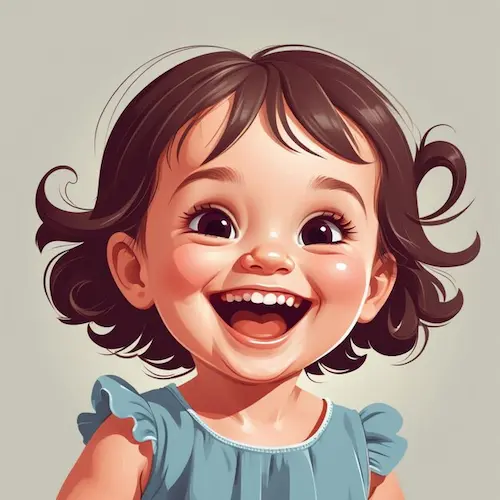

<a href="https://www.freepik.com/premium-ai-image/picture-smiling-baby-with-blue-dress-it_239828577.htm">Image by iliaulizko2 </a> on Freepik

صبح درحالی‌که لبخند به لبانش بود وارد می‌شد، تمام روز را لبخند می‌زد و در نهایت هم با همان لبخند خداحافظی می‌کرد و می‌رفت. 

حکایت همکاری است که حالا نزدیک به سه هفته است او را ندیده‌ام. خانمی که کمی از مادرم کوچکتر است. روز آخر هم درحالی‌که همان لبخند را به لب داشت هدیه‌ای را به دستم داد و خواست که آن را به مادرم بدهم و از او تشکر کنم. زنی که هیچ گاه او را ندیده‌ بود. 

به قول پوریا بعضی آدم‌ها در لیگ دیگری بازی می‌کنند.

و حالا بعد از سه هفته بی‌خبری درحالی‌که خیال می‌کردم در حقش کوتاهی کرده‌ام این پیام را برایش نوشتم:

> سلام 👋  
خواستم سلام کنم و بگم یه موقع پیش خودتون فکر نکنید که این شعبانی بی‌معرفت رفت و پشت سرش هم نگاه نکرد.😅  
من حتی گاهی یاد دوستای دورهٔ ابتدایی‌ام که پونزده سال یا بیش‌تر ندیدمشون می‌افتم.  
و معمولاً به این قضیه فکر می‌کنم که اگه امروز حالم خوبه آدم‌ها چه نقش مهمی توی زندگی‌ام داشتن و بعضی از دوستام اگه نبودن و محبت‌هاشون توی این سال‌ها نبود شاید الآن من جور دیگه‌ای بودم و حالم خوب نبود یا هر چیز دیگه.  
خلاصه که من اعتقاد دارم که اگرچه گاهی زمان و مکان بین آدم‌ها فاصله می‌اندازه ولی پیوند آدم‌ها مربوط به عالم دیگه‌ایه و با این فاصله‌ها شکسته نمی‌شه.  
طولانی شد دوباره😅  
همین دیگه. سلام برسونید مخصوصاً به پسر کوچیکه که دیدمش😍  
مراقب خودتون و گل‌پسرها باشید🌹
