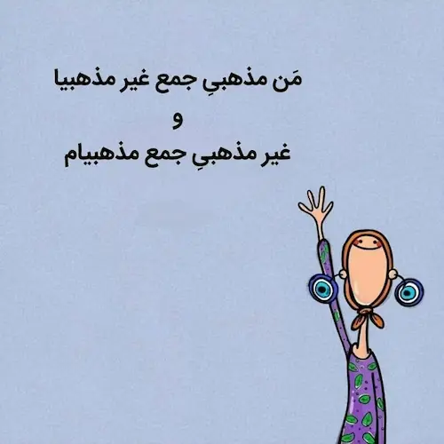

دو دوست پیاده عزم سفر کردند. در راه به رودخانه‌ای رسیدند. زنی میان‌سال را دیدند که بر روی سنگی نشسته است. احوالش پرسیدند. زن به دلیل زخم پاهایش نمی‌توانست از رودخانه عبور کند. اولی زن را بغل می‌کند و از رودخانه عبور می‌دهد. به خشکی که می‌رسند زن را پیاده می‌کند و به سفرشان ادامه می‌دهند. شب می‌شود. جایی را برای استراحت پیدا می‌کنند و سر به بالین می‌نهند. صبح وقتی اولی برای نماز از خواب برمی‌خیزد، دومی می‌گوید:

> دیشب خوابم نبرد. 

<!---->
> چرا؟

<!---->
> از دیروز دارم فکر می‌کنم که کاری که تو کردی و اون زن رو بغل کردی درست بود یا نه!

<!---->
> عه! راست می‌گی؟

<!---->
>  آره! نامحرم بود و  لمس بدن نامحرم حرامه! بغلش که کرده بودی یه جوری نشدی؟

<!---->
>  می‌دونی چیه؟ من اصلاً یادم رفته بود! از دیروز که گذاشتمش زمین دیگه بهش فکر نکردم. جدی تمام این مدت فکرت رو مشغول کرده بود؟

این داستان را سال‌ها قبل علیرضا برایم تعریف می‌کرد که واقعاً داستان پر از عبرتی است.

***

چند روز پیش روی صندلی نشسته بودم و منتظر قطار مترو بودم و داشتم اوریگامی می‌ساختم که جوانی چند سال بزرگ‌تر از خودم نشست کنارم و پرسید:

> چی درست می‌کنی؟

<!---->
> خرگوش! ولی انگار یادم رفته…

<!---->
> من قایق بلدم. کاغذت رو بده، یادت بدم.

کاغذم را می‌گیرد و شروع می‌کند به ساختن قایق.

قایق که تمام می‌شود می‌پرسد:

> دانشجویی؟ طلبه‌ای؟ چی کار می‌کنی؟

<!---->
>  بندهٔ خدایم!

<!---->
>  اون که آره! همه‌مون بندهٔ خداییم…

می‌فهمم آقا طلبه‌ است. یک خرگوش درست می‌کنم و می‌دهم دستش که یادگاری داشته باشد. حالا دیگر حسابی صمیمی شده‌ایم. شروع می‌کند از صابون و گلنار صحبت کردن و توصیه می‌کند که هر چه زودتر ازدواج کنم و اگر پول ندارم صیغه کنم!

البته که تلاشش برای نجات یکی از بندگان خدا شایستهٔ تحسین است اما این که رابطهٔ جنسی دغدغهٔ اول یک جوان آن هم از نوع طلبه‌اش باشد به نظرم خیلی پسندیده نیست.

می‌دانم کار بدی است اما در ذهنم این آقای طلبه را با چند تن از دوستان نه چندان مذهبی‌ام مقایسه می‌کنم. نمی‌دانم نیازهای جنسی‌شان را چگونه برطرف می‌کنند؟ گلنار استفاده می‌کنند یا زنا می‌کنند؟ یا شاید هم مثل حاج آقا صیغه می‌کنند! اما مطمئنم هر غلطی که می‌کنند نتیجه این است که س**ک* *س مهم‌ترین دغدغهٔ زندگی‌شان نیست که اگر بود بعد از این همه سال رفاقت می‌فهمیدم که نیازهایشان را چگونه برطرف می‌کنند!

می‌ترسم که فردا روزی یقه‌ام را بگیرند و به جرم تضعیف روحانیت کله‌پایم کنند. نه که از محتسب بترسم. از خدا می‌ترسم که آن را که خدا پشتیبان باشد از محتسب چه باک؟

***

با سید نشسته‌ایم و داریم مدارک پوریا را وارسی می‌کنیم. حالا رسیده‌ایم به کارت واکسیناسیون.

> خُب! گارداسیل هم که نزدی!

می‌پرسم:

> سید! گارداسیل توی ایران چه جوریه؟ مراکز بهداشت دارند یا باید بری از ناصر خسرو بگیری؟

<!---->
>  مراکز بهداشت رو نمی‌دونم ولی فکر کنم داروخونه‌ها داشته باشند.

<!---->
>  بریم یه گارداسیل بزنیم!

سید نگاهی عاقل اندر سفیه به من می‌اندازد. بعد از چند ثانیه اما لبخند می‌زند و می‌گوید:

> آره! استخر که می‌ری!

می‌پرسم:

> سید تو زدی؟

در جوابم می‌گوید که:

> من زن دارم!

می‌خندم و می‌پرسم:

> یعنی استخر هم نمی‌ری؟

پوریا هم می‌خندد.

***

بی‌کار که می‌شوم برای سرگرمی و تفنن شروع می‌کنم عکس‌ پروفایل‌های مردم را نگاه می‌کنم! اصلاً عادت خوبی نیست اما چه کنم؟ سرگرمی بهتری ندارم! 

در میان همین پروفایل گردی‌ها می‌رسم به دختری که روی عکسش نوشته:

> من مذهبیِ جمع غیر مذهبیا و غیر مذهبیِ جمع مذهبیام

نمی‌شناسمش! نمی‌دانم چه جور دختری است اما این جمله حسابی به دلم می‌نشیند. با خودم فکر می‌کنم:

> من هم که بزرگ شدم می‌خواهم مذهبی جمع غیر مذهبی‌ها و غیر مذهبی جمع مذهبی‌ها باشم…

تا قبل از دیدن این عکس دودل بودم که حکایت علیرضا و حاج‌آقایی که قایق می‌ساخت را بنویسم اما با دیدن این عکس مصمم شدم به نوشتن. حین نوشتن به نظرم رسید که حکایت من و سید و گارداسیل را هم اضافه کنم. نمی‌دانم رابطهٔ این‌ها با هم چیست اما در هر صورت حالا از نوشته‌ام احساس رضایت می‌کنم.

