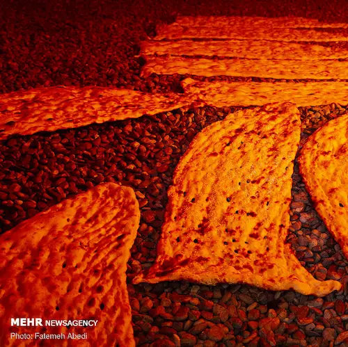

عکس از  <a href="https://www.mehrnews.com/photo/4838996/%D8%B3%D9%86%DA%AF%DA%A9-%D9%86%D8%A7%D9%86-%D8%A7%DB%8C%D8%B1%D8%A7%D9%86%DB%8C"> فاطمه عابدی </a>

غروب رفتم نانوایی که دو تا سنگک بخرم. مدتی است که دیگر صف آقایان و بانوان جدا نیست. پیش‌تر شاید جدا بودن صف آقایان و بانوان توجیهی داشت: حفظ حریم خواهران و مادرانمان. اما حالا که مردان و زنان همه جا در هم می‌لولند دیگر مسخره است جدا بودن صف خانم‌ و آقا. نانوایی لواشیمان اما هنوز جدا است صف آقا و خانم‌. گاهی می‌روم نانوایی و می‌بینم ده نفر آقا توی صف ایستاده‌اند و هیچ خانمی نیست. بعد هر بار یک خانم می‌آید و همان لحظه نانش را می‌گیرد و ما همچنان باید در صف بایستیم. مسخره است…

 بعضی‌ روزها هم برعکس است. می‌روم نانوایی و می‌بینم هیچ آقایی نیست و ده نفر خانم ایستاده‌اند. رویم نمی‌شود نانم را جمع کنم. خودم را می‌زنم به حواس پرتی و خودم را با گوشی موبایلم سرگرم می‌کنم که چند تا خانم نان بگیرند و بعد من نانم را جمع کنم. بعضی از فرصت استفاده می‌کنند و بلافاصله بعد از خانم قبلی شروع می‌کنند نان جمع کردن و بعضی دیگر هم مرام و معرفتشان را نشان می‌دهند و صدایم می‌زنند که آقا نوبت شماست؛ جمع نمی‌کنید؟

بگذریم. داشتم نانوایی سنگکی را تعریف می‌کردم. رفتم نانوایی. دیدم ۵ نفر در صف یدونه‌ای ایستاده‌اند و هیچ کس در صف چندتایی نیست. سریع کارتم را کشیدم و نوبتم شد! و آن مردمانی که یدونه می‌خواستند هم‌چنان در صف ایستاده بودند و صدایشان هم در نمی‌آمد…

دیدم به دور از انصاف است سوء استفاده از این سکوت و مظلومیت. من نانم را بگیرم و بروم و بندگان خدا بمانند؟ 

به شاطر گفتم:

> این‌هایی که در صف یدونه‌ای ایستاده‌اند همه قبل از من آمده‌اند. اول نان آن‌ها را بده!

یکی از همان یدونه‌ای‌ها گفت:

> نه آقا. نوبت شماست. شما بگیرید. نوبت ما هم می‌شه. دستتون درد نکنه.

داشتم به او می‌فهماندم که الآن نوبت اوست و این کار من لطف نیست و ادای حق است که یکی از پشت فریاد زد:

> اگه نمی‌خوای نون بگیری، بیا عقب من بگیرم. چرا مسخره بازی در می‌آری؟

کاش می‌زدم و دندان‌هایش را خرد می‌کردم آن الاغ را…

