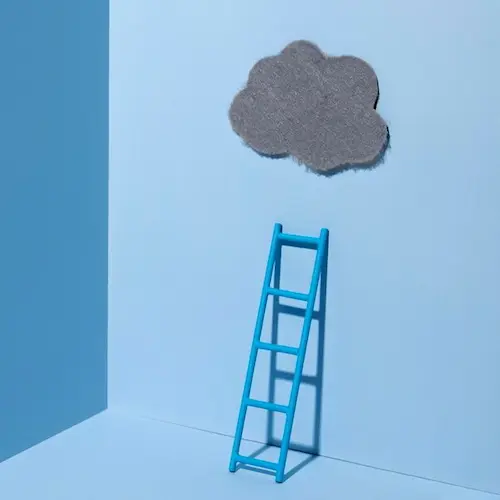

Image by  <a href="https://www.freepik.com/free-photo/blue-monday-with-ladder-cloud_11009057.htm"> Freepik </a>

نردبان سالم که نداشته باشی خیال رفتن به افق‌های بالاتر خریت محض است.

آخرش می‌افتی و دست و پایت را می‌شکنی و همین موقعیت فعلی را هم از دست می‌دهی!

***

سید ساعت‌ها برایمان از افق‌های بالاتر تعریف کرد و در انتها گفت که هر چه برایتان گفتم را بریزید دور. نه نردبان داریم و نه دست و پای سالم. بیایید همفکری کنیم ببینیم در این شرایط چه خاکی باید بر سرمان بریزیم!؟

***

پوریا گفت برای اینکه این مردم ایمان بیاورند باید شش ماه برق قطع شود! در وضعیت فعلی ایمان آوردن محال است.

حرفش را تأیید کردم و اضافه کردم که اما بعضی آمادگی لازم را دارند. یک جرقّه لازم است…

پوریا گفت که او گفت که اگر دین ندارید لااقل آزاده باشید…

*** 

مغزم سوت می‌کشد. حالم خوش نیست. نه دست و پای سالم دارم نه نردبانی که بشود به آن تکیه کرد. به قول رفیقم نه پای رفتن دارم نه بال پریدن. 

دارم در کثافت دست و پا می‌زنم.

***

شیخ ما گفت که از شیخشان پرسیدند که: 

> یا شیخ! چگونه‌ای؟

شیخ پاسخ گفت که:

> عالی‌ایم آقا! عالی…  
نه پولی داریم دزد ببره، نه ایمانی داریم شیطون ببره. دیگه از چی بترسیم آقا؟

***

دیگر شکّم برطرف شده است: دین ندارم! الآن فقط یک سؤال در گلویم گیر کرده و امانم را بریده است:

> دین که ندارم. آزاده هستم آیا؟

***

[ از تو دور و بی تو نزدیکم به پایانی که دیگر گفتنی نیست ](https://soundcloud.com/c0merun/az-to-goftam)

<iframe width="100%" height="166" scrolling="no" frameborder="no" allow="autoplay" src="https://w.soundcloud.com/player/?url=https%3A//api.soundcloud.com/tracks/1702888884&color=%23ff5500&auto_play=true&hide_related=false&show_comments=true&show_user=true&show_reposts=false&show_teaser=true"></iframe>
<a href="https://soundcloud.com/c0merun" title="Cᴏᴍᴇʀᴜɴ" target="_blank" style="color: #cccccc; text-decoration: none;">Cᴏᴍᴇʀᴜɴ</a> · <a href="https://soundcloud.com/c0merun/az-to-goftam" title="Arman Garshasbi - Az To Goftam | آرمان گرشاسبی - از تو گفتن" target="_blank" style="color: #cccccc; text-decoration: none;">Arman Garshasbi - Az To Goftam | آرمان گرشاسبی - از تو گفتن</a>
