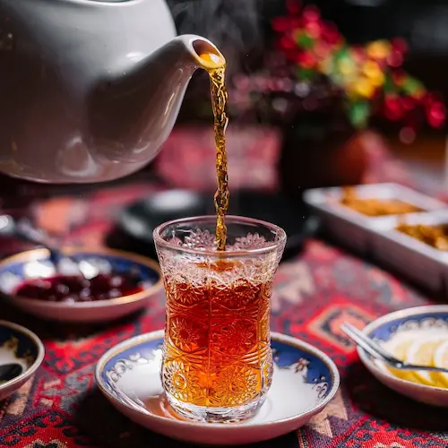

Image by  <a href="https://www.freepik.com/free-photo/side-view-black-tea-pear-shape-glass-table_7926910.htm"> stokking on Freepik </a>

گفتم: باید روزی شش تا چایی نبات بخورم تا چیزیم نشه.  
گفت: بدنت سرد شده.  
خندیدم و گفتم: پس این دفعه عوض جنابت مسّ میت نیت کن.  
گفت هنوز زوده!   
منظورش را ولی نفهمیدم…

***

خندیدم و گفتم: پس فردا صبح عوض جنابت مسّ میت نیت کن.  
سرش را پایین انداخت.  
حساب کار آمد دستم؛ دخترک بیچاره اصلاً نفهمید حرفم را.  
این چیزها را هیچ‌کس یادش نداده باشد انگار.  

***

سرش را پایین انداخت و در حالی که سرخ شده بود خیلی آرام در جوابم گفت: ولی من فقط هر یکشنبه‌ عصر غسل می‌کنم.  
خندیدم و گفتم: دیوانه! بعدش غسل می‌کنند نه قبلش.  
گفت: ساجده هم همین را گفت. من هم همین کار را می‌کنم. منتها هر جور حساب می‌کنم می‌شود یکشنبه عصر و دوباره سرش را پایین انداخت.  
دستم را بردم سمتش.  
خودش را عقب کشید.  
خواستم چیزی بگویم که زد زیر گریه…  

***

خندیدم و گفتم: دیوانه! بعدش غسل می‌کنند نه قبلش.  
گفت: بعدِ اولین بار که دیدمت ساجده بهم گفت که هربار که ناپاک می‌شم باید غسل کنم.  
گفتم: خُب؟  
گفت: من هم حساب کردم دیدم یه هفته که از معدن پاکی‌ها دورم باید غسل کنم تا برای ملاقات بعدی آماده بشم.  
خنده‌ام گرفت.  
شوخی نمی‌کرد. چشمش جز خوبی من چیزی را نمی‌دید.  
خودم را نگهداشتم که نخندم اما فهمید و گفت: باشه! بخند که گردن من از مو باریک‌تره…  
هنوز جمله‌اش را تمام نکرده بود که زدم زیر گریه و افتادم به پاش.  
خودش را عقب کشید و گفت: نه! 

***

سرش را پایین انداخت و در حالی که سرخ شده بود خیلی آرام در جوابم گفت: من غسل نمی‌کنم اما!  
پرسیدم: چرا؟  
گفت: یادته ساجده چی گفته بود؟ گفته بود هر بار که ناپاک می‌شم باید غسل کنم ولی من حالا دیگه به معدن پاکی‌ها وصلم.  
بغض گلویم را گرفت. نزدیکش شدم. دستم را گذاشتم روی موهایش و پیشانی‌اش را بوسیدم.   
خجالت کشید و سرش را پایین انداخت.  
دستم را گذاشتم زیر چانه‌اش و گفتم: من‌رو نگاه کن!  
چشمانش برق می‌زد. خواستم صورتش را نوازش کنم که گفت: نه!  
گفتم: اذیتم نکن که گناه دارم. گناه ندارم؛ دوستت دارم.   
گفت: گردن من از مو باریک‌تره ولی وضو ندارم.  
زدم زیر گریه و افتادم به پاش.  
خودش را عقب کشید و خواست چیزی بگوید که نگذاشتم.  
گفتم: پس برو وضویت را بگیر و بیا.  
گفت: تو داری؟  
گفتم: مهمه؟!  
گفت: آره. شاید خدا خواست و بچهٔ‌مان شد.  
بغض گلویم را گرفت و صورتم خیس شد. گفتم: آره دارم! تازه نماز خوندم!  
درحالی‌که چشمانش از شادی می‌درخشید گفت: پس تا از خدا بخوای که یه صالحش رو بهمون بده من هم اومدم!  
خندیدم.  
خندید و رفت.  
با خودم خیال کردم که شاید چند تا داد…