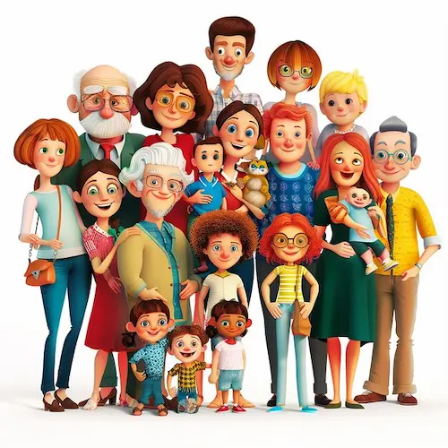

Image by  <a href="https://www.freepik.com/premium-ai-image/big-family-3d-cartoon-image-isolated-white-background_289164450.htm"> meimanlifestore on Freepik </a>

در این بیست و چند سالی که در خانهٔ‌ پدر و مادرم بوده‌ام همه چیز دیده‌ام. روزهای خوب، روزهای بد. غم، شادی و از این دعواهایی که زن و شوهر می‌کنند و ابلهان هم باور. 

اما مدتی است که کشفی جدید کرده‌ام و آن اینکه این دو هیچ وقت سر مسائل شخصی‌شان با هم درگیر نشده‌اند. من هیچ وقت یادم نمی‌آید که در مورد مسائلی مثل لباس پوشیدن، غذا پختن، کار کردن، خوابیدن و ... با هم دعوا کنند. نه اینکه هیچ مشکل و اختلاف نظری نداشته باشند، منظورم این است که مشکلات کاملاً سطحی و لحظه‌ای است. مثلاً ممکن است مادرم غذایی بپزد که پدر دوست ندارد. پدر هم بدون اعتراضی می‌رود برای خودش نانی پنیری تخم مرغی چیزی درست می‌کند. حالا شاید در دلش کمی ناراحت هم بشود اما اصلاً بروز نمی‌دهد. مادر هم وقت گذاشته و غذا درست کرده و وقتی می‌بیند پدر غذایی که درست کرده را نمی‌خورد توی دلش ناراحت می‌شود اما او را درک می‌کند و قضیه تمام می‌شود. 

یا مثلاً ممکن است پدرم تصمیم بگیرد وسیله‌ای بخرد که مادرم دوست ندارد. مادر شاید در ابتدا کمی مخالفت کند اما کمی بعدتر به خودش می‌آید که: 

> مردی صبح تا شب کار می‌کند. آیا این حق را ندارد که به دلخواه خودش چیزی بخرد؟
 
و کوتاه می‌آید و باز هم به خیر می‌گذرد.

اما همین لیلی و مجنون سر موضوعاتی دیگر معمولاً کدورت درست می‌کنند! چه موضوعاتی؟ موضوعاتی که پای یک شخص سوم و چهارم در میان است.

در تمام این سال‌ها خیلی به ندرت (شاید هیچ وقت) مادرم با خاله‌ام در فضایی خارج از خانواده دیدار داشته‌ است. این موضوع در مورد پدرم و عمو و عمه‌هایم نیز برقرار است. واقعاً یادم نمی‌آید پدرم بدون مادرم رفته باشد به خواهر یا برادرش سر زده باشد. 

همین قضیه حتی در مورد همکارهای پدرم هم برقرار است. ما با خیلی از آن‌‌ها رفت و آمد خانوادگی داریم. 

حالا مشکل کجاست؟ اگر برفرض رابطهٔ مادرم با یکی از زن‌عموهایم به مشکل بخورد بالطبع رابطهٔ پدر و عمویم هم به هم می‌ریزد و این خودش شروع چالش است. یا حتی اگر پدرم بخواهد با یکی از همکارهایش به دلیل مسائل کاری یا هر موضوع دیگری قطع رابطه کند مادرم ورود می‌کند و کار خراب می‌شود. حق هم دارد البته. چون او فقط همکار پدرم نیست و خانوادهٔ آن‌ها دوست خانوادگیِ خانوادهٔ‌ ما حساب می‌شود و مادرم هم در این قضیه حقوقی دارد. 

و من همیشه شاهد جملاتی از این دست در خانه هستم که چرا فلان چیز را به فلان کس گفتی؟ چرا با آن یکی این رفتار را کردی؟ چرا آن یکی را گرم استقبال نکردی و …

اما در مورد افرادی که دوست خانوادگی خانوادهٔ ما نباشند اصلاً از این چالش‌ها نداریم. یعنی روابط پدرم با همکاری که مادرم او را نمی‌شناسد هیچ ربطی به مادرم ندارد و مادرم هم اصلاً دلیلی نمی‌بیند در مورد این روابط اظهار نظری بکند.

این قضیه در مورد خودم هم وجود دارد. همیشه این طور است که رابطهٔ من با دوستی که مادرم او و مادرش را بشناسد همیشه به مادرم ربط پیدا می‌کند. حق هم دارد. هر رفتار اشتباه من رابطهٔ مادرم و مادرش را تحت تأثیر قرار می‌دهد. کار به جایی می‌رسد که حتی در مورد چه بپوش و چه بخور و چه جوری باهاش حرف بزن و ... هم باید به خواسته‌های مادرم توجه کنم که مامان جان ناراحت نشوند.

این مشکل را در مورد همسایه‌ها هم داریم و من اگر با یک همسایه بد حرف بزنم ممکن است نظر خانم همسایه در مورد مادرم عوض بشود و رابطهٔ‌شان به هم بخورد. یا برعکس چون مادرم از فلان همسایه خوشش نمی‌آید من هم نباید خیلی با شوهرش گرم بگیرم و از این جور حرف‌ها.

اما در مورد دوستانی که مادرم از وجود آن‌ها بی‌اطلاع است یا حداکثر در حد یک اسم می‌شناسدشان آزادی عمل صددرصدی دارم. می‌توانم بزنم توی گوششان، بغلشان کنم، بهشان پول قرض بدهم، ازشان پول قرض بگیرم و هر کار دیگری که فکرش را بکنید و مادرم هم هیچ وقت شاکی نخواهد شد که چرا این کار را کردی و آن کار را نکردی! اصلاً برایش مهم نیست چون بهش ربطی ندارد!

در [لبخندها فراموش نمی‌شوند](/blog/smiles-are-not-forgotten) درباره‌اش نوشته بودم. یک بار به من گفت:

> به نظرم من و مامانت می‌تونیم دوست‌های خوبی باشیم!

و من داشتم فکر می‌کردم که بعد از عمری یک آدمی پیدا کردیم که سرش به تنش می‌ارزد و حالا هم انگار باید به واسطهٔ دوستی او با مادرم از لیست‌ آدم‌های به درد بخور زندگی‌ام حذفش کنم. با مادرم که دوست بشود دیگر به هیچ دردی نمی‌خورد!

بعد هم توی دلم گفتم:

> تو حالا منتظر بمون که من شرایطی رو مهیا کنم که با مادرم ملاقات کنی… شتر در خواب بیند پنبه دانه. 

و من حالا مدت‌هاست که مسائل خارج از خانه را به خانه نمی‌آورم. مادرم تقریباً هیچ نمی‌داند. کجا می‌روم؟ با که می‌روم؟ با چه می‌روم؟ و نتیجه رضایت‌بخش است. 

*** 

یادم باشد اگر روزی خواستم ازدواج کنم این نوشته را نشان عروس خانم بدهم. 

احتمالاً مجبور بشوم برای آرامش بیش‌تر در زندگی‌ام در روابط همسرم با پدر و مادر و برادرم و دوست و همکارم و … محدودیت ایجاد کنم. 

به‌علاوه تا جای ممکن خودم را درگیر روابط همسرم با خانواده‌اش نکنم.

می‌دانم سخت است اما این جوری برای آرامش هر دویمان بهتر است…