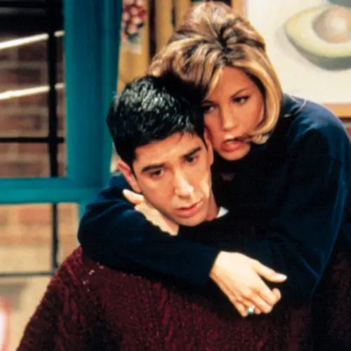

قبل از این یادداشت، صد و ده یادداشت منتشر کرده‌ام. این یکی هم صد و دوازدهمی است. پس تکلیف صد و یازدهمی چه می‌شود؟

دیروز یک یادداشت نوشتم و عنوانش را گذاشتم **یک بازسازی دیگر**. گزارش پنجشنبهٔ دو یا سه هفتهٔ قبل بود. حضور من و زینب و مریم و بقیهٔ بچه‌ها در بازسازی. اگر دوست داری در مورد بازسازی بدانی پیش‌تر یک یادداشت با نام [زندگی سخته؟! بیا بازسازی](/blog/zendegi_sakhte_bia_bazsazi) نوشته‌ام. 

آن جا توضیح داده‌ام که بازسازی چه‌قدر خوب است و چه‌قدر دوستش دارم. بازسازی رؤیایی‌ترین جای این دنیا است. بازسازی امن‌ترین جای دنیا است. شاید خوشت آمد و تو هم شدی عضوی از تیم ما. خدا را چه دیدی؟ شاید تو هم روزی دلت گرفت و پناه بردی به بازسازی. بازسازی خانهٔ امن همهٔ ما است. 

اما ترسیدم که بیایی به اینجا سر بزنی. خاطرات بازسازی مرا بخوانی و عکس‌ها را ببینی و پیش خودت خیال کنی که از سر لج تو دارم این‌ها را می‌نویسم که بگویم باشی یا نباشی همه چیز خوبِ خوب است. خیال کنی از عمد می‌نویسم که حرصت را در بیاورم.

برای همین هم خواباندمش در آب و نمک که بماند برای روزی که مطمئن شده باشم یادداشت‌هایم را نمی‌بینی.

می‌بینی با من چه کرده‌ای؟ اینجا را ساخته بودم که بتوانم بی‌خیال از همه چیز و همه کس حرف‌های دلم را بنویسم. این پناهم را هم از من گرفته‌ای… 

از حال من اگر پرسیده باشی باید بگویم که کم‌کم دارم پیر می‌شوم.

قبل‌تر وقتی جایی از بدنم زخم می‌شد، پس از مدتی جای زخم کم‌کم خوب می‌شد و ردی از آن نمی‌ماند اما انگار از بیست و چند سالگی به بعد قوت بدن در ترمیم بافت‌ها روز به روز کمتر می‌شود. حالا روی پوستم آثاری از زخم‌های چند مدت اخیر می‌بینم. بهتر شده‌اند اما هنوز ردشان مانده است. شاید باز هم کمرنگ‌تر بشوند اما احتمالاً در نهایت هم ردی از آن‌ها باقی بماند.

عیبی ندارد. با پوستم کنار می‌آیم. با آثاری که روی دلم به جای مانده چه کنم؟

ولش کن. همه‌اش از خودم گفتم. تو حالت چه‌طور است؟

***

پی‌نوشت: داشت فراموشم می‌شد. اگر این یادداشت‌ها را **نمی‌بینی** می‌شود که به من اطلاع بدهی تا خیالم از بابت تو راحت باشد؟

پی نوشت دیگر: [او ریچل نیست](/blog/she_is_not_rachel) را هم بخوانید.