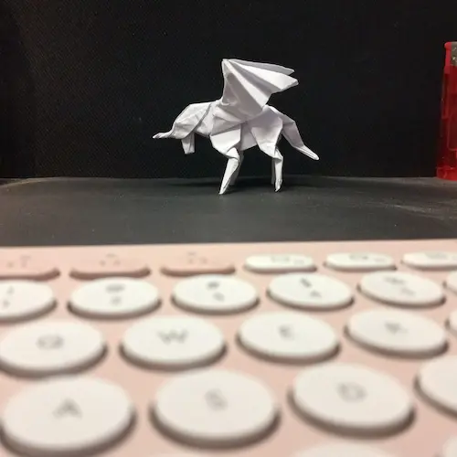
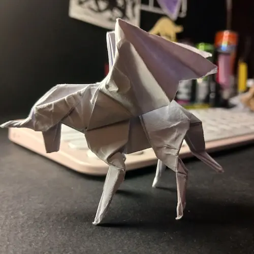
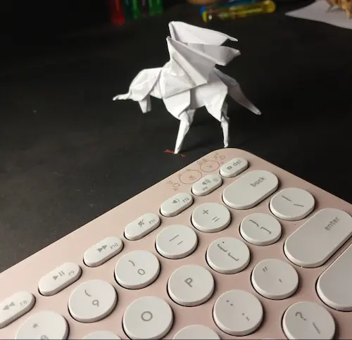

یادت می‌آید این اسب‌های بالدار را؟ هنوز هم دوستشان داری؟ هنوز هم دل و دماغ ساختنشان را داری؟

از وقتی رفتی، وقت‌های تنهایی‌ام از این‌ها می‌سازم. 

حالا نمی‌دانم چند تا شده‌اند؟ دوست داشتم هزار تا از این‌ها بسازم و همهٔ‌شان را نذر سلامتی‌ات بین بچه‌ها پخش کنم و از لبخند‌هایشان عکس بگیرم. همان لبخند‌هایی که برای دیدن آن‌ها جان می‌دادی. یادت هست؟ لبخند خودت اما از همه زیباتر بود. حالا خیلی شده‌اند اما تا هزار هنوز هم خیلی مانده. 

گردنم را هم که می‌دانی. اذیت می‌کند. یک هفته‌ای می‌شود که دیگر از این‌ها نساخته‌ام. حتماً می‌خواهی بپرسی که سلامتی تو مهم‌تر است یا گردن من؟ خُب معلوم است. سلامتی تو. گردن من از اول هم از مو باریک‌تر بود…

یادت می‌آید اولین اسب بالداری که به من دادی را؟ هنوز هم دارمش. از اسب‌هایی که من می‌سازم ظریف‌تر و دقیق‌تر است. آن را برای خودم نگه‌ می‌دارم. بوی تو را می‌دهد. نگهش می‌دارم که با هر بار دیدنش لبخند بر لبانم بنشیند. شاید اما لبخند من قیمتی نداشته باشد. نمی‌دانم…

یادت هست وقتی می‌خواستی ساختن این اسب‌ها را یادم بدهی؟ هر چه می‌گفتی یاد نمی‌گرفتم. سر به سرم می‌گذاشتی و می‌خندیدی و می‌گفتی که چه‌قدر خنگم؟ حالا خیلی سریع شده‌ام. شاید اسب‌هایم به قشنگی اسب‌های تو نباشد اما آن‌ها را سریع‌تر از تو می‌سازم. ولی چه فایده؟ تو که نباشی هیچ چیز مزه‌ای ندارد.

دلم برایت تنگ شده است…

***

پی‌نوشت: اگر کسی دوست داشت اسم و آدرس و شماره‌اش را برایم بفرستد تا یکی از این اسب‌ها را برایش بفرستم. هزینه‌اش هم مثل همیشه دعا برای سلامتی‌ همانی است که این اسب‌ها را دوست داشت.

پی‌نوشت دیگر: ساختن این اسب‌ها به لحاظ شرعی احتمالاً محل اشکال است. خدا از سر تقصیرات همهٔ‌مان بگذرد…

عکس‌های دیگر:

