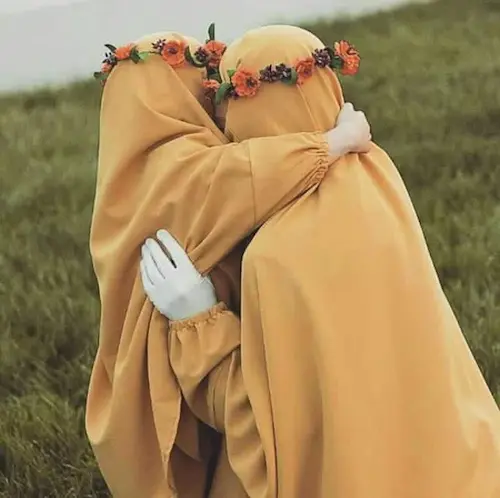

Image on <a href="https://www.pinterest.com/pin/7459155621667067/"> Pinterest </a>

انسان نیاز به ازدواج دارد. وقتی که به یک سنی رسید قابلیت ازدواج در او محقّق می‌شود و صفات و غرائز و خصوصّیات او به آن مرتبه‌ای می‌رسد که کم‌کم از آن حیثیت استقلالیهٔ شخصیت خودش خارج می‌شود و نیاز دارد که در کنار یک نفس دیگر قرار بگیرد. تا به حال اگر تنها بود، رفیق داشت یا نداشت، با پدر و مادر بود یا نبود برای او فرقی نداشت اما حالا نیاز دارد در کنار یک شخصیت دیگر قرار بگیرد.

همین شخصّیت مستقل، همین که برای خودش بود و مستقل بود، رفت و آمدش دست خودش بود، نشست و برخاستش دست خودش بود، تصمیم گیری‌ها تصمیم گیری‌های شخصی بود، راه خودش را مستقلاً اختیار می‌کرد، حالا می‌بیند که باید در کنار شخصّیت دیگری به حیات ادامه بدهد و این موقع موقعِ ازدواج است. ازدواج یعنی در کنار شخصیت خود، شخصیت دیگری را قرار دادن، کأنّ احساس انسان این است که تنها بودن، با پدر و مادر بودن، با برادر و خواهر بودن، با قوم و خویش و شریک و همسایه و هم‌کلاسی بودن نمی‌تواند آن نقصی که در درون او است را تأمین کند، آن خلأ را بپوشاند.

این حالت حالتی است که نفس و روح (نه بدن) به نقطه‌ای از فعلیت رسیده که دیگر نمی‌تواند تنها باشد. حالا کاری به بدن نداریم؛ بدن اقتضائات خودش را دارد: نیاز به آب دارد، نیاز به غذا دارد، نیاز به اکسیژن دارد، نیاز به مسائل دیگری دارد که همه به جای خود محفوظ است اما الآن صحبت فقط در مسئلهٔ نفس است؛ نفس در راه استکمالی خود و طریق کمالیهٔ خود به یک فعلیتی می‌رسد که از آن به بعد عبادتی را که انجام می‌دهد تنهایی جان ندارد، راهی را که می‌خواهد برود به تنهایی کشش ندارد، بنزین نمی‌رسد، کاربراتور خراب است، باید تعمیر بشود، سرویس بشود، تنظیم‌ بشود، می‌رود اما پِت‌پِت می‌کند، هی خاموش می‌کند، باید هل بدهد و نمی‌دانم چکار بکند. روح نمی‌تواند به تنهایی این را بکشاند، برای ادامهٔ حرکت نیاز دارد در کنار یک انسان دیگر قرار بگیرد.

مسئلهٔ ازدواج فقط به یک نیاز جنسی برنمی‌گردد، مسئله ازدواج نشئت گرفته از یک نیاز روحی است. البتّه در یک همچنین زمینه‌ای خُب بدن و جسم هم نیاز به مسائلی دارند که به جای خود محفوظ است و البته این دو قضیه تقریباً در یک زمان یا با یک تأخیر ناچیز اتفاق می‌افتد. پس بنابراین نکته‌ای که ما باید در اینجا بدانیم این است که در مسئلهٔ ازدواج معیار و مقصود و مقصد صرف یک ارتباط ظاهری نیست، قضایا و اسراری پشت این مسئله قرار دارد که این نکته بدون یک ازدواج واقعی، نه حتی ازدواج موقّت، حاصل نخواهد شد. یعنی اگر کسی تا پایان عمرش صد تا، دویست تا، سیصد تا، صد هزار تا هم ازدواج موقت کند، تا به نحو ازدواج دائم نباشد، این نیاز مرتفع نخواهد شد.

***

 از زنان دیگری که جزء خاندان حضرت امام حسین علیه‌السلام نبودند ولی از خود عظمت به یادگار گذاشتند، همسر زهیر ابن قین بجلی است که عامل اصلی انقلاب احوال و نجات زهیر از اعماق جهنم و رساندن او به عالی‌ترین درجات بهشت می‌شود.

زهیر، عثمانی بود. عثمانی‌ها معتقد بودند خون عثمان بر گردن حضرت امیرالمؤمنین علیه‌السلام است و به همین دلیل دشمن حضرت بودند. یعنی نه‌تنها به اهل بیت علیهم‌السلام معرفت نداشتند، دشمن هم بودند. زهیرِ عثمانی با آن برخورد حساب‌شده و تحول‌سازی که همسرش با او داشت از این رو به آن رو شد. زهیر نمی‌خواست با حضرت امام حسین علیه‌السلام مواجه شود و بنایش بر این بود که هرجا به ضرورت با حضرت امام حسین علیه‌السلام همراه شد، جایی که امام توقف می‌کرد، او حرکت می‌کرد که آنجا نباشد و تلاش می‌کرد تا با امام روبه‌رو نشود. اما وقتی قاصد آمد و سلام امام علیه‌السلام را رساند و گفت امام می‌خواهند تو را ببینند، خشکش زد و قصد نداشت برود‌! همسرش گفت «سبحان‌الله! پسرِ دختر پیامبر تو را می‌طلبد و تو نمی‌روی؟». چنان این را محکم گفت که زهیر شرمنده شد و در حقیقت در رودربایستی قرار گرفت. با این حرکت همسر تصمیم گرفت نزد امام علیه‌السلام برود. ما نمی‌دانیم چه بین او و امام رد و بدل شده است. وقتی برگشت، دیدند متحول شده و شاد و مسرور بود و گفت «من راه خودم را پیدا کرده‌ام».

درباره‌ی همسر زهیر ابن قین دو نقل است: یکی اینکه همسر زهیر در کربلا هم بود و از اسرا و حتی شاهدان فاجعه کربلاست. اما نقل مشهور این است که زهیر، همسرش را با کسانی که همراه او بود به کوفه بازگرداند و موقعی که می‌خواستند جدا شوند همسر با چشمان گریان گفت «تو در رکاب پسر پیامبر به شهادت نائل می‌شوی. در روز قیامت من را فراموش نکن» و درست هم می‌گفت چون او عامل این تحول شده بود.
<a href="https://farsi.khamenei.ir/others-page?id=18116">(منبع)</a>

***

اگر از اول شیوه پاکدامنی در پیش گرفتی و پاک زندگی کردی ولی الان برای ازدواجت به مشکل خوردی و مورد مناسب پیدا نمی‌کنی و یا مورد مناسبی تو رو پیدا نمی‌کنه بدون که مشکل از تو نیست...

این آیه رو روزی چند بار تو ذهنت مرور کن: 
 

الْخَبِیثَاتُ لِلْخَبِیثِینَ وَالْخَبِیثُونَ لِلْخَبِیثَاتِ وَالطَّیِّبَاتُ لِلطَّیِّبِینَ وَالطَّیِّبُونَ لِلطَّیِّبَاتِ (نور، ۲۶)

**ترجمه**: زنان خبیث و ناپاک از آن مردان خبیث و ناپاکند! و مردان ناپاک نیز تعلق به زنان ناپاک دارند؛ و زنان پاک از آن مردان پاک و مردان پاک از آن زنان پاکند!

پس خیلی نگران نباش و بیشتر بگرد و یا صبر کن تا پیدات کنن. امثال تو در این روزگار عجیب و غریب خیلی کم هستن و زمان می‌بره تا همدیگه رو پیدا کنن! 

<a href="https://mahdi.blog.ir/post/Uno%20specchio%20non%20mente%20mai">(منبع)</a>

***

اما خُب می‌دونی چیه؟ من پسر خوبی نیستم و این خیلی بده…