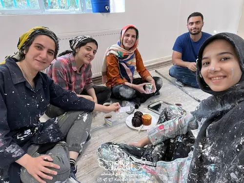
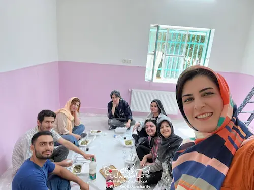
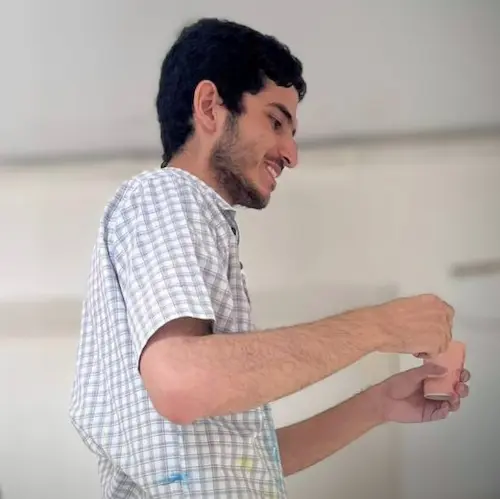

شب که عکس‌ها را در گروه گذاشتند دیدم بدون من عکس انداخته‌اند. حالا بدون من عکس انداختن را می‌شود تحمل کرد اما عکس را ببینید! بدون من کیک هم خورده‌اند. 

صبح برایشان شیرینی خریده‌ بودم. ظهر هم وقتی مریم می‌خواست عکس بیاندازد فوری خودم را از عکس انداختم بیرون. پرسید چرا؟ گفتم شما نباشی فایده نداره. مجبور شد سلفی بیاندازد:

بعد این‌ها بدون من عکس انداخته‌اند. بدون من کیک خورده‌اند. عکس اول را دوباره ببینید! اصلاً خیالشان هم نیست که آقای شعبانی‌ای هم بود و حالا نیست…

شب توی گروه پیام گذاشتم که اون چیه اون وسطه؟ بدون من خوردید؟

النا نوشت:

> یک کیک خیلی خوشمزه! سهم شما رو هم من خوردم…

داخل عکس هم مشخص است. دوباره عکس اول را ببینید. اصلاً معلوم است این عکس را انداخته‌اند حرص من را در بیاورند.

و برخورد محکم و قاطع من:

> شما باز هم میای بازسازی دیگه؟!

بگذریم.

قبل‌تر یک یادداشت دربارهٔ بازسازی نوشته بودم. آن را در [زندگی سخته؟! بیا بازسازی](/blog/zendegi_sakhte_bia_bazsazi) بخوانید. آن را خیلی دوست دارم. امیدوارم این یکی هم خوب از آب در بیاید.

تعدادی از بچه‌ها قرار است جمعه بروند بلوچستان. این‌ها باید همراه خودشان وسایلی ببرند که تعدادی از این وسایل را من از دیجی کالا سفارش داده‌ام. مطابق برنامه دیجی کالا قرار بود  سفارشم را دیروز یعنی چهارشنبه تحویل بدهد اما خبری نشد. چند باری زنگ زدم. معذرت خواهی کردند و گفتند در سیستم اختلال ایجاد شده و چاره‌ای نیست. باید صبر کنید! حالا من هر چه می‌گویم بسته نرسد من بیچاره می‌شوم این‌ها باز فقط معذرت‌خواهی می‌کنند! در انتها یک راه دیگر هم به من نشان می‌دهند. می‌گویند که می‌توانیم سفارشتان را لغو کنیم! این یکی منطقی‌تر به نظر می‌رسد اما واقعاً حوصلهٔ بازار رفتن را ندارم. پس همان صبر را در دستور کار قرار می‌دهم و امیدوار می‌مانم که سفارشم تا پنجشنبه عصر برسد.

پنجشنبه است. تکلیف پنجشنبه هم مشخص است. پنجشنبه چه کار کنیم؟ برویم بازسازی…

صبح نیم کیلو شیرینی می‌خرم و می‌رسم مرکز بازسازی. زنگ می‌زنم زینب که بیاید در را باز کند. 

فرق بازسازی امروز با بازسازی قبلی که درباره‌اش نوشته بودم در این است که آن موقع بعد از یک مدت طولانی دوری رفته بودم و خیلی از بچه‌ها عوض شده بودند، لیدرهای قدیم رفته بودند و لیدرهای جدید آمده بودند و خلاصه همه چیز تازه بود. حالا اما مدت‌ها است که بیش‌تر از همه به بازسازی می‌روم.

مرکز دو تا در دارد. ایستاده‌ام پشت دری که همیشه از آن وارد می‌شدم. زینب اما یک ملت را بسیج کرده که آن در دیگر را باز کند. حالا زینب نابغه است. نمی‌دانم چرا بقیه دارند کمکش می‌کنند!؟ دوباره زنگ می‌زنم که آن در دیگر احتمالاً راحت‌تر باز شود اما زینب خانم که اولین حضورش در این مرکز است می‌گوید گفته‌اند آن یکی هم بسته است. خلاصه زینب در تلاش است که در را باز کند که در همان لحظه یک نفر می‌خواهد از مجموعه خارج شود. آن در دیگر را خیلی راحت باز می‌کند و من هم از فرصت استفاده می‌کنم و داخل می‌شوم و پشت زینب سبز می‌شوم و یک لبخند نیم‌متری تحویلش می‌دهم و جعبهٔ شیرینی را هم می‌دهم دستش.

او هم می‌خندد:

> اِه اومدین تو که. تازه داشتیم در رو باز می‌کردیم. باز هم تولدتونه؟ مبارک باشه.

و دوباره این تولدهای پِی در پِی من. این‌ها همه به برکت بازسازی است. بازسازی که باشد هر روز تولدت می‌شود. خدایا خیلی دوستت دارم…

هنوز کسی نیامده است. لباسم را که عوض می‌کنم بچه‌ها هم یکی یکی می‌رسند و من و زینب هر بار می‌رویم در را برایشان باز می‌کنیم. 

ذهنم مشغول است که دیجی کالا چه می‌شود. خداخدا می‌کنم که امروز برسد اما هنوز که خبری نیست. آمادگی لازم را در خودم ایجاد کرده‌ام که اگر تا حوالی ظهر خبری ندادند بچه‌ها را به خدا بسپارم و شال و کلاه بازار کنم.

ساعت حوالی یازده است. این بار حلقهٔ صبحگاهی نداشته‌ایم انگار. عوضش ساعت یازده کار را تعطیل کرده‌ایم و نشسته‌ایم دور هم چای و شیرینی می‌خوریم. خانم مهربان که ربطی به تیم بازسازی ما ندارد و از اعضای مرکز است و برایمان خوراکی و غذا می‌آورد تعدادمان را شمرده و یک چای اضافه هم ریخته. معلوم است او هم دلش پیش رضا است. خلاصه این روز آخر بدون رضا یک چیزی کم است. نشسته‌ایم دور هم و داریم دربارهٔ حلقهٔ صبحگاهی‌ای که برگزار نشد صحبت می‌کنیم که خاطرهٔ مهدیه و تأکیدش برای حفظ حجاب را برای بچه‌ها تعریف می‌کنم. البته آنجا اسم نمی‌آورم. زینب و مریم می‌گویند بعداً یواشکی به ما بگو ولی بعدتر یادشان می‌رود.

گعده را به مقصد تلفن‌هایم به دیجی‌کالا ترک می‌کنم. از دیروز تا حالا به اندازهٔ مصرف یک ماهم شارژ مصرف کرده‌ام. 

باز هم جواب درست و حسابی نمی‌دهند. انگار قضیه جدی است. پنجشنبه ظهر است و خبری نیست و فردا هم حرکت است. تا حوالی اذان کار می‌کنم و بعد می‌روم آرام به زینب می‌گویم که اگر اجازه بدهید من بروم.

خودم می‌توانم تصور کنم قیافهٔ به هم ریختهٔ خودم را. زینب که حال و زارم را می‌بیند جرأت شوخی پیدا نمی‌کند و حتی نمی‌پرسد که چه شده؟! فقط می‌گوید:

> باشه حتماً!

می‌روم که دست‌ و صورتم را بشورم و دارم با خودم فکر می‌کنم که این چه وضع حرف زدن با دختر مردم بود که مریم می‌آید دنبالم:

> خوبی؟

یک لبخند تحویلش می‌دهم:

> آره!

می‌گوید:

> درسته اذیتت می‌کنیم ولی دوستت داریم. متوجهی دیگه؟! چیزی شده؟

یک لبخند پهن‌تر تحویلش می‌دهم و ماجرا را برایش تعریف می‌کنم و تنها کاری که می‌تواند برایم بکند اظهار همدردی است. کمی هم شاکی است که با آن قیافه‌ام نگرانشان کرده‌ام. جا دارد یکی بزند توی گوشم ولی بزرگواری می‌کند و این کار را نمی‌کند.

خدایا باز هم شکرت. برای بازسازی. برای دوستانم. برای خودت. برای همه چیز…

دست و صورتم را که شستم، وضو می‌گیرم، می‌روم گوشه‌ای تا نمازم را بخوانم. نماز را که خواندم دوباره زنگ می‌زنم دیجی کالا تا بلکه خبری شده باشد. اما نه! خبری در کار نیست. همچنان می‌گویند دو انتخاب داری. یا باید صبر کنی و یا سفارش را لغو کنی و به نظر می‌رسد برای صبر کردن خیلی دیر است اما هیچ جوره دلم نمی‌آید بچه‌ها را تنها بگذارم و بروم. نه برای بچه‌ها. بیش‌تر برای خودم. 

علامه طهرانی تعریف می‌کرد:

> ما که در بیمارستان خوابیده بودیم، بعضی روزها برای ما ناهار می‌آوردند و از این دستمال کاغذی‌ها هم آنجا بود. خُب! ما مقداری از یک دستمال را پاره می‌کردیم و جلوی خودمان می‌انداختیم. این سفره‌مان بود، بنده زاده هم آنجا بودند و غذاها را می‌گذاشتیم و یک لقمه می‌خوردیم. تا موقع غذا می‌شد من می‌گفتم: آسیّد محسن، این سفره را بیاور! این سفره را، به جان شما رئیس جمهور آمریکا هم ندارد. این سفره‌ای که ما پاره می‌کنیم، اینجا می‌اندازیم برای خودمان و این غذا را روی آن می‌گذاریم و شما هم اینجا نشسته‌اید و با کمال صفا و وفا و خوشی و با این دلشادی و بی‌غمّ و غصّگی، قسم به خدا رئیس جمهورهای دنیا ندارند! [(آیین رستگای، ص ۳۱)](https://maktabevahy.org/Document/Book/Details/46/%D8%A7%DB%8C%DB%8C%D9%86-%D8%B1%D8%B3%D8%AA%DA%AF%D8%A7%D8%B1%DB%8C?page=31)

حکایت ما هم همین است. سفره‌هایی که اینجا ما برای ناهار می‌اندازیم را هیچ کجای دیگر ندارند و من حیفم می‌آید حتی یک دقیقه‌اش را از دست بدهم. نشستن روی این سفره در کنار بچه‌هایی که از تبار فرشته‌ها هستند خیلی می‌ارزد. برای همین هم تصمیم می‌گیرم که تا ناهار بمانم. ناهار را با بچه‌ها بخورم و بعد هم شاید قسمت بود و بستهٔ دیجی کالا رسید و دیگر بازار هم نرفتم…

تا نزدیک‌های ساعت دو کار می‌کنیم و خانم مهربان و دوستانش لطف می‌کنند برایمان قورمه سبزی می‌آورند. این مرکز هم مثل آن مرکز احیاء ناهار می‌دهند اما راستش همه‌جا از این خبرها نیست. بعضی مراکز یک آب هم به زور می‌دهند. چه بگویم؟! حکایت داغ این روزهای بازسازی حجم غذایی است که آقای شعبانی می‌خورد. البته بیش‌تر یک شوخی است که من هم در مقابل آن مقاومتی نمی‌کنم. هفتهٔ قبل غذایمان را که خوردیم مریم این قدر سربه‌سرم گذاشت که یکی از دخترها پاشد رفت از توی کیفش غذایی که آورده بود را آورد و داد دستم که بخورم که گشنه نمانم. من هم نامردی نکردم تا آخرین دانهٔ برنجش را خوردم. دوغ هم برایم آورده بود که مریم از دستم گرفت و اجازه نداد بخورم. نمی‌دانم چه مشکلی دارد با من! داستان کیکی که خوردند و عکسی که انداختند و جواب النا هم نتیجهٔ همان حکایت داغ است. همه‌اش تقصیر مریم است…

امروز هم تا نشستم سر سفره گفت:

> آقای شعبانی! می‌خواهی نصف غذای من رو هم بخوری؟!

چراااااا؟!

من هم در جوابش گفتم:

> هفتهٔ پیش که دوغ ما رو خوردی! این هفته نمی‌خواهی برامون دوغ بخری؟!

بچه‌ها می‌گویند دوغ نمی‌خورند و نوشابه می‌خواهند. 

مهربان می‌شود. پا می‌شود برود کارتش را بیاورد که بروم دوغ و نوشابه بخرم. من صبر نمی‌کنم اما. همین که خواهریش را نشان داد کافی است. 

کارت همراهم نیست. به هزار زحمت با گوشی کارت به کارت می‌کنم و برمی‌گردم و زنگ می‌زنم و زینب می‌آید. حالا دیگر یاد گرفته کدام در را باز کند. ناهار را می‌خوریم و دیگر وقت دل کندن است. 

لباس‌هایم را عوض می‌کنم، خداحافظی می‌کنم و راه می‌افتم به سمت بازار. امروز پنجشنبه است و منطقاً باید بازار هم زودتر تعطیل بشود. هر چه به بازار نزدیک‌ می‌شوم و ساعت هم به سه نزدیک‌تر می‌شود بیش‌تر اضطراب می‌گیرم که نرسم خرید‌ها را انجام بدهم. 

حوالی سه می‌رسم بازار. تعدادی بسته‌اند، تعدادی هم انگار دارند جمع می‌کنند اما هنوز تعداد زیادی بازند.

به مغازهٔ اول که می‌رسم، سفارش دیجی کالا را نشان فروشنده می‌دهم و می‌پرسم که کدام یکی را دارد؟ جوابم می‌دهد که هیچ کدام. بعد هم راهنمایی‌ام می‌کند که هیچ کس این اقلام را با این قیمت‌ها به من نخواهد فروخت. می‌گوید که از همان دیجی‌کالا بخرم. برایش توضیح نمی‌دهم داستان را. تشکری می‌کنم و به مسیرم ادامه می‌دهم. مشابه همین کار را در مغازه‌های بعدی هم انجام می‌دهم و می‌فهمم که حق با همان فروشندهٔ اول بود. اینجا همه چیز گران‌تر است…

خلاصه به هر زحمتی شده خریدها را انجام می‌دهم. خرید کردن از بازار دردسرهای دیگری هم دارد. بسیاری از جنس‌هایی که می‌خواستم به سختی پیدا می‌شود. بازار پر است از جنس احتمالاً به درد نخور چینی. قاعدتاً باید سود بیش‌تری برایشان داشته باشد. 

از دیروز که دیجی‌کالا سفارشم را تحویل نداد هر چه می‌توانستم درست اندر کاران را لعن و نفرین کردم اما حالا می‌فهمم که دیجی کالا طی این سال‌ها چه قدر برایم مفید بوده است. عوض دست و پنجه نرم کردن با جنس‌های به درد نخور و گران قیمت ریخته در بازار همیشه با چند کلیک ساده بهترین جنس را با بهترین قیمت خریده‌ام. حالا حس می‌کنم بی‌انصافی است این حجم از لعن و نفرین را روانهٔ کسی کردن که قبل‌تر سر سفره‌اش نشسته‌ام.

وسیله‌ها را خریده‌ام. در پانزده خرداد گوشه‌ای را پیدا کرده‌ام و نشسته‌ام. دارم سعی می‌کنم با بچه‌ها هماهنگ کنم که چگونه به دستشان برسانم اقلام خریده شده را که گوشی‌ام زنگ می‌خورد. کیست؟ دیگر حفظم شمارهٔ‌شان را. از دیجی کالا تماس می‌گیرند. جواب می‌دهم و می‌شنوم:

> سلام آقای شعبانی! سفارش شما داره ارسال می‌شه. همون آدرسی که برای سفارش وارد کردید حضور دارید یا به آدرس دیگه‌ای بفرستیم سفارش رو؟

این‌ جملات را که می‌شنوم انگار دنیا روی سرم خراب شده باشد. جوابش می‌دهم که خریدها را انجام داده‌ام و قطع می‌کنم.  

ظهر بعد از خریدن دوغ و نوشابه به زینب قول داده بودم که بعداً شماره کارتم را بدهم تا پول دوغ و نوشابه را برایم بریزد. البته قول که ندادم. زینب گفت که شماره کارت بدهم و من هم لبخند تحویلش دادم که حالا فعلاً بریم ناهار بخوریم. بچه‌ها منتظرند.

حالا دیگر شب شده است. رسیده‌ام خانه. زینب پیام گذاشته و از من برای **خرید الزامی تایم ناهار** تشکر کرده. منظورش زحمت خریدن است، من اما تصمیم می‌گیرم سربه‌سرش بگذارم و در جوابش می‌نویسم:

> یه جور تشکر کردین از من که دیگه پولش رو بهم ندین! یادم می‌مونه…

حالا از او اصرار و از من انکار. هر چه اصرار می‌کند قبول نمی‌کنم. این که زینب چند سالی از من کوچکتر است احتمالاً در این داستان بی‌تأثیر نیست. خیال می‌کنم دلگیر می‌شود از این رفتارم. در هر صورت وقتی می‌فهمد زورش به من نمی‌رسد می‌گوید دیگر این کار را نکنم. 

احتمالاً بعد از این ماجرا می‌رود شکایتم را پیش مریم می‌کند که این شعبانی هر چه اصرار کردم شماره کارت نداد!

مریم خیلی محکم وارد می‌شود:

> داداش شماره کارت بده من دوغ نوشابه رو حساب کنم

چیزی نمی‌گویم. می‌ترسم. ترس که نه. زینب کوچک‌تر بود و ندادم. مریم بزرگ‌تر است و باید بدهم. یک جور احترام شاید. شماره کارت می‌دهم و این جوری یک بازسازی دیگر هم تمام می‌شود. 

این عکس را هم وقتی بالای نردبان بودم بچه‌ها انداختند. قشنگ شده: 

