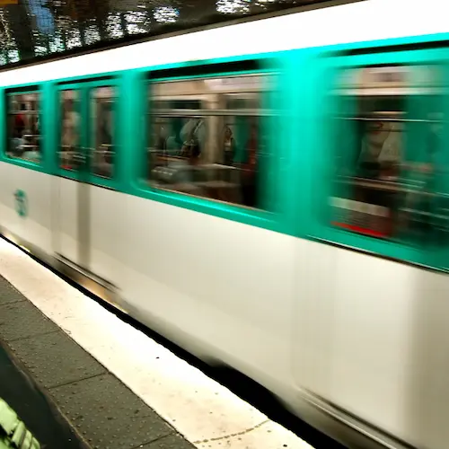

به مهدی گفتم: 

> می‌ترسم. دارم تو صفحه‌ام چیزهایی رو می‌نویسم که نباید. ممکنه نوشتنشون بعداً به ضررم تموم شه. حس می‌کنم هر دختری که یادداشت‌ها رو ببینه جوابش از مثبت به منفی بر می‌گرده.

مهدی گفت:

>  شاید هم برعکس شد. شاید یکی یادداشت‌هات رو دید و خوشش اومد. دخترها موجودات عجیبی‌اند. به نظرم بعید نیست که یکی خوشش بیاد…

***

محمد گفت: 

> قبل از اینکه یادداشت‌هایی که اینجا منتشر می‌کنی رو بخونم فکر می‌کردم **کمی** می‌شناختمت اما حالا حس می‌کنم هیچ نمی‌شناسمت!

***

انگار شفافیت زیاد نتیجهٔ عکس می‌دهد. کاری هم نمی‌شود کرد. نمی‌دانم همه همین طور هستند یا یک نوع بیماری خاص است که فقط شامل حال من شده. می‌توانم افکار و احساساتم را سانسور کنم و از خودم یک شخصیت شسته روفتهٔ سالم ارائه بدهم. بعد هم چهار روز دیگر می‌افتم می‌میرم و یا اگر خدا بخواهد شهید می‌شوم و درباره‌ام کتاب می‌نویسند که جوانی باتقوا بود که به نامحرم نگاه نمی‌کرد و غذای مشتبه نمی‌خورد و عفت داشت و از این جور حرف‌ها که همه‌اش دروغ است. 

**زاهدان** کاین جلوه در محراب و منبر می‌کنند، چون به خلوت می‌روند آن کار دیگر می‌کنند. 

***

در مترو وقتی رو صندلی نشسته بود، روی صندلی کناری که هیچ حتی رو صندلی کناری‌ترش هم ننشستم و همهٔ‌ مدت را سرپا ایستادم. چرا این کار را کردم؟ از خدا ترسیدم؟ بعید است. من را چه به خدا ترسی؟ خواستم به او بفهمانم که آدم باتقوایی هستم؟ نه احتمالاً. درست است که آدم ریاکاری هستم اما دیگر نه تا این حد. راستش حس کردم امانت است. نخواستم در امانت خیانت کنم. حالا قرار نبود کاری هم بکنم. اما پیش خودم حس کردم همین که کنارش بنشینم شاید برایش کافی باشد تا یک قدم از این معصومیتش فاصله بگیرد. چهار روز دیگر چه جواب خدا را بدهم اگر بپرسد با امانتم چه کردی؟ بگویم بکارت روحش را خدشه دار کردم؟ چه بگویم؟

بعدتر قطار می‌آید. خلوت است. می‌نشیند. من هم می‌نشینم و بینمان جای یک نفر را خالی می‌گذارم. دو سه ایستگاه بعد تعداد مسافرها که بیش‌تر می‌شود رگ غیرتم باد می‌کند که یک آدم دیگر کنارش ننشیند. خودم را سُر می‌دهم به سمتش و کاپشنم را می‌گذارم میانمان که بدنمان به هم برخورد نکند. اما خُب اشتباه کردم. به نفعش بود که کنار آدمی که نمی‌شناخت می‌نشست تا کنار من. 

با وجود همهٔ این‌ها حواسم به شکل و رنگ مانتوی بلندش بود. به کتانی‌اش. به کیفش و همهٔ این‌ها را دیدم. این یکی را نباید بنویسم اما حتی مقدار خیلی کمی از ساق پایش را هم دیدم. حتی دلم می‌خواست مسیر طولانی‌تری را با هم باشیم. با این که بینمان فاصله بود و حتی با هم حرف هم نمی‌زدیم اما خُب من هم آدمم. حتی دلم می‌خواست که مسیرم را عوض کنم و تا خانه‌ٔ‌شان همراهی‌اش کنم. نه برای اینکه امانت بود. نه! صرفاً برای خودم. برای دلم. خُب می‌دانید؟ من هم آدمم. 

***

من حتی نمی‌دانم چرا دارم این‌ها را می‌نویسم! شاید به قول مهدی تا کسی ببیند و بپسندد. می‌بینید حال و روزم را؟ 

این ریاکاری حتی اینجا هم دست از سرم برنمی‌دارد. از این اوضاع خسته شده‌ام اما مفرّی نیست انگار…

***

نمی‌دانم چه خواهد شد؟ دوباره او را می‌بینم یا نه. فقط از ته دلم دعا می‌کنم خدا او را حفظ کند. روزگار عجیبی است و من نگرانم. 

همهٔ این‌ احساسات من نشان از آن دارد که عفت و حیا همچنان ارزشمندترین چیزی است که یک دختر می‌تواند داشته باشد. ولی چه کنم که کبوتر با کبوتر، باز با باز. من هم باید بگردم یکی لنگهٔ‌ خودم را پیدا کنم شاید. [به قول مهدی](/blog/i-am-not-a-good-boy):

> الْخَبِيثَاتُ لِلْخَبِيثِينَ وَ الْخَبِيثُونَ لِلْخَبِيثَاتِ وَ الطَّيِّبَاتُ لِلطَّيِّبِينَ وَ الطَّيِّبُونَ لِلطَّيِّبَاتِ (نور، ۲۶)

اینجا اینجور می‌نویسم اما در دلم با خدای خودم می‌گویم:

> خداجونم! من هم که پسر بدی نیستم. هستم؟

*** 

پی‌نوشت: یکی می‌پرسد پس دخترهایی که کنارشان نشستی و با آن‌ها صحبت کردی چه؟ به روح آن‌ها خدشه وارد نشد؟ جواب خدا را چه می‌دهی؟
و من جوابی ندارم…