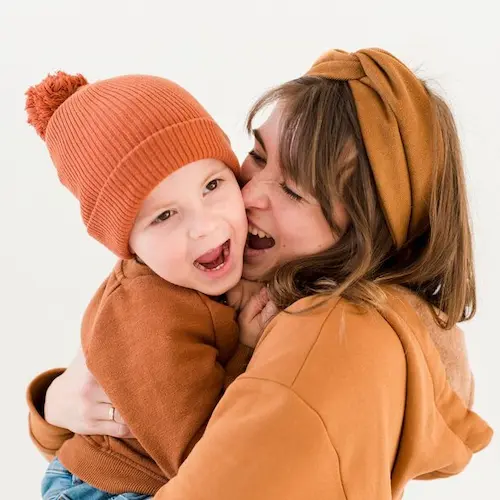

Image by  <a href="https://www.freepik.com/free-photo/playful-mother-son_6881514.htm"> Freepik </a>

یکی دو ماه قبل، یک روز ظهر خیلی اتفاقی از کنار یک مدرسهٔ ابتدایی پسرانه عبور می‌کردم. بچه‌ها تازه تعطیل شده بودند و اطراف کوچهٔ مدرسه پر بود از پدر و مادرهایی که منتظر بچه‌هایشان بودند.

ذهنم مشغول مسئله‌ای بود و توجهی به کسی نداشتم. یک آن به خودم آمدم. گیر افتاده بودم  پشت مادر و پسری که دست هم را گرفته‌ بودند و آرام قدم می‌زدند. مادر احتمالاً هنوز سی سالش نشده بود و پسر هم به نظر می‌رسید که کلاس اول یا دوم باشد. پیاده رو باریک بود. اول حرصم در آمد که چرا این قدر آرام راه می‌روند. خواستم بیایم توی خیابان که صدای مادر توجهم را جلب کرد:

> امروز رفتم برات پرسیدم کلاس فوتبال رو...

مادر داشت حرف می‌زد که پسرک دستش را دور کمر مادرش حلقه کرد، سرش را بلند کرد و توی چشمان مادرش نگاه کرد و گفت:

> مامان خیلی دوسِت دارم…

دوباره راه افتادند و شاید نزدیک پنج دقیقه‌ای به دنبالشان حرکت کردم و در نهایت مسیرمان از هم جدا شد.

تمام این شاید پنج دقیقه را با هم حرف می‌زدند. از همه جا گفتند. از مدرسه، از ناهار، خاله الهه و هر چیز دیگری که فکرش را بکنید. هر چه شور و هیجان و عشق بود را می‌شد در این مادر دید. پسرک هم انگار تمام مدرسه را به این امید گذرانده باشد که ظهر بشود، مادرش بیاید، دست هم را بگیرند و تمام مسیر را بلندبلند حرف بزنند و بخندند و به همهٔ‌ دنیا نشان بدهند که چه قدر هم را دوست دارند.

از من اگر از بهترین عاشقانه‌ای که در عمرم دیده‌ام بپرسید، بی‌شک جوابم همین مادر و پسر است.

من به این مادر و فرزند نگاه می‌کردم و خاطرات خودم را به یاد می‌آوردم. مادرم بیست سالش بود که من به دنیا آمدم و در نتیجه وقتی به کلاس اول می‌رفتم بیست و هفت سال داشت. راستش ما هم همین قدر با هم خوش بودیم. البته هیچ وقت دستم را دور کمر مادرم حلقه نکردم و نگفتم که چه قدر دوستش دارم ولی همیشه دوستش داشتم.

می‌دانید حالا که بیست و شش سال دارم اعتراف می‌کنم که آدم‌ها در این سن و سال، منظورم دههٔ سوم از زندگی است، هنوز هم بچه‌اند و باید بچه‌گی کنند و چه خوب می‌شد اگر در کنار بچهٔ خودشان بچه‌گی می‌کردند.

دنیای عجیبی است اما.

***

امروز غروب داشتم در خیابان قدم می‌زدم. مادری را دیدم دست پسر چهار پنج ساله‌اش را گرفته بود و راه می‌رفت. ناامیدی از تمام سر و صورتش می‌بارید. خسته بود. نمی‌دانست خستگی‌اش را با که باید قسمت کند. پسر بچه آیا می‌توانست شریکی برای به دوش کشیدن خستگی‌های مادر باشد؟ نمی‌دانم.

مادر با همهٔ خستگی‌اش دست پسرش را گرفته بود و او را به دنبال خودش می‌کشاند. پسرک انگار که در شلوارش خرابی کرده باشد به سختی اما بی‌آنکه لج‌بازی کند به دنبال مادرش راه می‌رفت.

چند قدم بهشان نزدیک شدم. پسرک معلول بود. دلم ریخت. همیشه وقتی مادری را می‌بینم که دست فرزند معلولش را گرفته خودم را پنهان می‌کنم. می‌ترسم مرا ببیند و دلش بشکند. می‌ترسم مرا ببیند و سر به شکایت بلند کند که:

> خدایا! چرا من؟

می‌دانم این دنیا سرای امتحان است. می‌دانم که هر که در این بزم مقرب‌تر است جام بلا بیش‌ترش می‌دهند. می‌دانم باید راضی بود به رضای او اما شما هم می‌دانید که آسان نیست؟

***

گاهی اوقات که اوضاع سخت می‌گذرد، چشمانم را می‌بندم و شروع می‌کنم به خیال بافی که روزی با دختری که از من مقرب‌تر است ازدواج می‌کنم. مهربان است. دوستم دارد. بچه‌دار می‌شویم. خسته که از سر کار بر می‌گردم دخترم با شیرین زبانی‌اش خستگی را از تنم بیرون می‌کند. همسرم در سختی‌ها تکیه گاهم است و …

اما خُب انگار شاید قرار نیست این جور باشد. نه این که ناامید باشم. نه. ناامیدی چیز دیگری است. صرفاً دارم با خودم فکر می‌کنم که این دنیا جای ماندن نیست. جای دل بستن نیست. جای آرزو داشتن و خیال بافتن نیست. باید هر چه داریم را بگذاریم و برویم و این آرزوها و خیال‌ها دست و پایمان را می‌بندد. می‌فهمید منظورم را؟

***

پی‌نوشت: مامان دوستت دارم!