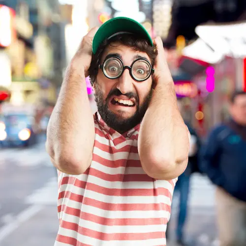

Image by  <a href="https://www.freepik.com/free-photo/young-crazy-man-worried_1032490.htm"> kues1 on Freepik </a>

همسایهٔ دیوار به دیوارمان پیرمردی است تنها که حالا مدتی است خیلی هوش و حواس درستی هم ندارد. ناراحتی اعصاب دارد. به سختی می‌تواند راه برود و گاهی تا سر کوچه که برسد چند بار به در و دیوار می‌خورد. سوی چشمانش کم شده و به سختی می‌بیند. تنها همدمش یک رادیو است که گاهی حوصلهٔ همان رادیو را هم ندارد. یاد مامان‌بزرگم افتادم که در [حکایت زن و شوهری](/blog/husband-and-wife) درباره‌اش نوشته بودم.

حالا چند هفته‌ای است که اوضاع خیلی خراب شده. تا هر صدایی می‌شنود داد می‌زند:

> مهران مادرت رو گا...   
سلطانی زنت رو گا...

سلطانی همسایهٔ دیگرمان است. آقای سطانی و خانمش نمونهٔ یک زوج آرام و مؤدب هستند. یک دختر هفت هشت ساله هم دارند که گاهی کمی شیطنت می‌کند. بچه است دیگر. چه کار می‌شود کرد؟!

خلاصه که این همسایهٔ ما هر بار فحش می‌دهد و من جلوی مادرم سرخ می‌شوم. کاری هم نمی‌شود کرد. چه کار می‌توانم بکنم با پیرمرد مریضی که راه هم نمی‌تواند برود؟! 

مادرم به پدرم می‌گوید برویم شکایت کنیم. پدرم لبخندی تحویلش می‌دهد و می‌گوید: صبر کن! درست می‌شه. 

***

بابا ناراحت نشسته بود و معلوم بود داشت به چیزی فکر می‌کرد. بعد که با هم صحبت کردیم بهم گفت که آدم‌ها یه سری چیزهای بد توی وجودشون هست که سعی می‌کنند اون‌ها را مخفی کنند و خودشون رو خوب جلوه بدهند. اما اون روزی که اعصابشون خراب باشه یا هوش و حواس درست نداشته باشند این پرده برداشته می‌شه و همهٔ اون چیزهایی که مخفی کرده بودند آشکار می‌شه. امان از اون روز…

حق با بابا است. این موضوع رو حتی می‌شه در آدم‌های مست که عقلشان زایل شده هم دید. همهٔ‌شان مست هستند اما مست داریم تا مست. بگذریم…

***

من همیشه از خط عابر پیاده عبور می‌کنم. حق‌الناس است دیگر. خودم هم رانندگی می‌کنم و می‌دانم چقدر اعصاب آدم به هم می‌ریزد وقتی مجبور می‌شوی هر ۵ متر برای عابر پیاده ترمز بزنی. ولی خدا شاهد است که وقتی رانندگی می‌کنم همیشه حواسم به عابر پیاده هست. تا عابر پیاده می‌بینم فوری ترمز می‌کنم و یک لبخند تحویلش می‌دهم. خیلی وقت‌ها آن‌ها هم یک لبخند پهن‌تر به نشانهٔ تشکر تحویلم می‌دهند و گاهی با حرکت دست و خلاصه به نوعی خرسندی‌شان را ابراز می‌کنند و شاید باورتان نشود اما در این شهر شلوغ  که رانندگی واقعاً آدم را خسته می‌کند تنها امید و انگیزه‌ام برای رانندگی همین لبخند‌هایی است که در ازای ترمز زدن تحویل می‌گیرم. خلاصه به نظرم همیشه حق با عابر است. مخصوصاً عابری که روی خط عابر پیاده انتظار می‌کشد که یکی سرعتش را کم کند تا او از خیابان عبور کند.

دیروز ایستاده بودم روی خط عابر. هربار تا یک قدم وارد خیابان می‌شدم خودرویی که به سمتم می‌آمد پایش را می‌گذاشت روی پدال گاز که حساب کار بیاید دستم و دوباره برگردم عقب که مبادا برسم به وسط خیابان و مجبور بشود برای یک آدم بی‌خاصیت ترمز بزند. این اتفاق شاید ده باری افتاد. هر بار تا راننده چشمش به من می‌افتاد پدال گاز را می‌فشرد تا سریع‌تر عبور کند.

این اوضاع را که دیدم اعصابم به هم ریخت. خودروی بعدی فاصلهٔ خوبی داشت. یک قدم وارد خیابان شدم که راننده پایش را گذاشت روی گاز و احتمالاً دو تا دنده‌ هم عوض کرد و با سرعت عجیبی از چند سانتی‌متری‌ام عبور کرد. 

و من آرام گفتم:

> مادرت رو گا…

واقعاً یادم نمی‌آید آخرین دفعه‌ای را که از این جمله استفاده کرده بودم. احتمالاً وقتی بود که هنوز معنایش را نمی‌دانستم. واقعاً زشت است. از خیابان که عبور کردم مدام داشتم به حرف‌های پدرم فکر می‌کردم:

> آدم‌ها یه سری چیزهای بد توی وجودشون هست که سعی می‌کنند اون‌ها را مخفی کنند و خودشون رو خوب جلوه بدهند. اما اون روزی که اعصابشون خراب باشه یا هوش و حواس درست نداشته باشند این پرده برداشته می‌شه و همهٔ اون چیزهایی که مخفی کرده بودند آشکار می‌شه. امان از اون روز…

مدام با خودم فکر می‌کردم که نکنه من یه روز دیوونه بشم. نکنه یه روز ناراحتی اعصاب بگیرم. نکنه یه روز اون پرده بیفته و درون کثیفم آشکار بشه. حسابی ترسیده بودم.

بعد هم مثل همیشه شروع کردم با خدا حرف زدن. یعنی ممکنه یه روز من هم دیوونه بشم؟ یه روز ناراحتی اعصاب بگیرم؟ عیبی نداره. دیوونه شدم هم عیبی نداره. فقط خداجونم؟! می‌شه این قدری خوب باشم که وقتی دیوونه شدم و پرده‌ها افتاد چیز بدی توی وجودم نباشه که بخواهم باهاش کسی رو آزار بدم؟

دیدید بعضی دیوونه‌ها که آروم هستند و خیلی مظلوم و آزارشون به کسی نمی‌رسه؟! کاش وقتی دیوونه شدم شبیه‌ اون‌ها بشم…

<!--
***
پی‌نوشت: لطفاً این قضیهٔ رانندگی را جدی بگیریم. اگر همهٔ‌مان رعایت کنیم خیلی از مشکلات حل می‌شود. روی خط عابر که ترمز نمی‌زنیم. بعضی‌ها از فرعی می‌پیچند توی اصلی و اصلاً حواسشان نیست. حتماً توقع دارند که راننده‌ای که در اصلی می‌راند حواسش باشد. یک عده هم که می‌آیند در خط سرعت و سبقت با ۲۰ تا می‌رانند و من مدام مجبورم سبقت از راست بگیرم و خُب سبقت از راست، آن هم در محیط محلی واقعاً خطرناک است. یک عدهٔ دیگر هم کلهٔ‌شان را می‌کنند توی گوشی همراهشان و بعد مدام از این لاین به آن لاین جابجا می‌شوند.  هیچ راهی نداری. باید پشتشان بروی و مدام فحششان بدهی. 
-->