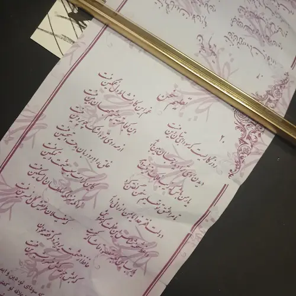

مدتی است سعادت یافته‌ام که هر هفته میهمان سیدالکریم‌باشم.

باید این روزها را قدر بدانم که فرصت‌ها زودتر از آنچه فکرش را بکنم خواهند گذشت.

هفتهٔ پیش نشد که بیایم و امروز بعد از دو هفته توفیق زیارت یافتم.

داشتم توی بازار قدیم قدم می‌زدم. برق‌ها رفته بود و همه جا تاریک بود اما مردم همچنان در تکاپوی خرید بودند. در میان این هیاهو دلرباتر از همه دخترک فال فروش بود که توجهم را به خودش جلب کرده بود. آرام و با ادب. هر از چند گاهی نزدیک کسی می‌شد و با معصومیتش می‌پرسید:

> عمو/خاله فال میخری؟

و با ناامیدی به دنبال آدم مناسب دیگری می‌گشت.

معصومیت را می‌شد در چشمانش مشاهده کرد. می‌دانید؟! گاهی با خودم خیال می‌کنم که بعضی‌ها خیلی حیفند برای این که بخواهند منت امثال من را بکشند تا چندتایی فال بفروشند و این دختر از همان‌ها بود. از همان‌هایی که عوض فال فروشی باید صبح به مدرسه می‌رفت و عصر در خانه منتظر می‌ماند تا پدرش از سر کار برسد و غرق در بوسه‌اش کند. اما خب گاهی خدا شوخی‌اش می‌گیرد و سربه‌سر بنده‌های نازنینش می‌گذارد. 

منتظر بودم که بیاید و اصرار کند که فال بخرم اما انگار نه انگار. حتی وقتی فهمید زل زده‌ام و دارم تماشایش می‌کنم باز هم با بی‌تفاوتی از کنارم گذشت. از اولش هم معلوم بود به درد فال فروشی نمی‌خورد.

صدایش زدم: 

> دخترم!

انگار تازه یادش افتاده باشد که باید فال‌ بفروشد:

> عمو فال میخری؟!

پرسیدم: 

> اسمت چیه؟!

آرام و نجیب جواب داد:

> مریم

زل زده بودم به صورتش. خودش اما نگاهش به فال‌هایش بود. پرسیدم:

> چنده فال‌هات مریم خانم؟!

در حالی که همچنان نگاهش به فال‌هایش بود گفت:

> هر چی دادی.

این یکی را خوب یاد گرفته‌ بود! آدم‌ها اینجوری بهتر خر می‌شوند.

یک اسکناس ده هزار تومانی از جیبم در می‌آورم و می‌دهم دستش و سعی می‌کنم یک فال خوب انتخاب کنم.

دارم فال انتخاب ‌می‌کنم که می‌پرسم:

>  مریم خانم چرا رنگ و روت پریده. صبحونه خوردی؟!

حرف نمی‌زند. 

این بار می‌پرسم: 

> بریم با هم یه چیزی بخوریم؟ 

باز حرف نمی‌زند. 

دو سه هفتهٔ قبل در یکی از همین خیابان‌های اطراف حرم یک نفر که کوچک هم نبود بهم گفت:

> می‌شه از سوپر مارکت چند تا خوراکی برام بخری؟

کارتم را دادم دستش و گفتم:

>  هر چه می‌خواهی بخر. 

گفت:

> دست خودتون باشه. خریدم بیاید حساب کنید.

سرم را انداختم پایین و با خجالت گفتم:

> دست شما باشه بهتره. آبروتون حفظ میشه. 

اما خُب خیلی بی‌آبروتر از آن چه فکرش را می‌کردم بود!

رفت داخل سوپرمارکتی. از شیرنارگیل و دنت توت فرنگی و هر چیزی که من تا حالا در عمرم از نزدیک‌ ندیده بودم را برداشت. دست آخر هم آمد اجازه گرفت که آیا می‌تواند برای ناهار یک الویه بردارد؟!

گفتم نه. نمی‌دانم خودش را زد به نشنیدن یا واقعاً اشتباه شنید. یک الویه هم برداشت و در انتها از داخل مغازه بلند داد زد:

> آقا رمزتون چند بود؟!

تا یک بار دیگر بهم یادآوری کند که به هر که دستش را جلویم دراز می‌کند اعتماد نکنم. 

مریم خانم اما این‌کاره نیست. به زور دستش را می‌گیرم و می‌رویم داخل یک ساندویچی. 

> چی میخوری؟!

سرش را می‌اندازد پایین و چیزی نمی‌گوید.

> همبرگر بگیرم؟!

کمی منّ و منّ می‌کند و بالأخره حرف می‌زند: 

> پس فلافل بخوریم اگه میشه.

می‌پرسم:

> همبرگر دوست نداری؟

سرش را می‌اندازد پایین: 

> چرا!

می‌پرسم: 

>پس برای چی نمی‌خوری؟!

انگاری کمی از خجالتش کم شده باشد. این بار راحت‌تر از قبل جواب می‌دهد: 

> فلافل ارزون‌تره آخه. 

دلم میخواهد بغلش کنم ولی بزرگ شده. باید ۸-۹ سالی داشته باشد و ۸-۹ سال خیلی دیر است برای بغل شدن توسط یک غریبه. 

همبرگر را می‌آورند. 

می‌گویم یک چاقو هم بیاورند. سینی را می‌کشم سمت خودم و ساندویچ را پاره می‌کنم. یک سوم و دو سوم. سینی را می‌چرخانم. قسمت بزرگ‌تر را می‌گذارم جلوی مریم و قسمت کوچک‌تر می‌ماند جلوی خودم. 

سرش را بلند می‌کند و توی صورتم نگاه می‌کند. لبخند شیرینش را تحویلم می‌دهد و سینی را می‌چرخاند تا تکهٔ بزرگتر بیفتد جلوی من. 

می‌خندم و می‌گویم: 

> پس همبرگر دوست نداشتی مریم خانم! 

انگار ترسش ریخته باشد. دیگر خجالت نمی‌کشد. دوباره لبخند می‌زند، نگاهم می‌کند و می‌گوید: 

>چرا! ولی شما بزرگترین…

دوباره دلم می‌خواهد بغلش کنم این مریم خانم را ولی نمی‌شود و فقط زل می‌زنم به صورتش.
 
دارم خیال ساندویچ خوردن با مریم خانم را می‌بافم و با خودم خیال می‌کنم کاش همبرگرش کیفیت بهتری داشت که صدایم می‌کند:

> عمو فالت رو بر نمی‌داری؟!

فالم را بر می‌دارم و راهم را می‌کشم و می‌روم و با خودم می‌گویم کاش حداقل دستی بر سرش کشیده بودم.

باید تمرین کنم در عالم واقع هم به اندازهٔ خیال‌هایم مهربان باشم.

***

اما فال:

روزگاریست که سودایِ بتان دینِ من است  
غمِ این کار نشاطِ دلِ غمگینِ من است

دیدنِ رویِ تو را دیدهٔ جان بین باید  
وین کجا مرتبهٔ چشمِ جهان بینِ من است؟

یارِ من باش که زیبِ فلک و زینتِ دهر  
از مه روی تو و اشکِ چو پروینِ من است

تا مرا عشقِ تو تعلیمِ سخن گفتن کرد  
خلق را وردِ زبان، مدحت و تحسینِ من است

دولت فقر خدایا به من ارزانی دار  
کاین کرامت سببِ حشمت و تمکینِ من است

واعظِ شَحنه شناس این عظمت گو مفروش  
زان که منزلگهِ سلطان، دلِ مسکینِ من است

یا رب این کعبهٔ مقصود تماشاگه کیست؟  
که مغیلانِ طریقش گل و نسرینِ من است

حافظ از حشمتِ پرویز دگر قصه مخوان  
که لبش جرعه کش خسرو شیرین من است