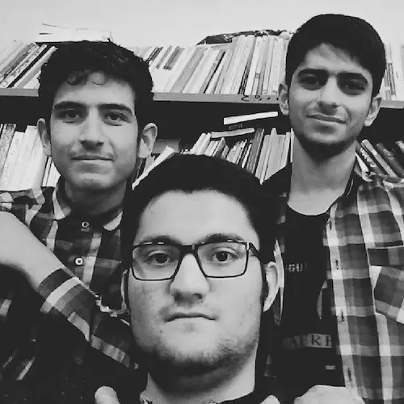

اواخر ما سه تا همیشه با هم بودیم. کتابخانهٔ مدرسه تحویل محمد بود. هر کاری که فکرش را بکنید در آن کتابخانه کردیم. شاید تنها کاری که نکردیم زمین زدن دختران مدرسهٔ بغلی بود. این‌ها را ننوشتم که بگویم خیلی خراب بودیم. نه اصلاً هم این طوری نبود. شیطنت اقتضای آن روزهایمان بود. نوجوان هفده هجده ساله اگر غیر این باشد عجیب است. آن سال بهترین تفریح من قدم زدن میان کتاب‌های کتابخانه و کشف کردن کتاب‌های جدید بود. تا از درس و کنکور خسته می‌شدم شروع می‌کردم به گشتن میان کتاب‌ها و چون همیشه از درس و کنکور خسته بودم همهٔ قفسه‌ها و کتاب‌ها را حفظ شده بودم. چه روزهای قشنگی بود. نه این که حالا قشنگ نباشد. حالا هم قشنگ است. شاید حتی قشنگ‌تر از آن روزها اما راستش دیگر هیچ کداممان صفای آن روزها را نداریم. انگار این دنیا ما را در خودش هضم کرده باشد. 

پوریا از ینگه دنیا برایم پیام فرستاده که مهران برام دعا کن تو اینجا هضم نشم. من هم در جوابش نوشتم که هضم شدیم و خبر نداریم. 

تلخ است اما خیلی به دور از واقعیت نیست. همهٔ‌مان هضم شده باشیم انگار. فرقمان در این است که بعضی خاکسترشان هم بر باد رفته است…

در همان روزها یک بار یک کتاب از قفسه بیرون کشیدم و تندی رفتم دادم دست علیرضا:

> ببین چه کتابی پیدا کردم. دیده بودی تا حالا این رو؟!

دستی به روی کتاب کشید و خاک روی کتاب را نشانم داد و پرسید: 

> می‌دونی یعنی چی؟!

با اعتماد به نفس گفتم:

> یعنی محمد کارش رو درست انجام نمی‌ده. تمیز نمی‌کنه کتاب‌ها رو.

<!---->

خندید:

> نه دیوونه!

نگاهم را دوختم به پنجره‌ٔ کتابخانه که باز بود:

> اینجا زیرزمینه. این پنجره هم که همیشهٔ خدا بازه. معلومه که خاک می‌آد.

دوباره خندید:

<!---->

> نه خیر! این حجم خاک یعنی هیشکی تا حالا این کتاب رو از قفسه در نیاورده! بهت تبریک می‌گم بابت این کشفت!

علیرضا که بارش را بست و رفت انگار دیگر کسی نبود که کتاب‌ها را نشانش بدهم. آدم برای جنگیدن انگیزه می‌خواهد…

همین چند روز پیش داشتم برای کسی تعریف می‌کردم. آن روزها مدرسه خانهٔ اولم بود. صبح پنج صبح بیدار می‌شدم صبحانه درست می‌کردم و بابا را بیدار می‌کردم که مرا برساند مدرسه. تا دیر وقت می‌ماندیم مدرسه، شب می‌رفتم خانه و می‌خوابیدم و فردا دوباره روز از نو روزی از نو. بماند که در خواب هم خواب مدرسه می‌دیدم…

خوب یادم است. یک هفته مانده بود به کنکور. هوا هنوز روشن بود. روزهای آخر بچه‌ها کمتر می‌آمدند مدرسه. بابا آمده بود دنبالم. ماشینش را آورده بود توی حیاط. من هم داشتم کتاب‌ها و وسایلم را جمع می‌کردم که بریزم توی ماشین و ببریم خانه. درِ کلاس‌ها را یکی یکی باز می‌کردم و به داخل کلاس نگاهی می‌انداختم. از همان لحظه دلم برای مدرسه تنگ شده بود. خوب فهمیده بودم آینده چه شیرین باشد چه تلخ دلم خیلی هوای مدرسه را خواهد کرد. هوای محمد و علیرضا، هوای آن کتابخانه، هوای آن روزهای قشنگ. درِ یکی از کلاس‌ها را باز کردم. دیدم مهدی نشسته و دارد درس می‌خواند. حال و زارم را که دید، پرسید:

> چی شده؟ خوبی؟

گفتم آره و فلنگ را بستم که مبادا بغضم جلویش بترکد. روزهای آخر کتابخانه تحویل من بود. رفتم یک سر هم به کتابخانه زدم و در را قفل کردم. باید کلید را تحویل پاشا می‌دادم اما دلم نیامد. نمی‌خواستم قبول کنم که روزهای قشنگمان به انتها رسیده است. برای همین کلید را همراه خودم بردم خانه تا تحویل دادنش بماند برای بعد از کنکور. 

یکی دو سال بعد پا شدم رفتم مدرسه. دیدم کتابخانه را خراب کرده‌اند و عوضش یک میز پینگ پنگ و یک فوتبال دستی کاشته‌اند و به خیال خودشان اتاق ورزش ساخته‌اند.
شاکی شدم که چرا؟

پاشا گفت: 

> بعد شما سه تا دیگه کسی کتاب نمی‌خوند. خیال کردیم اتاق ورزش مفیدتره!

آن روز خیلی دلم شکست. کتابخانهٔ‌مان را، یادگار روزهای قشنگمان را خراب کرده بودند و در عوضش اتاق ورزش ساخته بودند اما اصلاً حواسم نبود که خودم در گیر و دار زندگی چه اندازه از دنیای کتاب‌ها فاصله گرفته‌ام.

حالا چند سال از آن ماجرا می‌گذرد و فاصلهٔ من از آن دنیا باز هم بیش‌تر شده است. 

امروز دستی کشیدم به قرآن روی میزم. پر از خاک بود. مشکل از تمیز نکردن نبود. مشکل از پنجرهٔ باز نبود. مشکل این بود که مدت‌ها از جایش تکان نخورده بود. مشکل این بود که مدت‌ها دستم به آن نخورده بود. به کجا دارم می‌روم؟!   

***

پی‌نوشت: پوریا اگر اینجا را می‌بینی برایم دعا کن که خاکسترم بر باد نرود. می‌دانی که؟! مردمان مغرب‌زمین به خدا نزدیک‌ترند…